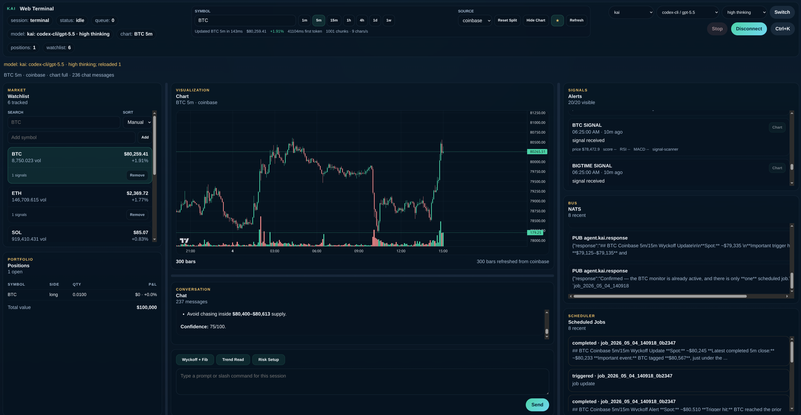

# Agent KAI

Daemon-backed crypto analysis and paper-trading terminal with shared terminal and web clients, persistent sessions, scheduler jobs, and a real sub-agent runtime powered by [`agent-k.ai`](https://agent-k.ai).



## What it is

Agent KAI now runs as an always-on local daemon (`kaid`) that owns:

- named sessions with persisted chat history and UI state
- the main agent plus the sub-agent registry and NATS integration
- scheduler jobs that survive client disconnects and daemon restarts
- a WebSocket protocol shared by the terminal client and the web UI
- REST endpoints for health, sessions, watchlist snapshots, portfolio, and chart history

The default user path is still `python main.py --terminal`, but that command now auto-starts the daemon and attaches to the default session. The old single-process path is still available via `--standalone`.

## Requirements

- Python 3.13+
- Docker with Compose for NATS
- an API key from [`https://agent-k.ai/`](https://agent-k.ai/)
- Linux clipboard helper: `wl-clipboard` on Wayland or `xclip` on X11
- Node.js + npm only if you want the web UI build locally

## Quick start

```bash
# 1. Start NATS
docker compose up -d

# 2. Install Python deps
python3 -m venv .venv
source .venv/bin/activate
pip install -r requirements.txt

# 3. Clipboard helper for the terminal UI
sudo apt install wl-clipboard   # Wayland
# or
sudo apt install xclip          # X11

# 4. Export your API key
export AGENT_KAI_API_KEY="kai-..."

# 5. Launch the daemon-backed terminal
python main.py --terminal
```

That command auto-starts the local daemon on `127.0.0.1:8765` if it is not already running, then attaches to the `terminal` session.

## Common commands

```bash
python main.py --terminal                              # daemon-first terminal
python main.py --terminal --session btc-scalper       # attach a named session
python main.py --terminal --standalone                # old in-process mode
python main.py --terminal --remote ws://HOST:8765/ws  # attach an existing daemon
python main.py --daemon                               # foreground daemon on 127.0.0.1:8765

bin/kaictl start
bin/kaictl status
bin/kaictl logs -n 200
bin/kaictl stop
```

When `kaictl` or terminal auto-spawn starts the daemon, stdout and stderr go to `logs/kaid.log`.

## Taskboard Gateway

The daemon exposes an OpenClaw-compatible gateway for the taskboard. Point the
taskboard's `OPENCLAW_GATEWAY_URL` at the daemon and keep the taskboard as the
workflow/state source of truth.

```bash
export OPENCLAW_GATEWAY_TOKEN="shared-gateway-token"
export TASKBOARD_URL="http://localhost:8080"
export TASKBOARD_BEARER_TOKEN="taskboard-api-token"

python main.py --daemon
# serves http://127.0.0.1:8765/tools/invoke

python main.py --daemon --host 0.0.0.0 --port 18789
# serves the daemon and taskboard gateway on http://HOST:18789/
```

Supported tool invocations:

- `sessions_spawn`
- `sessions_send`
- `sessions_list`

Cross-host operator actions must verify the target first. Use `scripts/verify-host-target.sh <host>` to emit the required `hostname; getent hosts <target>` audit preamble, and set `KAI_FORBIDDEN_HOSTS` (comma or space separated, for example `devlab`) to hard-block forbidden destinations at the `agent-ops fire` CLI layer and in guarded shell commands.

The embedded compatibility gateway also supports `POST /api/cron/wake` for taskboard
comment notifications and `POST /api/sessions/{session_key}/abort` for stop
requests. `sessions_send` returns `result.details.reply` for synchronous
command-bar traffic and queues follow-ups when the target run is already active.

Docker Compose maps both `8765` and `18789` on the host to the same daemon
process, so existing taskboards configured for `OPENCLAW_GATEWAY_URL` on
`18789` can use the daemon without a second gateway service. The taskboard role
ids `developer`, `code-reviewer`, `security-auditor`, `architect`, `qa-agent`,
`ux-manager`, and `deep-research` are configured in `agent-config.json`.

## Web UI

The daemon serves the built Svelte web client at `/`. Until you build it, the root route shows a placeholder page instead of the dashboard.

```bash
cd web
npm install
npm run build
cd ..

python main.py --daemon
# then open http://127.0.0.1:8765/
```

The browser client attaches to the same named sessions as the terminal and renders:

- watchlist and positions sidebars
- Lightweight Charts chart panel
- markdown chat output with token streaming
- signals, NATS traffic, and scheduler event panels
- Ctrl+K slash-command palette

## Scheduler

Scheduler jobs live in the daemon, not the terminal client, so they keep firing after you close the UI.

Examples:

```text
/schedule add at "in 30 minutes" "Check BTC and summarize the 1h chart"
/schedule add cron "30 9 * * 1-5" "Open the day with BTC, ETH, and SOL"
/schedule list
/schedule show JOB_ID
/schedule pause JOB_ID
/schedule pause all
/schedule resume JOB_ID
/schedule cancel JOB_ID
```

Jobs persist in `workspaces/scheduler/jobs.json` and execute inside their owner session, so the resulting output lands in the same chat history as normal user turns.

## Auth and remote access

The daemon creates a bearer token at `workspaces/daemon-token.txt` on first start.

- direct localhost terminal and browser clients can attach without a token
- remote or proxied clients must present the token on both REST and WebSocket requests
- the browser UI sends the token from its login field
- the terminal remote client can use a tokenized URL such as `ws://HOST:8765/ws?token=...`

Health and metrics endpoints:

```bash
curl -H "Authorization: Bearer $(cat workspaces/daemon-token.txt)" \
  http://127.0.0.1:8765/api/health

curl -H "Authorization: Bearer $(cat workspaces/daemon-token.txt)" \
  http://127.0.0.1:8765/api/metrics
```

The built-in `python main.py --daemon` path binds `127.0.0.1` only. To expose the daemon on your LAN, run the ASGI app explicitly or put a reverse proxy in front of it:

```bash
.venv/bin/uvicorn daemon.server:app --host 0.0.0.0 --port 8765
```

If you expose the daemon outside localhost, treat `workspaces/daemon-token.txt` like a secret.

## systemd user service

The repo ships a user-service template at `deploy/kaid.service`. It assumes the checkout lives at `~/kai-agent`; adjust the paths in the unit file if yours differs.

```bash
mkdir -p ~/.config/systemd/user
cp deploy/kaid.service ~/.config/systemd/user/kaid.service
systemctl --user daemon-reload
systemctl --user enable --now kaid
systemctl --user status kaid
journalctl --user -u kaid -f
```

## Tests

```bash
PYTHONPATH=. .venv/bin/pytest

cd web
npm run test
npm run check
npm run build
```

## Documentation

Start with [`docs/README.md`](docs/README.md), then use these as the main operator references:

| Doc | What it covers |
|---|---|
| [docs/getting-started.md](docs/getting-started.md) | install, API key, first run, sample prompts |
| [docs/commands.md](docs/commands.md) | slash commands and operator workflows |
| [docs/keybindings.md](docs/keybindings.md) | terminal shortcuts |
| [docs/chart-panel.md](docs/chart-panel.md) | symbols, timeframes, data sources, chart controls |
| [docs/watchlist-and-positions.md](docs/watchlist-and-positions.md) | watchlist, positions, alerts |
| [docs/agents.md](docs/agents.md) | sub-agent runtime, workspaces, NATS |
| [docs/models-and-thinking.md](docs/models-and-thinking.md) | `/model`, `/think`, endpoint switching, Codex auth |
| [docs/learning-and-skills.md](docs/learning-and-skills.md) | `/learn`, memory, skills |
| [docs/configuration.md](docs/configuration.md) | `agent-config.json`, env vars, secrets |
| [docs/data-sources.md](docs/data-sources.md) | kai-api, Coinbase, signals, backtesting |
| [docs/architecture.md](docs/architecture.md) | process model, storage, contributor guide |
| [docs/troubleshooting.md](docs/troubleshooting.md) | common failures and fixes |
