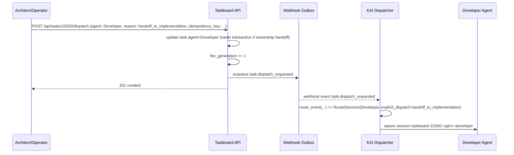
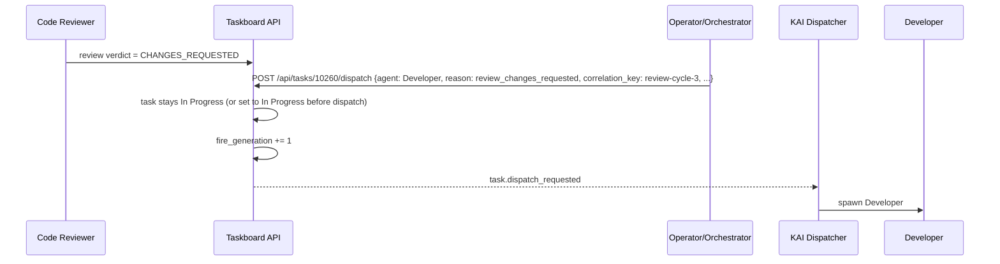
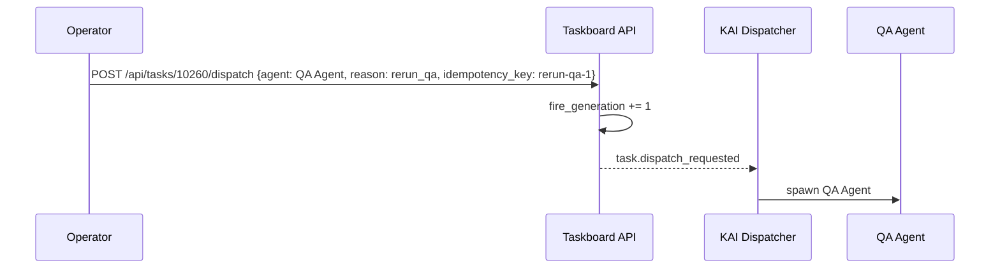

# Router v2 #4 — Explicit Dispatch Event for Same-Status Handoffs and Re-fire Loops

- Task: #10260
- Epic: #10032 Router Architecture v2 — task-aware role routing
- Branch: `feat/spec-10258`
- Status: Proposed
- Author: Architect
- Date: 2026-05-06

## Context

Router v2 now routes `task.status_changed` events into structured `RouteDecision`s, but the current contract still assumes that **work dispatch is implied by a status transition**. That breaks three required workflows:

1. **Same-status handoff** — e.g. Architect finishes a design artifact and hands the task to Developer while the task remains `In Progress`.
2. **Changes-requested loops** — e.g. Review agent requests changes, operator/orchestrator sends the task back to the implementer, then later the implementer sends it back into review.
3. **Operator re-fire / replay** — e.g. “re-run QA on this ticket” without forcing a synthetic status toggle.

Today these fail because the dispatcher intentionally no-ops identity transitions where `from_status == to_status` and because `fire_generation` is currently tied to status-changing webhook emission.

## Problem Statement

We need an explicit dispatch contract that:

- can request a new agent fire even when the task status does not change,
- is auditable and deduplicable,
- preserves current `task.status_changed` behavior,
- does not break existing webhook subscribers,
- provides a clean path for operator-initiated dispatches and orchestrator-generated handoffs.

## Design Goals

1. **Separate workflow phase from executor dispatch.** Status is workflow state; dispatch is an execution request.
2. **Make dispatches first-class events.** No synthetic status toggles required.
3. **Preserve backward compatibility.** Existing `task.status_changed` subscribers continue to work unchanged.
4. **Keep implementation simple.** Add one new event type and one explicit API surface rather than overloading PATCH semantics.
5. **Provide strong auditability.** Every dispatch must explain who requested it, for which role, and why.
6. **Support dedup and replay safety.** Retries must not double-spawn the same requested dispatch.

## Recommendation Summary

### Chosen design

- **Event shape:** introduce a **new webhook event type**: `task.dispatch_requested`.
- **Trigger surface:** introduce a **new endpoint**: `POST /api/tasks/{id}/dispatch`.
- **fire_generation:** bump **per dispatch event**, not only per status change.
- **Idempotency:** require an explicit `idempotency_key` at the API boundary; emit a distinct `event_id`; dedup dispatcher reservations by `(task_id, fire_generation, agent_id)` as today.
- **Audit trail:** persist structured dispatch metadata and emit stable `route_reason` / `dispatch_reason` values.
- **Backward compatibility:** do **not** add required fields to `task.status_changed`; existing subscribers remain unaffected.

This creates a clean two-event model:

- `task.status_changed` — workflow state changed.
- `task.dispatch_requested` — a specific role should be fired for the current task snapshot.

## Why a New Event Instead of Extending `task.status_changed`

### Option A — New event type `task.dispatch_requested` **(recommended)**

**Pros**
- Models dispatch as a separate domain event rather than as status metadata.
- Supports same-status handoffs naturally.
- Lets subscribers opt in explicitly.
- Avoids ambiguous semantics when a payload has both a status transition and a dispatch override.
- Simplifies future use cases such as replay, bulk re-fire, and non-status-triggered orchestration.

**Cons**
- Requires subscribers to add support for one more event type.
- Requires one more API endpoint and outbox writer path.

### Option B — Add `dispatch_agent` / `dispatch_reason` to `task.status_changed`

**Pros**
- Fewer event types.
- Might appear simpler at first glance.

**Cons**
- Overloads one event with two responsibilities: workflow mutation and execution request.
- Same-status dispatch becomes unnatural because there is no status change to report.
- Encourages synthetic no-op PATCHes just to get a webhook out.
- Forces all `task.status_changed` consumers to reason about optional dispatch semantics even if they only care about status.
- Makes idempotency confusing: is dedup based on status change, dispatch request, or both?

### Decision

Use **Option A**. Dispatch is a separate concern and deserves a separate event contract.

## Proposed Event Contract

### Webhook envelope

```json
{
  "event_type": "task.dispatch_requested",
  "event_id": "uuid",
  "emitted_at": "2026-05-06T02:00:00Z",
  "occurred_at": "2026-05-06T02:00:00Z",
  "task_id": 10260,
  "fire_generation": 12,
  "actor": "Architect",
  "dispatch": {
    "target_agent": "Developer",
    "reason": "handoff_to_implementation",
    "requested_by": "Architect",
    "requested_via": "api",
    "requested_from_status": "In Progress",
    "requested_to_status": "In Progress",
    "review_cycle": 3,
    "review_phase": "changes_requested",
    "idempotency_key": "task-10260-handoff-dev-r3-v1",
    "correlation_key": "review-cycle-3",
    "comment": "Architect completed spec; hand off to implementation"
  },
  "task": {
    "id": 10260,
    "status": "In Progress",
    "agent": "Developer",
    "implementation_agent": "Developer",
    "task_type": "Feature"
  }
}
```

### Required fields

- `event_type`: `task.dispatch_requested`
- `event_id`: unique per emitted event
- `task_id`
- `fire_generation`
- `actor`: logical actor causing the dispatch
- `dispatch.target_agent`: canonical display role expected by dispatcher routing (`Developer`, `Architect`, `Code Reviewer`, `Security Auditor`, `QA Agent`, `Orchestrator`)
- `dispatch.reason`: stable machine-readable reason enum
- `dispatch.requested_by`: actor or system component name
- `dispatch.requested_via`: one of `api`, `orchestrator`, `operator`, `system`
- `dispatch.idempotency_key`: caller-supplied dedup key within task scope
- `task`: latest task snapshot after any task mutation associated with the dispatch

### Optional fields

- `dispatch.requested_from_status`
- `dispatch.requested_to_status`
- `dispatch.review_cycle`
- `dispatch.review_phase`
- `dispatch.correlation_key`
- `dispatch.comment`
- `dispatch.metadata` for future extension

## Trigger Surface

### Recommended API

`POST /api/tasks/{id}/dispatch`

### Request body

```json
{
  "agent": "Developer",
  "reason": "handoff_to_implementation",
  "idempotency_key": "task-10260-handoff-dev-r3-v1",
  "comment": "Architect approved design and is handing off to implementation",
  "requested_via": "api",
  "correlation_key": "review-cycle-3"
}
```

### Behavior

1. Validate the target agent against canonical taskboard roles.
2. Authorize the caller exactly like other task-writing endpoints.
3. Load the latest task snapshot.
4. Optionally update task ownership fields if the dispatch semantics require handoff (details below).
5. Atomically:
   - bump `fire_generation`,
   - persist an audit row / dispatch ledger row,
   - enqueue one `task.dispatch_requested` outbox event.
6. Return the updated task snapshot plus dispatch metadata.

### Why a new endpoint

A dedicated endpoint is clearer than overloading `PATCH /api/tasks/{id}` or `/move` because dispatch may occur **without** a status change. That keeps status mutation and dispatch intent independently legible in both logs and audit history.

### Interaction with `/move`

`/move` remains responsible for workflow state transitions. It may internally call the dispatch helper in future if a status move should also trigger an explicit handoff, but that is an implementation detail; the public contract should remain separate.

## Ownership / Task Snapshot Semantics

A dispatch request may or may not update `task.agent` depending on the reason:

- **Handoff dispatches** (`handoff_to_implementation`, `handoff_to_architect`, `review_changes_requested`) **should update** `task.agent` to the target executor before emitting the event.
- **Replay / retry dispatches** (`rerun_qa`, `rerun_security_audit`, `operator_refire`) **should not necessarily update** task ownership if the current owner is still correct.

Rule:

- If the dispatch reason represents a durable ownership transfer, update `task.agent` inside the same DB transaction before event emission.
- If the dispatch reason represents a stateless re-fire, preserve `task.agent` and emit dispatch-only metadata.

This keeps the emitted `task` snapshot authoritative.

## `fire_generation` Semantics

### Proposal

`fire_generation` becomes a **monotonic per-task execution-generation counter**, bumped on **every event that should be eligible to spawn work**, including:

- `task.status_changed` that implies dispatch,
- `task.dispatch_requested`.

### Why

Today `fire_generation` is effectively “spawn generation,” despite being incremented only on status change. Same-status dispatches need their own unique generation to:

- create unique dispatcher reservation keys,
- create unique session IDs,
- cleanly separate retries from the original run,
- preserve a total ordering of spawn-eligible events.

### Non-goals

`fire_generation` is **not** a pure workflow-state version. It is the generation of spawn-eligible task firing.

### Example

- `Backlog -> In Progress` emits `fire_generation=7`
- Architect hands off to Developer while staying `In Progress` emits `fire_generation=8`
- Developer moves to `Code Review` emits `fire_generation=9`
- Code Reviewer requests changes, operator dispatches Developer back onto the ticket emits `fire_generation=10`
- Operator re-runs QA emits `fire_generation=11`

## Idempotency and Deduplication

Idempotency must exist at **three layers**.

### 1) API layer

Caller sends `idempotency_key` scoped to `(task_id, target_agent, reason)`.

Recommended uniqueness rule:

- unique on `(task_id, idempotency_key)` in a new dispatch request ledger table.

Behavior:

- first request: create ledger row, bump generation, emit event
- duplicate with same body: return existing dispatch result (`200` or `201` equivalent)
- duplicate with conflicting body: `409 conflict`

### 2) Webhook/outbox layer

Each emitted event gets a unique `event_id`. Retries of webhook delivery reuse the same `event_id` because they refer to the same outbox row.

### 3) Dispatcher layer

Dispatcher continues to reserve on `(task_id, fire_generation, agent_id)`.

That means:

- two deliveries of the same webhook event do not double-spawn,
- a new intentional dispatch for the same agent gets a new `fire_generation`, so it is not suppressed as a duplicate.

## Audit Trail

### Required audit data

Every dispatch request should be queryable later with:

- `task_id`
- `fire_generation`
- `event_id`
- `target_agent`
- `dispatch_reason`
- `requested_by`
- `requested_via`
- `idempotency_key`
- `comment`
- task snapshot fields (`status`, `agent`, `implementation_agent`, `review_cycle`, `review_phase`)
- timestamps (`requested_at`, `emitted_at`)

### `route_reason` / `dispatch_reason` taxonomy

Use stable lower_snake_case values.

Recommended initial set:

- `handoff_to_implementation`
- `handoff_to_architect`
- `handoff_to_developer`
- `review_changes_requested`
- `review_rework_requested`
- `rerun_code_review`
- `rerun_security_audit`
- `rerun_qa`
- `operator_refire`
- `manual_replay`
- `orchestrator_retry`
- `dependency_unblocked_refire`

Guideline:

- `dispatch.reason` explains **why this dispatch exists**.
- dispatcher `route_reason` for this event type should typically be `explicit_dispatch:<dispatch.reason>` or equivalent stable mapping, so logs distinguish router-derived status routes from explicit dispatch requests.

Example log:

```text
taskboard_fire_spawned task_id=10260 fire_generation=12 role=Developer route_reason=explicit_dispatch:handoff_to_implementation session_id=taskboard-10260-12-developer
```

## Dispatcher Routing Semantics

Extend the router boundary as follows:

```text
route_event(payload, latest_task, review_context) -> tuple[RouteDecision]
```

New rule:

- if `payload.event_type == "task.dispatch_requested"`, bypass status-based routing and return exactly one `RouteDecision` for `dispatch.target_agent`, with `reason = explicit_dispatch:<dispatch.reason>`.

Status-based routing remains unchanged for `task.status_changed`.

This preserves the current Router v2 shape and makes explicit dispatch a clean integration point instead of a special-case status transition.

## Failure Modes and Handling

### Invalid target agent

- API returns `422`.
- No generation bump, no outbox row.

### Duplicate idempotency key, same payload

- API returns previously created dispatch record.
- No new generation bump.

### Duplicate idempotency key, different payload

- API returns `409`.
- No new generation bump.

### Outbox enqueue failure after task ownership update

- Entire transaction rolls back.
- No partial handoff without event emission.

### Dispatcher receives explicit dispatch for unsupported role

- Dispatcher marks row `unknown_role` and posts audit comment, same as existing behavior.
- This should be rare because API should validate roles first.

### Race: status change and explicit dispatch emitted concurrently

- Ordered by separate `fire_generation` values.
- Dispatcher dedup remains correct because reservation key includes generation.
- Audit trail can explain both events independently.

## Backward Compatibility

### Existing webhook subscribers

Must not break.

Proposal:

1. Keep `task.status_changed` payload unchanged for existing required fields.
2. Introduce `task.dispatch_requested` as an additive event type.
3. Subscribers that only care about `task.status_changed` continue unchanged.
4. Subscribers that validate `event_type` with an allowlist must add one new case, but they are not broken unless they explicitly reject unknown events.
5. During rollout, unknown-event subscribers should log-and-ignore rather than fail the endpoint.

### Why not add required fields to `task.status_changed`

Even additive optional fields can create accidental semantic coupling where consumers start interpreting the event differently. A new event type isolates the new behavior and is safer for long-lived integrations.

## Data Model Additions

Implementation should add a dedicated persistence record for explicit dispatch requests.

Suggested table:

`task_dispatch_requests`

Columns:

- `id`
- `task_id`
- `fire_generation`
- `event_id`
- `target_agent`
- `dispatch_reason`
- `requested_by`
- `requested_via`
- `idempotency_key`
- `correlation_key`
- `comment`
- `created_at`
- `payload_json`

Constraints:

- unique `(task_id, idempotency_key)`
- unique `event_id`
- index `(task_id, fire_generation)`

This is preferable to overloading comments or activity logs as the system of record.

## Sequence Diagrams

### A. Same-status handoff: Architect -> Developer



### B. Changes-requested loop



### C. Operator re-run QA



## Rejected Alternatives

### 1. Synthetic status toggles

Example: `In Progress -> Backlog -> In Progress` just to re-fire Developer.

Rejected because it pollutes workflow history, breaks invariants, and couples execution retries to fake state changes.

### 2. Treat `task.agent` change as implicit dispatch

Rejected because not every owner update should spawn immediately, and pure owner changes do not carry dedup/audit intent.

### 3. Add `force_refire=true` to `/move` or `PATCH /tasks/{id}`

Rejected because it overloads endpoints whose primary meaning is status mutation or field patching. Ambiguous, hard to validate, and harder to audit cleanly.

## Implementation Phases

### Phase 1 — Taskboard API and outbox

- Add `POST /api/tasks/{id}/dispatch`
- Add `task_dispatch_requests` table
- Add transaction helper to persist dispatch + bump generation + enqueue `task.dispatch_requested`
- Add tests for idempotency and audit rows

### Phase 2 — Dispatcher/router

- Extend router boundary to support `task.dispatch_requested`
- Route directly from `dispatch.target_agent`
- Preserve existing status routing unchanged
- Add dedup tests for repeated webhook delivery

### Phase 3 — Orchestrator/operator integration

- Update orchestrator to call `/dispatch` for same-status handoffs and replay flows
- Update operator UX/docs to expose explicit re-fire
- Add audit-trail rendering for dispatch requests

### Phase 4 — Rollout guardrails

- Feature flag explicit dispatch handling in dispatcher if needed
- Log metrics for `task.dispatch_requested`, duplicates, unknown roles, and conflicts
- Shadow/test in staging before enabling operator-facing UI

## Test Plan

### Unit tests

- API validation for valid/invalid target agents
- idempotency key replay semantics
- conflicting duplicate semantics
- `fire_generation` bump on dispatch
- no generation bump on duplicate replay
- router returns `RouteDecision` from explicit dispatch payload

### Integration tests

- same-status Architect -> Developer handoff spawns Developer exactly once
- changes-requested loop spawns Developer with new generation
- operator rerun QA spawns QA with new generation
- repeated webhook delivery does not double-spawn
- `task.status_changed` subscribers continue to receive unchanged payloads

### Rollback tests

- disabling explicit dispatch route leaves status-based routing unaffected
- failed enqueue rolls back ownership update and dispatch ledger write

## Rollout Guardrails

- Ship API + dispatcher support behind a feature flag if deployment sequencing is uncertain.
- Ensure webhook consumers treat unknown `event_type` values as ignorable until upgraded.
- Add structured logs for `event_type`, `fire_generation`, `dispatch.reason`, and dedup outcome.
- Monitor for unexpected spikes in duplicate suppression after rollout.

## Concrete Answers to Requested Questions

1. **Event shape?**
   - New webhook event type: **`task.dispatch_requested`**.
   - Do **not** overload `task.status_changed` with dispatch fields.

2. **Trigger surface?**
   - New endpoint: **`POST /api/tasks/{id}/dispatch`**.
   - `/move` and `PATCH` remain status/field mutation surfaces.

3. **`fire_generation` semantics?**
   - Bump **per spawn-eligible event**, including explicit dispatches and status changes.

4. **Idempotency / dedup keys?**
   - API: unique `(task_id, idempotency_key)`.
   - Event: unique `event_id`.
   - Dispatcher: dedup via existing `(task_id, fire_generation, agent_id)` reservation.

5. **Audit trail / `route_reason` values?**
   - Persist dispatch ledger rows.
   - Use stable `dispatch.reason` enums.
   - Dispatcher logs `route_reason=explicit_dispatch:<dispatch.reason>`.

6. **Backward compatibility?**
   - Keep `task.status_changed` stable.
   - Add `task.dispatch_requested` as an additive event.
   - Existing subscribers remain functional and can ignore unknown event types until upgraded.

## Follow-up Implementation Ticket

This spec requires a follow-up implementation task in the taskboard covering:

- taskboard API endpoint
- dispatch ledger schema
- webhook outbox emission
- dispatcher/router support
- tests and rollout flagging

Recommended title:

**Router v2 #5: implement explicit dispatch event and `/api/tasks/{id}/dispatch` flow**
