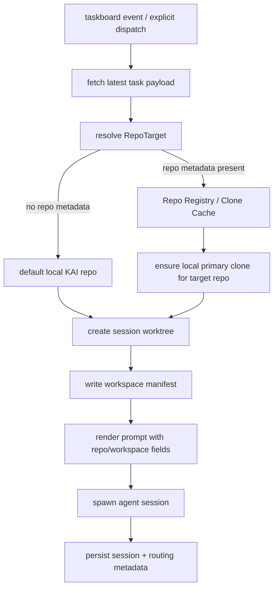

Task 10366 — FEAT: cross-repo workspace routing — dispatcher preps the right repo for the ticket target

Status: architecture complete
Author: Architect
Date: 2026-05-06

Context
- The current dispatcher/worktree flow is single-repo by construction.
- `DaemonTaskboardSpawner` initializes `WorktreeManager` with `repo_root = Path(__file__).resolve().parents[1]`, which is this local KAI repo.
- When worktree isolation is enabled, `spawn()` always creates the session worktree from that fixed repo root and only varies `default_branch` from task payload.
- The task prompt renderer already extracts `project.repoUrl` / `repo_url` and `default_branch`, but that repo targeting data is not used by the dispatcher for workspace selection.
- Existing prompts expose only `Worktree path`, not the actual target repo identity or any durable workspace manifest. Earlier fire prompts in logs showed placeholders for `Workspace path`, `Primary repo path`, and `Workspace manifest path`, which indicates the operator need already exists.
- Resulting failure mode: tickets scoped to another repo (for example a taskboard-server bug) can be dispatched into the KAI repo worktree, leading an implementation agent to modify the wrong repository while still appearing “green” locally.

Problem statement
We need dispatcher-side workspace routing that selects the correct repository for each ticket target before the agent is fired. The solution must:
- honor the repo target encoded on the task/project payload,
- keep the current single-repo path working unchanged when no target repo is provided,
- provide explicit prompt context proving which repo/workspace the agent should use,
- remain auditable and safe under retries,
- avoid branch-changing git operations in operator/primary clones.

Recommendation summary
Adopt a repo-targeted workspace routing layer in the dispatcher.

Chosen design
1. Introduce a repository resolution step before session spawn.
2. Resolve a canonical `RepoTarget` from task payload fields (`repo_url`, `project.repoUrl`, optional repo slug/name metadata when present).
3. Materialize or reuse a dispatcher-managed local clone cache per target repo under a dedicated run root.
4. Create the per-session worktree from that resolved repo clone, not from the KAI repo root.
5. Emit a small workspace manifest and inject explicit repo/workspace fields into the auto-fire prompt.
6. Persist routing metadata into dispatcher session records / run ledger so cleanup and audits remain deterministic.

Why this design
- Fixes the root cause: wrong repo selection happens before the agent starts.
- Preserves the existing worktree isolation model instead of replacing it.
- Keeps repo routing centralized in the dispatcher, where task payload, session setup, and audit hooks already meet.
- Supports future multi-repo expansion without requiring prompt-only heuristics or agent self-discovery.

Rejected alternatives
1. Prompt-only routing (“tell the agent which repo to use”)
   - Rejected because the agent would still start in the wrong filesystem context.
   - Increases operator risk and allows accidental edits in the wrong clone.

2. Keep a single repo root and call `git clone` ad hoc inside each agent session
   - Rejected because it shifts infra concerns into role agents.
   - Produces inconsistent layouts, duplicated network fetches, and weaker cleanup/audit semantics.

3. Reuse `git_prepare_task_workspace` as the primary dispatcher path
   - Rejected for dispatcher session prep.
   - That tool is useful for task workspaces under a guarded run root, but the dispatcher already has a stable worktree lifecycle and cleanup model. Adapting that tool for every spawn would conflate implementation-time repo prep with dispatcher-time routing.

4. Infer target repo from task text/title only
   - Rejected as non-deterministic.
   - The authoritative contract should be structured task/project metadata.

Architecture

High-level flow


Core components
1. Repo target resolver
   - New dispatcher-side function/class.
   - Input: latest task payload.
   - Output: canonical `RepoTarget`.
   - Responsibilities:
     - normalize repository URL,
     - derive stable repo key,
     - select branch default,
     - mark whether routing decision was explicit or fallback.

2. Repo workspace registry / clone cache
   - Dispatcher-managed directory for local primary clones, e.g. `/tmp/kai/taskboard-repos/<repo-key>` or configurable equivalent.
   - Ensures each target repo has exactly one local clone root used as the parent for session worktrees.
   - Does not use the operator’s working tree or the daemon’s own primary clone for foreign repos.

3. Multi-repo worktree manager
   - Evolution of current `WorktreeManager`, which is presently bound to a single repo root at construction.
   - Should accept a repo root per create/cleanup call, or be wrapped by a `WorkspaceRouter` that chooses the right `WorktreeManager` instance per repo.

4. Workspace manifest writer
   - Writes structured metadata adjacent to the session workspace.
   - Gives the agent and auditors a single source of truth for repo identity and paths.

5. Prompt contract extension
   - Add fields so implementation/review agents can verify they are in the correct repository before editing or reviewing.

Data contracts

1. `RepoTarget`
```json
{
  "repo_key": "openclawdev-taskboard",
  "repo_url": "https://forgejo.example/openclawdev/taskboard.git",
  "default_branch": "main",
  "source": "task.project.repoUrl",
  "routing_mode": "explicit",
  "display_name": "TASKBOARD"
}
```

Required semantics
- `repo_key`: stable filesystem-safe identifier; derived from canonical URL or explicit slug.
- `repo_url`: canonical clone URL used by clone cache.
- `default_branch`: branch to base new worktrees on; fallback `main` only if unspecified.
- `source`: field provenance for audit/debug.
- `routing_mode`: `explicit` when repo metadata exists, `fallback_local` when absent.
- `display_name`: human-readable label for prompts/comments.

2. `WorkspaceManifest`
Recommended JSON file written per session, for example:
`<session-worktree>/.kai/workspace-manifest.json`

```json
{
  "task_id": 10366,
  "session_id": "taskboard-10366-1-architect",
  "fire_generation": 1,
  "agent_id": "architect",
  "role": "Architect",
  "repo": {
    "repo_key": "claude-local-ai-agent",
    "repo_url": "https://forgejo.example/atc/claude-local-ai-agent.git",
    "default_branch": "main",
    "source": "task.project.repoUrl",
    "routing_mode": "explicit"
  },
  "paths": {
    "primary_repo_path": "/tmp/kai/taskboard-repos/claude-local-ai-agent",
    "worktree_path": "/tmp/kai/sessions/taskboard-10366-1-architect"
  },
  "created_at": "2026-05-06T03:00:00Z"
}
```

3. Prompt fields
Extend taskboard fire prompt substitutions with:
- `workspace_path` — same as effective session workspace if distinct wording is desired
- `primary_repo_path`
- `workspace_manifest_path`
- `repo_url`
- `default_branch`
- `repo_routing_mode`

At minimum the prompt should show:
- Target repo URL
- Primary repo path
- Worktree path
- Workspace manifest path

Recommended prompt snippet
- Target repo URL: {repo_url}
- Default branch: {default_branch}
- Primary repo path: {primary_repo_path}
- Worktree path: {worktree_path}
- Workspace manifest path: {workspace_manifest_path}

Behavioral rules
1. If the task payload contains a resolvable repo target, the dispatcher MUST spawn into that repo.
2. If no repo metadata exists, the dispatcher MAY fall back to the current local KAI repo, but must label the routing mode as fallback in prompt + audit logs.
3. For implementation roles, explicit repo mismatch between task scope and available routing metadata SHOULD fail closed rather than silently targeting the KAI repo.
4. For architecture/review-only roles, fallback may be tolerated if no code changes are expected, but the prompt must still disclose the fallback.
5. Cleanup MUST use the same repo root that created the worktree.

Failure modes and handling
1. Missing repo metadata
   - Symptom: task/project has no repo URL.
   - Handling:
     - fallback only when policy allows,
     - add audit note `repo_routing=fallback_local reason=missing_repo_metadata`.
   - Risk: silent wrong-repo work.
   - Guardrail: make fallback policy role-sensitive and visible in prompt.

2. Unknown or malformed repo URL
   - Handling: mark dispatch failed/unknown_target, post audit comment, do not spawn into arbitrary default repo for implementation tasks.

3. Clone cache missing and clone/bootstrap fails
   - Handling: fail dispatch cleanly; keep pending row retryable; audit with actionable reason.

4. Concurrent bootstrap of same repo
   - Handling: per-repo lock around clone/init/fetch operations.
   - Reason: multiple dispatcher workers must not corrupt the clone cache.

5. Stale or broken clone cache
   - Handling: `git fetch --prune` / health check before worktree add; if irrecoverable, quarantine and recreate clone directory.

6. Cleanup without repo metadata
   - Handling: persist `primary_repo_path` or `repo_key` in session metadata so cleanup never guesses.

7. Repo URL secret leakage
   - Handling: redact embedded credentials if ever present in URLs; never log auth-bearing remote URLs.

8. Wrong branch baseline
   - Handling: prefer task/project default branch; record resolved branch in manifest; fail if requested base branch does not exist rather than silently switching.

Interface changes

1. Dispatcher session spawn metadata
Add fields carried from dispatcher to spawner/runtime:
- `repo_target` or flattened fields:
  - `repo_url`
  - `repo_key`
  - `primary_repo_path`
  - `workspace_manifest_path`
  - `repo_routing_mode`
  - `default_branch`

2. Prompt renderer substitutions
Extend `_extract_substitutions()` and template variables with the fields above.
Backward compatibility: empty strings remain valid for older callers/tests.

3. Session ledger / dispatcher session metadata
Persist enough routing metadata to support:
- cleanup,
- stuck-session debugging,
- audit comments,
- operator inspection.

Recommended minimum persisted fields
- `repo_key`
- `repo_url` (redacted if needed)
- `primary_repo_path`
- `worktree_path`
- `workspace_manifest_path`
- `repo_routing_mode`

Implementation phases

Phase 1 — Repo target resolution contract
- Add canonical resolver over task/project payload fields.
- Define normalization and precedence:
  1. task-level repo URL
  2. project-level repo URL
  3. optional future repo slug/id mapping
  4. fallback local repo
- Add unit tests for precedence and normalization.

Phase 2 — Clone cache + routed worktree creation
- Introduce a repo registry/cache directory under dispatcher control.
- Create helper to ensure local primary clone exists for a `RepoTarget`.
- Refactor `WorktreeManager` usage so `spawn()` can create a worktree from the resolved repo root rather than fixed `parents[1]`.
- Persist chosen repo root in session metadata for cleanup.

Phase 3 — Manifest + prompt contract
- Write workspace manifest during spawn.
- Extend prompt substitutions and taskboard templates with repo/workspace fields.
- Restore explicit `Primary repo path` and `Workspace manifest path` prompt context.

Phase 4 — Policy + fail-closed behavior
- Add config/policy for fallback behavior by role.
- Recommend default:
  - Developer: fail closed on unresolved foreign repo target.
  - Code Reviewer / QA / Security Auditor: warn or fail based on repo requirement.
  - Architect: allow fallback with explicit disclosure.
- Add structured audit comments for fallback/failure reasons.

Phase 5 — Operational hardening
- Per-repo locks.
- Clone health checks.
- Metrics/logging for repo routing outcomes.
- Cleanup validation for multi-repo sessions.

Testing plan

Unit tests
1. Prompt renderer
   - extracts `repo_url`, `default_branch`, `primary_repo_path`, `workspace_manifest_path`, `repo_routing_mode`.
   - renders empty strings safely when absent.

2. Repo target resolver
   - task-level URL overrides project-level URL.
   - project-level URL used when task-level absent.
   - branch precedence correct.
   - normalization strips unsafe characters and creates stable repo keys.
   - malformed URL returns explicit resolution failure.

3. Worktree routing
   - `spawn()` uses resolved repo root, not module-parent repo root, when target repo exists.
   - cleanup uses persisted repo root.
   - fallback path still works for current single-repo behavior.

4. Manifest writer
   - file path deterministic,
   - JSON includes task/session/repo/path fields,
   - secrets are not persisted in clear if URL contains credentials.

Integration tests
1. Existing single-repo E2E remains green.
2. Multi-repo spawn test:
   - task payload points to alternate repo,
   - clone cache is prepared/mocked,
   - resulting worktree path belongs to alternate repo root,
   - prompt contains alternate repo path and manifest path.
3. Dispatch failure test:
   - malformed repo URL or clone failure,
   - row marked failed/retryable with audit comment,
   - no wrong-repo worktree created.
4. Cleanup E2E:
   - session created from alternate repo,
   - finalize path removes worktree from correct repo root.

Rollout guardrails
1. Feature flag
- Gate cross-repo routing behind a dispatcher config flag, e.g. `TASKBOARD_MULTI_REPO_ROUTING=1`.
- Allows staged deploy and rollback.

2. Read-only dry-run mode for first rollout
- Optional mode that resolves repo target and logs/audits the chosen route without changing actual worktree root.
- Use to validate payload quality in production.

3. Structured logging
Log once per spawn:
- task_id
- role
- repo_key
- repo_routing_mode
- repo_source
- primary_repo_path
- worktree_path

4. Safe fallback policy
- Do not silently route Developer tasks into the KAI repo when repo metadata is present but invalid.
- Silent fallback is the failure we are trying to eliminate.

5. Explicit clone root separation
- Store clone cache outside operator worktrees and outside the daemon’s own checkout.
- Prevents branch movement in protected clones.

Security / SDLC considerations
- Never embed tokens in persisted repo URLs or logs.
- Clone cache path derivation must be filesystem-safe and collision-resistant.
- Worktree cleanup must only operate under dispatcher-managed roots.
- Any future support for authenticated repo cloning should source credentials from env/vault and keep them out of manifests/comments.

Tradeoffs
Pros
- Correct repo by default.
- Better auditability and operator confidence.
- Minimal conceptual change to existing dispatcher lifecycle.
- Scales to many repos.

Cons
- More local disk usage due to clone cache.
- Additional concurrency/cleanup complexity.
- Some tasks may lack enough metadata, forcing policy decisions on fallback vs fail-closed.

Recommended implementation sequence
1. Add `RepoTarget` resolver and tests.
2. Add clone-cache abstraction and repo-root selection in dispatcher spawn path.
3. Refactor worktree lifecycle to persist repo-root metadata for cleanup.
4. Add workspace manifest writer.
5. Extend prompt renderer/templates with repo/workspace fields.
6. Add fail-closed policy and audit comments for unresolved/invalid targets.
7. Add integration tests for alternate-repo routing and cleanup.
8. Roll out behind feature flag, validate logs, then enable by default.

Risks
1. Incomplete task metadata may force temporary fallback behavior.
2. Cleanup bugs could leave orphaned worktrees in non-default repos.
3. Repo-key normalization collisions if URL canonicalization is weak.
4. Network/bootstrap failure may temporarily increase dispatch failures until cache warming exists.
5. Review/QA agents may need updated expectations now that repo identity is explicit in prompts.

Acceptance criteria
1. A task with `task.repo_url` or `project.repoUrl` spawns into a worktree created from that repository, not always from the KAI repo.
2. The spawned session prompt includes target repo URL, primary repo path, worktree path, and workspace manifest path.
3. Dispatcher cleanup removes a routed worktree using the same repo root that created it.
4. When repo metadata is absent, fallback behavior is explicit in prompt/log/audit output.
5. When repo metadata is malformed or unusable for an implementation task, dispatcher fails closed instead of silently routing to the local KAI repo.
6. Existing single-repo dispatcher tests continue to pass.
7. New unit/integration tests cover repo resolution precedence, alternate-repo worktree creation, prompt rendering, and cleanup.

Practical note for implementation agents
The narrowest safe refactor is to introduce repo routing at the `DaemonTaskboardSpawner.spawn()` boundary and keep the rest of the dispatcher semantics intact. Do not scatter repo-selection logic across role prompts or role agents.
