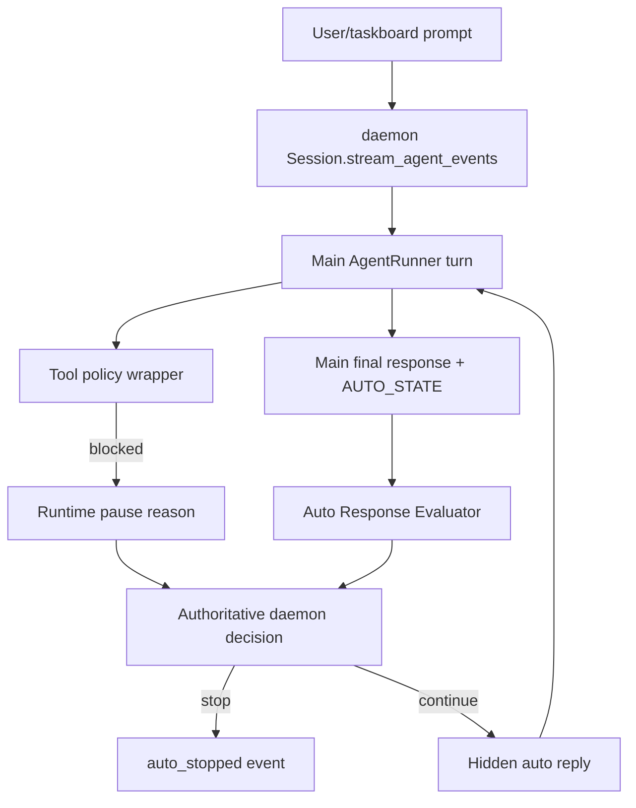

# Architecture Artifact — Task 10369

## Title
ARCH: `auto_agent_mode` — second agent evaluates main response + auto-replies on convergence patterns

## Context inspected

Relevant repository artifacts reviewed:

- `AUTO-MODE-DESIGN.md` — original broad `/auto` design with regex continuation checker.
- `AUTO-MODE-CRITIC-REVIEW.md` — critique identifying wrong-layer continuation, weak regexes, history pollution, and incomplete tool safety.
- `AUTO-MODE-V2-RESPONSE.md` — accepted reframe: premature finalization, not missing execution loop.
- `AUTO-MODE-CONVERGENCE.md` — convergence on narrowed v1: session-owned auto loop, structured `AUTO_STATE`, strict tool policy, no fake user history.
- `agent/auto_prompt.py` — structured footer parsing: `[AUTO_STATE: done|continue|pause]`.
- `agent/core.py` — `AgentRunner` auto prompt rebuild path, hidden continuation flag, tool-policy enforcement, `consume_auto_pause_reason()`.
- `daemon/core.py` — session-owned auto loop, hidden continuation injection, progress/stop events, loop and budget gates.
- `agent/tool_policy.py` — central tool policy registry.
- `agent/run_outcome.py` and `agent/taskboard_dispatcher.py` — auto-stop/run outcome mapping for taskboard agent runs.
- `tests/test_auto_mode.py`, `tests/test_auto_prompt.py`, `tests/test_tool_policy.py` — existing regression surface for auto mode.

## Problem statement

The current v2 `/auto` mode relies primarily on the main agent's self-reported `AUTO_STATE` footer. This is conservative and safe, but it still fails in common cases:

1. The main agent gives a useful intermediate answer but says something like “I can run tests next if you want.”
2. The main agent emits `[AUTO_STATE: done]` even though its own text clearly describes pending next steps.
3. The main agent omits or malforms the footer even though the response is a recognizable convergence/continuation pattern.
4. The main agent asks for approval for a safe/read-only next step, causing unnecessary human friction.

The requested enhancement is a **second agent/evaluator** that reviews the main response and allows the system to auto-reply only when there is high-confidence convergence on a safe continuation pattern.

## Recommendation

Add a session-owned **Auto Response Evaluator** between each main agent turn and the existing auto-loop stop/continue decision.

The evaluator is not a second autonomous worker with tools. It is a bounded, tool-less critic that receives only:

- main final response text,
- parsed `AUTO_STATE`,
- runtime pause reason, if any,
- tool-call summary for the just-finished turn,
- recent auto-loop counters,
- configured mode (`normal` or `readonly`).

It returns strict JSON. The daemon uses that JSON to decide whether to inject a hidden auto-reply such as `Continue with the next step.` or to stop conservatively.

The evaluator **may recommend a continuation**, but the daemon remains authoritative for safety, budgets, loop detection, and tool approval gates.

## High-level design



### Component responsibilities

#### 1. `AutoResponseEvaluator`

New module recommended: `agent/auto_evaluator.py`.

Responsibilities:

- Evaluate whether the main response is truly complete, safely continuable, or should pause.
- Detect convergence patterns that indicate a safe next auto-reply.
- Produce a structured decision object only; never execute tools.
- Be deterministic at the daemon boundary: malformed evaluator output equals `STOP`.

Implementation should support two backends:

1. **Rule prefilter** — cheap, deterministic signals for whether an evaluator call is warranted.
2. **Tool-less critic LLM** — optional/primary evaluator for semantic judgment when prefilter sees an ambiguous pattern.

The rule prefilter is not the control plane; it is only a cost guard. Final auto-reply decisions come from strict evaluator JSON plus daemon safety gates.

#### 2. `Session` auto-loop integration

Modify the existing auto decision section in `daemon/core.py` after:

- runtime pause reason is consumed,
- `auto_iterations_remaining` is decremented,
- progress is emitted,
- before deciding `done`, `pause`, malformed footer, or continuation.

Decision order must remain safety-first:

1. Runtime tool-policy pause wins immediately.
2. Budget/wall-clock/loop gates win immediately.
3. Parse main `AUTO_STATE`.
4. Invoke evaluator only when eligible.
5. Daemon applies evaluator result under hard constraints.
6. Hidden auto-reply is injected only if allowed.

#### 3. Hidden auto-reply injector

Existing hidden continuation support should be reused:

- `AgentRunner._is_auto_continuation = True`
- Do not persist synthetic `HumanMessage`.
- Do not render hidden auto-reply as a user-authored message.
- Emit compact auto events for observability.

Prefer a small set of daemon-owned auto-reply templates over arbitrary evaluator text.

Allowed v1 templates:

- `Continue with the next safe step.`
- `Proceed with the read-only analysis you just described.`
- `Finish the artifact or final answer requested by the task.`

Do **not** let the evaluator generate unrestricted follow-up prompts in v1.

## Data contracts

### Evaluator input

```python
@dataclass(frozen=True)
class AutoEvaluationInput:
    session_name: str
    agent_name: str
    auto_mode: bool
    readonly: bool
    main_response: str
    parsed_auto_state: Literal["done", "continue", "pause", "unknown"]
    parsed_auto_reason: str | None
    runtime_pause_reason: str | None
    turn_tool_calls: list[ToolCallSummary]
    consecutive_no_tool_turns: int
    repeated_final_detected: bool
    iterations_remaining: int
    elapsed_seconds: float
```

```python
@dataclass(frozen=True)
class ToolCallSummary:
    name: str
    input_key: str  # existing hashed/normalized key, not raw secret-bearing input
```

### Evaluator output

Evaluator output must be strict JSON and schema-validated.

```json
{
  "decision": "STOP|CONTINUE|PAUSE|ACCEPT_MAIN_STATE",
  "confidence": 0.0,
  "reason": "short human-readable reason",
  "pattern": "permission_deflection|declared_next_step|incomplete_artifact|malformed_footer_recoverable|main_done_accepted|safety_pause|unknown",
  "auto_reply_template": "continue_next_safe_step|proceed_readonly_analysis|finish_requested_artifact|null"
}
```

Recommended Python type:

```python
@dataclass(frozen=True)
class AutoEvaluationDecision:
    decision: Literal["STOP", "CONTINUE", "PAUSE", "ACCEPT_MAIN_STATE"]
    confidence: float
    reason: str
    pattern: str
    auto_reply_template: Literal[
        "continue_next_safe_step",
        "proceed_readonly_analysis",
        "finish_requested_artifact",
    ] | None
```

### Decision semantics

- `ACCEPT_MAIN_STATE`: daemon follows the parsed main `AUTO_STATE` exactly.
- `CONTINUE`: daemon may inject one hidden auto-reply if all safety gates allow it.
- `PAUSE`: daemon stops auto with evaluator reason.
- `STOP`: daemon stops auto conservatively.

### Event additions

Publish internal/stream events:

```json
{"type": "auto_evaluation", "data": {"decision": "CONTINUE", "confidence": 0.91, "pattern": "permission_deflection", "reason": "main asked permission for read-only next step"}}
```

```json
{"type": "auto_reply", "data": {"template": "continue_next_safe_step", "reason": "permission_deflection"}}
```

The taskboard run store and TUI can display these as control events, not chat messages.

## Convergence patterns for v1

Only these patterns should be enabled for auto-reply in v1:

1. **Permission deflection for safe next step**
   - Main response asks whether to do a next step.
   - Next step is read-only or within current task scope.
   - No runtime policy pause exists.
   - Example: “I can run the existing tests next if you want.”

2. **Declared next step but premature stop**
   - Main response states “next I will …” or “remaining work is …”.
   - The task is not complete.
   - The next step does not require a blocked tool.

3. **Recoverable malformed/missing footer**
   - Main text clearly indicates progress is incomplete.
   - Existing loop counters are healthy.
   - Evaluator confidence is high.

4. **False `done` on missing required artifact**
   - Main says done but the requested deliverable is absent from the response or not produced.
   - This pattern is especially relevant to taskboard architecture runs where the artifact path is explicit.

Non-goals for v1:

- Planning a new multi-step agenda not implied by the main response.
- Continuing after tool-policy approval blocks.
- Continuing through repeated tool loops.
- Continuing after wall-clock or iteration exhaustion.
- Allowing evaluator-created arbitrary prompts.

## Authoritative daemon decision logic

Pseudocode:

```python
runtime_pause_reason = runner.consume_auto_pause_reason()
if runtime_pause_reason:
    stop_auto(runtime_pause_reason)
    return

if budget_exhausted() or wall_clock_exceeded() or loop_detected():
    stop_auto(gate_reason)
    return

main_state, main_reason = parse_auto_state(turn_final_text)

eval_input = AutoEvaluationInput(...)
eval_decision = evaluator.evaluate(eval_input)
publish_auto_evaluation(eval_decision)

if eval_decision.decision == "PAUSE":
    stop_auto(eval_decision.reason)
    return

if eval_decision.decision == "STOP":
    stop_auto(eval_decision.reason or "auto evaluator stopped")
    return

if eval_decision.decision == "ACCEPT_MAIN_STATE":
    follow_existing_auto_state(main_state, main_reason)
    return

if eval_decision.decision == "CONTINUE":
    if eval_decision.confidence < AUTO_EVALUATOR_MIN_CONFIDENCE:
        stop_auto("auto evaluator confidence below threshold")
        return
    if not template_allowed(eval_decision.auto_reply_template):
        stop_auto("auto evaluator returned invalid reply template")
        return
    if not continuation_quota_available():
        stop_auto("auto evaluator continuation quota exhausted")
        return
    current_input = render_template(eval_decision.auto_reply_template)
    is_auto_continuation = True
    publish_auto_reply(...)
    continue
```

## Safety model

Hard rules:

1. Runtime tool policy overrides evaluator decisions.
2. Evaluator is tool-less.
3. Evaluator output is schema-validated; malformed output means stop.
4. Confidence threshold should default to `0.85`.
5. Add a separate evaluator continuation quota, default `1` per original user/taskboard prompt for interactive mode and `3` for taskboard autonomous fire runs.
6. Hidden auto-replies use daemon-owned templates only.
7. If `/auto readonly` is active, auto-reply templates must be read-only scoped.
8. Do not include raw bearer tokens, session tokens, auth headers, or raw tool inputs in evaluator prompts/logs.

## Options considered

### Option A — Keep only main `AUTO_STATE`

Pros:
- Simple.
- Already implemented.
- Conservative.

Cons:
- Fails when the main model malforms footers or asks permission unnecessarily.
- No independent check on false `done`.

Rejected as insufficient for this task.

### Option B — Regex continuation checker

Pros:
- Cheap.
- Easy to implement.

Cons:
- Already rejected in prior design review.
- High false positive/negative rate.
- Blind to task state, tool safety, and loop state.

Rejected.

### Option C — Full second autonomous agent with tools

Pros:
- Powerful.
- Could inspect filesystem/taskboard independently.

Cons:
- Doubles autonomy surface.
- Hard to budget.
- Can bypass main runner safeguards.
- Increases history/log complexity.

Rejected for v1.

### Option D — Tool-less evaluator critic with strict JSON and daemon-owned templates

Pros:
- Provides semantic review without expanding tool authority.
- Integrates with existing session-owned auto loop.
- Keeps safety gates authoritative in runtime.
- Testable with schema fixtures.

Recommended.

## Implementation phases

### Phase 1 — Data model and evaluator interface

- Add `agent/auto_evaluator.py`.
- Define input/output dataclasses and JSON schema validation.
- Implement deterministic fallback evaluator that returns `ACCEPT_MAIN_STATE` for all cases.
- Add unit tests for schema validation and malformed output handling.

### Phase 2 — Session integration in shadow mode

- Wire evaluator into `daemon/core.py` after each main auto turn.
- Publish `auto_evaluation` events.
- Do not alter control flow yet.
- Add env/config flag:
  - `KAI_AUTO_EVALUATOR_ENABLED=false` default for non-taskboard sessions initially.
  - `KAI_AUTO_EVALUATOR_SHADOW=true` default in first rollout.

### Phase 3 — Enable high-confidence auto-replies

- Add template renderer and per-run evaluator continuation quota.
- Enable only permission-deflection and declared-next-step patterns.
- Keep default quota low.
- Add `auto_reply` events.

### Phase 4 — Taskboard artifact-aware pattern

- For taskboard runs, include sanitized task metadata:
  - task id,
  - title,
  - expected artifact path if present in prompt,
  - role.
- Allow evaluator to detect “done but required artifact missing from final response/control evidence.”
- Prefer filesystem/artifact existence checks by daemon code if available, not by evaluator tools.

### Phase 5 — Rollout and tuning

- Enable by role/session type:
  1. Architect/taskboard shadow.
  2. Architect/taskboard active with quota 1.
  3. Developer/taskboard active with quota 1.
  4. Interactive `/auto` opt-in.

## Tests

### Unit tests

- `parse_auto_evaluation_decision()` accepts valid JSON and rejects malformed/freeform text.
- Missing fields, invalid enum values, confidence out of range => STOP/failure.
- Runtime pause reason prevents evaluator continuation.
- Low confidence prevents continuation.
- Invalid auto-reply template prevents continuation.
- Readonly mode only allows readonly-scoped template.

### Session-loop tests

Extend `tests/test_auto_mode.py`:

1. Main says `[AUTO_STATE: done]` but evaluator returns `CONTINUE` with high confidence => hidden continuation injected.
2. Main has malformed footer and evaluator returns `CONTINUE` => hidden continuation injected.
3. Evaluator returns `CONTINUE`, but runtime pause reason exists => auto stops with runtime pause reason.
4. Evaluator returns `CONTINUE`, but iteration budget exhausted => auto stops with budget reason.
5. Evaluator output malformed => auto stops conservatively.
6. Continuation quota exhausted => auto stops.
7. Hidden auto-reply is not persisted as `HumanMessage`.

### Tool-policy tests

Extend `tests/test_tool_policy.py` or auto tests:

- Evaluator cannot authorize `shell_exec`, `file_write`, `place_order`, scheduler mutation, `codex_exec`, `claude_exec`, `spawn_agent`, `nats_request`, or taskboard mutation when tool policy blocks them.

### Integration tests

- Taskboard gateway run emits `auto_evaluation` and `auto_reply` events into run store.
- Run outcome mapping remains correct when auto stops because evaluator paused.
- TUI/web remote stream renders control events but not fake user messages.

## Failure modes and mitigations

| Failure mode | Mitigation |
|---|---|
| Evaluator hallucinates unsafe continuation | Runtime tool policy remains authoritative; evaluator has no tools; templates only. |
| Evaluator output malformed | Schema parser returns STOP. |
| Evaluator causes loops | Existing loop detection plus separate evaluator continuation quota. |
| Main and evaluator disagree repeatedly | Quota exhaustion stops; publish reason. |
| Extra LLM cost/latency | Prefilter + shadow metrics; allow config disable. |
| Sensitive data leaks into evaluator prompt/logs | Pass summaries/hashes, not raw auth/tool inputs; redact final text if needed before logging. |
| Taskboard marks run failed due evaluator pause wording drift | Add explicit outcome mapping for evaluator pause reasons if needed. |

## Rollout guardrails

Configuration knobs:

- `KAI_AUTO_EVALUATOR_ENABLED` — master enable.
- `KAI_AUTO_EVALUATOR_SHADOW` — evaluate and log only.
- `KAI_AUTO_EVALUATOR_MIN_CONFIDENCE` — default `0.85`.
- `KAI_AUTO_EVALUATOR_MAX_CONTINUATIONS` — default `1` interactive, `3` taskboard.
- `KAI_AUTO_EVALUATOR_MODEL` or endpoint config — optional cheap model.
- `KAI_AUTO_EVALUATOR_TIMEOUT_SECONDS` — default `10`.

Operational guardrails:

- Start in shadow mode.
- Emit metrics: decisions by pattern, accepted/overridden, stop reasons, continuation success rate.
- Alert on evaluator continuation quota exhaustion spikes.
- Keep a kill switch that disables evaluator without disabling core `/auto`.

## Acceptance criteria

1. A new tool-less evaluator interface exists with strict schema validation.
2. The daemon session auto loop can call the evaluator after main agent turns.
3. Evaluator decisions are emitted as control events, not chat messages.
4. High-confidence `CONTINUE` decisions can inject daemon-owned hidden auto-reply templates.
5. Hidden auto-replies are not persisted as user messages.
6. Runtime tool-policy pauses, budgets, wall-clock limits, and loop detection override evaluator decisions.
7. Malformed evaluator output stops conservatively.
8. Tests cover evaluator schema, session integration, safety overrides, and no-history-pollution behavior.
9. Feature can run in shadow mode and can be disabled by configuration.
10. No bearer tokens, session tokens, authorization headers, or raw signed webhook bodies are logged or included in evaluator prompts.

## Recommended implementation sequence

1. Implement `agent/auto_evaluator.py` dataclasses, parser, and default accept-main-state evaluator.
2. Add unit tests for parser/schema and default behavior.
3. Wire evaluator into `daemon/core.py` in shadow mode and emit `auto_evaluation` events.
4. Add daemon-owned auto-reply template renderer and continuation quota.
5. Enable active `CONTINUE` only for high-confidence safe convergence patterns.
6. Add taskboard artifact-aware evaluation context.
7. Update run-outcome mapping only if new evaluator pause reasons need distinct classification.
8. Roll out by config: shadow first, then active for taskboard architect sessions, then broader `/auto` opt-in.

## Final design decision

Proceed with a **bounded, tool-less second-agent evaluator** integrated at the daemon/session auto-loop layer. It should review the main response and recommend continuation only through strict JSON and daemon-owned templates. The daemon remains the sole authority for safety, budgets, loop detection, and persistence.
