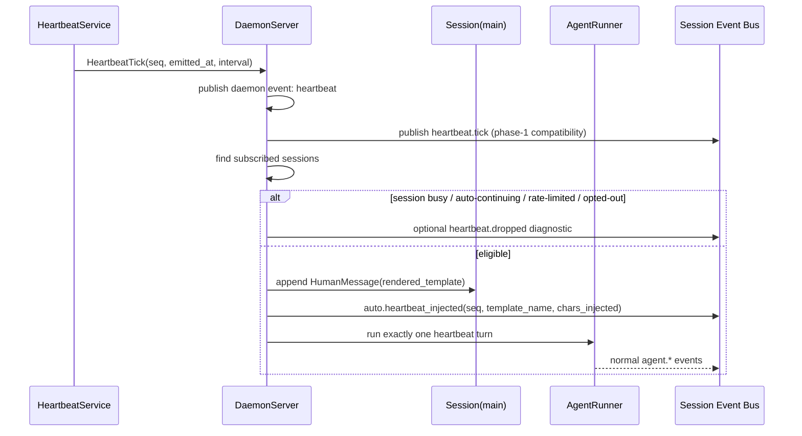

# Architecture Artifact: Task 10374 — Heartbeat Phase 2: Main-Agent Tick Subscription + Prompt Injection

## Context

Phase 1 introduced a daemon-owned heartbeat service (`daemon/heartbeat.py`) that emits periodic `HeartbeatTick` objects and fans them out through `DaemonServer._handle_heartbeat_tick()`. Today the tick is intentionally passive: it publishes daemon/session events only and never wakes an agent.

Task 10374 wires this tick stream into the main KAI agent loop so auto-mode sessions can receive a fresh self-prompt on cadence. The design must preserve Phase 1 behavior for non-subscribed sessions, avoid queued heartbeat backlogs, protect token spend, and keep the injected prompt git-tracked.

Relevant existing code inspected:

- `daemon/heartbeat.py`
  - `HeartbeatConfig(enabled=True, interval_seconds=60.0, publish_session_events=True)`
  - `load_heartbeat_config()` reads `daemon.heartbeat.*` from `agent-config.json` and env overrides including `KAI_HEARTBEAT_INTERVAL_SECONDS`.
  - `HeartbeatService.emit_once()` builds `HeartbeatTick` and invokes the callback.
- `daemon/server.py`
  - `DaemonServer.startup()` creates `HeartbeatService`.
  - `_handle_heartbeat_tick()` publishes `heartbeat` on `DaemonEventBus` and `heartbeat.tick` session events.
  - `run_input()` serializes turns with `ManagedSession.input_lock` and sets `current_input_task` / activity status.
  - `/api/metrics` and `/api/health` already include heartbeat status.
- `daemon/core.py`
  - `Session.start_auto_mode()` enables autonomous mode.
  - `Session.stream_agent_events()` runs one input and, when `auto_mode` is enabled, may continue internally while `AUTO_STATE: continue` is emitted.
  - `chat_history` is shared with `AgentRunner.chat_history`; injected prompts must be added as `HumanMessage` entries.
- `agent/taskboard_dispatcher.py`
  - Taskboard-fire sessions call `managed.session.start_auto_mode()` before their run; these spawn sessions must default heartbeat subscription off.
- `tests/test_heartbeat.py`
  - Existing tests assert Phase 1 ticks fan out without agent wakeup. These should be updated only where a subscribed main-agent session is intentionally enabled; non-subscribed behavior remains covered.

## Goals / Acceptance Mapping

1. Change default heartbeat cadence from 60 seconds to 30 minutes (`1800` seconds) while preserving `KAI_HEARTBEAT_INTERVAL_SECONDS` override.
2. Load a daemon-start heartbeat prompt template from a git-tracked file. Default: `prompts/heartbeat/main.md.tmpl`; config-overridable path.
3. Subscribe eligible main-agent sessions on `start_auto_mode`; on each tick append rendered template as `HumanMessage` and trigger exactly one agent turn.
4. Drop ticks when the session is busy, mid-tool-call, or already auto-continuing. Do not queue missed ticks.
5. Add per-session opt-out: `heartbeat_subscribed: false`; default true for KAI main agent; default false for taskboard-fire sessions.
6. Emit telemetry event `auto.heartbeat_injected` with `seq`, `template_name`, `chars_injected`; expose `heartbeat.subscribers_count` in health/metrics.
7. Add unit, integration, and e2e coverage.
8. Add configurable cap: default max 4 heartbeat-injected turns/hour.

## Recommended Design

### High-Level Flow



### Component Additions

#### 1. Extend `HeartbeatConfig`

Update `daemon/heartbeat.py`:

```python
@dataclass(frozen=True)
class HeartbeatConfig:
    enabled: bool = True
    interval_seconds: float = 1800.0
    publish_session_events: bool = True
    prompt_template_path: str = "prompts/heartbeat/main.md.tmpl"
    max_injected_turns_per_hour: int = 4
```

Config keys under `daemon.heartbeat`:

```json
{
  "daemon": {
    "heartbeat": {
      "enabled": true,
      "interval_seconds": 1800,
      "publish_session_events": true,
      "prompt_template_path": "prompts/heartbeat/main.md.tmpl",
      "max_injected_turns_per_hour": 4
    }
  }
}
```

Env overrides:

- Existing: `KAI_HEARTBEAT_ENABLED`
- Existing: `KAI_HEARTBEAT_INTERVAL_SECONDS`
- Existing: `KAI_HEARTBEAT_PUBLISH_SESSION_EVENTS`
- New recommended: `KAI_HEARTBEAT_PROMPT_TEMPLATE_PATH`
- New recommended: `KAI_HEARTBEAT_MAX_INJECTED_TURNS_PER_HOUR`

Validation:

- Clamp `interval_seconds` to `>= 0.1` as current code does.
- Clamp `max_injected_turns_per_hour` to `>= 0`; `0` means disable prompt injection while leaving passive heartbeat ticks active.
- Resolve relative `prompt_template_path` against repo root / current process CWD consistently. Prefer a helper anchored at `Path(__file__).resolve().parent.parent` so tests and daemon launches are stable.

#### 2. Add Template Loader

Create a small, testable helper, preferably in `daemon/heartbeat.py` or a new `daemon/heartbeat_prompt.py`.

Recommended contract:

```python
@dataclass(frozen=True)
class HeartbeatPromptTemplate:
    name: str              # basename or config logical name, e.g. main.md.tmpl
    path: Path
    content: str

    def render(self, tick: HeartbeatTick, *, session_name: str, agent_name: str | None) -> str:
        ...
```

Template rendering should be intentionally simple: Python `str.format_map()` with a safe dict is enough. Do not introduce Jinja unless the project already depends on it.

Supported variables:

- `{seq}`
- `{emitted_at}`
- `{interval_seconds}`
- `{session_name}`
- `{agent_name}`
- `{source}`
- `{reason}`

Failure policy:

- Daemon startup should fail fast if the configured template file is missing or unreadable. This prevents silent prompt drift and misconfiguration.
- Rendering failures on a tick should not crash the heartbeat loop; increment heartbeat failure/diagnostic counters and publish/drop the tick without agent wakeup.
- Unknown template variables should render as empty or be left literal; choose one behavior and cover it with a unit test. Recommendation: use a `SafeFormatDict` that leaves unknown placeholders literal, making template mistakes visible in chat history.

Default template file to add:

`prompts/heartbeat/main.md.tmpl`

Suggested content:

```markdown
Heartbeat tick {seq} at {emitted_at} UTC.

You are in autonomous mode. Briefly inspect current state, continue any useful pending work, and stop if there is nothing actionable.

End with the required AUTO_STATE footer.
```

This is intentionally compact to reduce recurring token spend.

#### 3. Session-Level Subscription State

Add to `daemon/core.py::Session`:

```python
self.heartbeat_subscribed: bool = False
self.heartbeat_injection_timestamps: deque[float] = deque()
self._heartbeat_turn_active: bool = False
```

Also persist/load `heartbeat_subscribed` if session config/state persistence is desired. The acceptance says “session config flag”; the cleanest minimal implementation is:

- Include `heartbeat_subscribed` in `Session.save()` state.
- Load it in `Session.load()` if present.
- Add a setter method:

```python
def set_heartbeat_subscribed(self, enabled: bool) -> None:
    self.heartbeat_subscribed = bool(enabled)
    self.publish_event("heartbeat.subscription", {"subscribed": self.heartbeat_subscribed})
```

Defaulting rules:

- KAI main agent session: default true when `start_auto_mode()` is called, unless state/config explicitly set `heartbeat_subscribed` false.
- Taskboard-fire spawn sessions: default false before calling `start_auto_mode()`.

To make invalid states less likely, avoid inferring from names in many places. Add a boolean parameter to `Session.start_auto_mode()`:

```python
def start_auto_mode(..., heartbeat_subscribed: bool | None = None):
    if heartbeat_subscribed is not None:
        self.set_heartbeat_subscribed(heartbeat_subscribed)
    elif not self.taskboard_dispatcher and self.agent_name == "kai":
        # default true for main KAI only if not explicitly disabled
        self.heartbeat_subscribed = True
```

However, beware persisted explicit `false`. Recommended stronger model:

- Track `self.heartbeat_subscription_configured: bool = False`.
- `set_heartbeat_subscribed()` sets configured true.
- `start_auto_mode(heartbeat_subscribed=None)` applies default only when not configured.

Minimal acceptable alternative:

- `start_auto_mode(..., heartbeat_subscribed=True)` default, and taskboard dispatcher passes `False`.
- This is simpler but can overwrite a persisted/user opt-out if `/auto` is used. If implemented, add a follow-up action item for durable explicit opt-out handling.

#### 4. Suppression Rules

Implement eligibility centrally to make unit testing easy.

Recommended new method on `DaemonServer` or a helper:

```python
def heartbeat_injection_decision(self, managed: ManagedSession, tick: HeartbeatTick) -> tuple[bool, str]:
    session = managed.session
    if not session.heartbeat_subscribed:
        return False, "not_subscribed"
    if not session.auto_mode:
        return False, "auto_mode_off"
    if managed.input_lock.locked():
        return False, "busy"
    if managed.current_input_task is not None and not managed.current_input_task.done():
        return False, "mid_turn"
    runner = session.agent_runner
    if runner is not None and getattr(runner, "_active_recorder", None) is not None:
        return False, "mid_tool_call"
    if runner is not None and getattr(runner, "_is_auto_continuation", False):
        return False, "auto_continuing"
    if session._heartbeat_turn_active:
        return False, "heartbeat_turn_active"
    if rate_limit_exceeded(session, now=time.monotonic()):
        return False, "rate_limited"
    return True, "ok"
```

Notes:

- `managed.input_lock.locked()` is the most reliable existing guard for “mid-turn” because `run_input()` holds it across the entire streamed turn and any internal auto-continuations.
- `_is_auto_continuation` is reset in `Session.stream_agent_events()` finally blocks; use it as an additional guard, not the only guard.
- “mid-tool-call” is likely already covered by `input_lock`, but check `AgentRunner` internals for any active recorder/tool state. If no precise flag exists, add one near tool execution in `agent/core.py` (e.g. `_tool_call_depth` increment/decrement) and expose `is_tool_call_active` property. Do not rely only on activity label text.
- Dropped ticks are not queued. Do not append to `input_queue`.

#### 5. Trigger Exactly One Auto-Mode Iteration

Current `Session.stream_agent_events()` can perform multiple turns in a single `run_input()` call when `auto_mode` is true and the model returns `AUTO_STATE: continue`. Heartbeat acceptance requires a single auto-mode iteration, not a full re-run.

Recommended implementation: add a `single_auto_iteration` parameter to `Session.stream_agent_events()` and `DaemonServer.run_input()`.

```python
async def run_input(..., single_auto_iteration: bool = False):
    async for event in managed.session.stream_agent_events(..., single_auto_iteration=single_auto_iteration):
        ...
```

In `stream_agent_events()`, after one agent turn and after publishing `auto.progress`, if `single_auto_iteration` is true:

- Do not parse/enforce hidden `AUTO_CONTINUE` loop beyond this turn.
- Do not call `stop_auto_mode()` just because the heartbeat turn ended.
- Leave `session.auto_mode` enabled for future heartbeat/user turns.
- Decrement `auto_iterations_remaining` by one as normal.
- If iteration budget reaches 0, stop auto mode with existing “iteration budget exhausted”.
- If the model explicitly returns `AUTO_STATE: done` or `pause`, it is acceptable to stop auto mode using existing semantics; the key is to avoid hidden self-continuation loops triggered by one heartbeat.

Pseudo-control-flow insertion:

```python
# after one agent_runner.run() turn
if self.auto_mode:
    self.auto_iterations_remaining = max(0, self.auto_iterations_remaining - 1)
    yield auto_progress

    if single_auto_iteration:
        if self.auto_iterations_remaining <= 0:
            yield auto_stopped("iteration budget exhausted")
        elif auto_state in {"done", "pause"}:
            yield auto_stopped(auto_reason or ...)
        # For continue/malformed, do not inject hidden turn; just return.
        break
```

This isolates heartbeat behavior without changing ordinary `/auto` or taskboard-fire runs.

#### 6. Heartbeat Injection Handler

Modify `DaemonServer._handle_heartbeat_tick()`:

1. Preserve existing Phase 1 fanout first:
   - Publish daemon event `heartbeat`.
   - Publish session event `heartbeat.tick` if enabled.
2. Then iterate sessions and inject only where eligible.
3. Start the one-turn run in a background task so the heartbeat service callback is not blocked by LLM execution.

Recommended helper methods:

```python
async def _handle_heartbeat_tick(self, tick: HeartbeatTick) -> None:
    await self._publish_heartbeat_tick_events(tick)
    self._trigger_heartbeat_subscribers(tick)


def _trigger_heartbeat_subscribers(self, tick: HeartbeatTick) -> None:
    for managed in list(self.sessions.values()):
        ok, reason = self._heartbeat_injection_decision(managed, tick)
        if not ok:
            self._publish_heartbeat_drop(managed, tick, reason)  # optional diagnostic
            continue
        task = asyncio.create_task(self._run_heartbeat_turn(managed, tick), name=f"heartbeat-{managed.session.name}-{tick.seq}")
        task.add_done_callback(_consume_task_exception)
```

In `_run_heartbeat_turn()`:

```python
prompt = self.heartbeat_prompt_template.render(...)
managed.session.chat_history.append(HumanMessage(content=prompt))
managed.session.agent_runner.chat_history = managed.session.chat_history
managed.session.record_heartbeat_injection(now)
managed.session.publish_event("auto.heartbeat_injected", {
    "seq": tick.seq,
    "template_name": self.heartbeat_prompt_template.name,
    "chars_injected": len(prompt),
})
managed.session._heartbeat_turn_active = True
try:
    await self.run_input(
        managed,
        prompt,
        source="heartbeat",
        job_id=f"heartbeat:{tick.seq}",
        single_auto_iteration=True,
    )
finally:
    managed.session._heartbeat_turn_active = False
```

Important chat-history detail:

- `AgentRunner.run(user_input)` appends `HumanMessage(content=user_input)` internally in `agent/core.py` around line 799. If `_run_heartbeat_turn()` also appends before calling `run_input(prompt)`, the prompt may be duplicated.
- Acceptance explicitly says the tick injects the rendered prompt into `chat_history` as a `HumanMessage` and triggers the iteration. There are two safe implementation options:

Option A (recommended): add `pre_injected_input: bool = False` to `run_input()` / `stream_agent_events()` / `AgentRunner.run()` so heartbeat can append once and tell the runner not to append the same user input again. This is precise but touches more call sites.

Option B: let `AgentRunner.run(prompt)` append the `HumanMessage` and treat that as the injection; emit telemetry immediately before running. This is minimal but less explicit and makes the integration assertion rely on normal run behavior rather than a dedicated injection path.

Recommended for acceptance clarity: Option A. Add tests that count only one heartbeat prompt in `chat_history`.

#### 7. Subscriber Count

Expose `heartbeat.subscribers_count` in `metrics_snapshot()` and therefore `/api/health`.

Definition:

```python
def heartbeat_subscribers_count(self) -> int:
    return sum(
        1 for managed in self.sessions.values()
        if managed.session.heartbeat_subscribed and managed.session.auto_mode
    )
```

Include in heartbeat metrics:

```python
"subscribers_count": self.heartbeat_subscribers_count(),
"max_injected_turns_per_hour": self.heartbeat_config.max_injected_turns_per_hour,
"prompt_template_name": self.heartbeat_prompt_template.name,
```

Acceptance only requires `subscribers_count`, but the additional fields help operations verify config.

#### 8. Rate Limit / Token Cost Protection

Add per-session sliding-window rate limiting.

- Store monotonic timestamps of successful heartbeat injections in a `deque` on `Session`.
- Before injection, drop timestamps older than 3600 seconds.
- If count >= `max_injected_turns_per_hour`, drop tick with reason `rate_limited`.
- Default 4. With 30-minute cadence this allows two expected ticks and two catch-up/safety ticks per hour if cadence is temporarily shorter in tests/dev.

This limiter applies to successful injections only, not passive `heartbeat.tick` events.

#### 9. Session Opt-Out Defaults

Main KAI session:

- On `/auto` command, call `session.start_auto_mode(..., heartbeat_subscribed=True)` unless the session has explicit opt-out.
- If a direct API path starts auto mode, use the same default.

Taskboard-fire sessions:

- In `agent/taskboard_dispatcher.py`, change current call:

```python
managed.session.start_auto_mode(max_iterations=max_iters, readonly=False)
```

to:

```python
managed.session.start_auto_mode(
    max_iterations=max_iters,
    readonly=False,
    heartbeat_subscribed=False,
)
```

This prevents background heartbeat prompts from perturbing architecture/developer/QA taskboard sessions.

Config flag:

- Accept persisted session state `heartbeat_subscribed: false`.
- If there is already a session config system outside inspected files, use the same field name there. Otherwise state persistence is sufficient for this task.

## Rejected Alternatives

### Alternative A: Use Scheduler Jobs for Heartbeat Wakeups

Rejected because the task explicitly says scheduled-job-style “every X minutes” jobs are out of scope and already handled by the BIO scheduler. Heartbeat should remain a daemon-level fresh signal, not a durable job backlog.

### Alternative B: Enqueue Heartbeat Prompts in `input_queue`

Rejected because acceptance requires dropped ticks when busy and no backlog. `input_queue` would create stale work and surprise token spend after a long busy period.

### Alternative C: Let Every Session Subscribe by Default

Rejected because taskboard-fire sessions run long autonomous implementation jobs. Injecting heartbeat prompts into those sessions could corrupt task-specific prompts, break completion semantics, and inflate token cost. Defaults must be role/session aware.

### Alternative D: Invoke Full Auto-Mode Loop on Tick

Rejected because a heartbeat should trigger a single cadence check, not consume the entire remaining auto budget or enter hidden `AUTO_CONTINUE` loops. A `single_auto_iteration` mode is needed.

### Alternative E: Store Template in Vault

Rejected by constraint: “No prompt drift: the template is git-tracked, not Vault.”

## Data Contracts

### Heartbeat Tick Payload (Existing)

Published on daemon channel `heartbeat` and session topic `heartbeat.tick`:

```json
{
  "seq": 12,
  "emitted_at": "2026-05-06T16:30:00Z",
  "monotonic_seconds": 123456.78,
  "interval_seconds": 1800.0,
  "source": "daemon",
  "reason": "periodic",
  "type": "heartbeat.tick",
  "pending": false,
  "agent_wakeup_enabled": true
}
```

For non-subscribed sessions, keep `agent_wakeup_enabled: false` or omit new meaning. For subscribed sessions, it is acceptable to set true in session event payload, but do not change the daemon event contract.

### Injected Telemetry Event

Session event topic: `auto.heartbeat_injected`

Payload:

```json
{
  "seq": 12,
  "template_name": "main.md.tmpl",
  "chars_injected": 231
}
```

Optional useful additions that do not violate acceptance:

```json
{
  "session": "terminal",
  "source": "heartbeat",
  "emitted_at": "2026-05-06T16:30:00Z"
}
```

### Optional Drop Diagnostic

Not required, but recommended for debugging:

Topic: `auto.heartbeat_dropped`

```json
{
  "seq": 12,
  "reason": "busy|mid_turn|mid_tool_call|auto_continuing|rate_limited|not_subscribed|auto_mode_off",
  "subscribed": true
}
```

Do not expose this as an error.

### Health / Metrics

`GET /api/health` heartbeat object should include:

```json
{
  "enabled": true,
  "running": true,
  "interval_seconds": 1800.0,
  "publish_session_events": true,
  "tick_count": 10,
  "failure_count": 0,
  "last_tick": {...},
  "subscribers_count": 1
}
```

## Failure Modes and Handling

1. **Template missing at daemon start**
   - Fail startup with a clear error naming only the path, no secrets.
   - Rationale: prompt drift/misconfiguration should be obvious.

2. **Template render exception at tick time**
   - Drop injection for that tick.
   - Preserve passive tick publication.
   - Log warning and optionally increment a render/drop counter.

3. **Session busy / tool active / auto-continuing**
   - Drop tick, no queue.
   - Optional `auto.heartbeat_dropped` event.

4. **Rate limit exceeded**
   - Drop tick, no queue.
   - Passive Phase 1 heartbeat still emitted.

5. **Heartbeat-triggered run crashes**
   - `run_input()` already captures errors into `InputRunResult` and publishes `agent.error`.
   - Ensure background task exceptions are consumed via existing `_consume_task_exception` pattern.
   - Reset `_heartbeat_turn_active` in `finally`.

6. **Agent returns `AUTO_STATE: continue`**
   - In heartbeat single-iteration mode, do not inject hidden “Continue with the next step.”
   - Leave auto mode enabled unless budget exhausted.

7. **Agent returns `AUTO_STATE: done/pause`**
   - Existing stop semantics may apply. This is acceptable; the heartbeat prompt asks the agent to stop if nothing actionable.

8. **Non-subscribed sessions**
   - Must continue receiving only passive `heartbeat.tick` events if `publish_session_events` is true.
   - No prompt injection, no input queue changes, no `current_input_task` created.

## Implementation Sequence

1. **Config and Template Loader**
   - Change default interval to `1800.0` in `HeartbeatConfig` and `load_heartbeat_config()` fallback.
   - Add `prompt_template_path` and `max_injected_turns_per_hour` fields + env overrides.
   - Add `HeartbeatPromptTemplate` loader/renderer.
   - Add `prompts/heartbeat/main.md.tmpl`.
   - Unit tests for defaults, env overrides, path load, render variables, missing file failure.

2. **Session Subscription State**
   - Add `heartbeat_subscribed` state and setter to `Session`.
   - Persist/load the flag.
   - Extend `start_auto_mode()` with subscription parameter/default behavior.
   - Update taskboard dispatcher to pass `heartbeat_subscribed=False`.

3. **Single-Iteration Run Support**
   - Add `single_auto_iteration` plumbing through `DaemonServer.run_input()` and `Session.stream_agent_events()`.
   - Ensure ordinary auto mode remains unchanged.
   - Test that `AUTO_STATE: continue` does not cause a second hidden turn when `single_auto_iteration=True`.

4. **Injection Handler**
   - Load template once in `DaemonServer.__init__` or `startup()`.
   - Add `_heartbeat_injection_decision()` and `_run_heartbeat_turn()`.
   - In `_handle_heartbeat_tick()`, preserve Phase 1 publish behavior then trigger eligible subscribers.
   - Add rate limiter.
   - Emit `auto.heartbeat_injected` telemetry.

5. **Health/Metrics**
   - Add `subscribers_count` under heartbeat in `metrics_snapshot()`.
   - Ensure `/api/health` inherits it.

6. **Tests**
   - Update existing config tests to expect 1800 default where no override is provided.
   - Add suppression-rule unit tests.
   - Add integration test: start auto mode on a main session, emit tick, assert one `HumanMessage` with rendered template appears in `chat_history` and `auto.heartbeat_injected` event is published.
   - Add non-subscribed/taskboard test: tick does not mutate `chat_history` or queue.
   - Add e2e/smoke test with a short overridden interval (e.g. 0.2s) to avoid waiting 30 minutes, plus one test that asserts default interval value is 1800. For true “30 min boundary” validation, use fake clock/controlled `emit_once()` rather than sleeping.

7. **Docs / Operational Notes**
   - Add a short section in local docs referencing the external target `docs.openclaw.ai/gateway/heartbeat`.
   - Document config keys and env overrides.

## Test Plan Detail

### Unit Tests

- `load_heartbeat_config({})` returns `interval_seconds == 1800.0`.
- `KAI_HEARTBEAT_INTERVAL_SECONDS` still overrides to custom value.
- Template loader reads `prompts/heartbeat/main.md.tmpl`; returned `name == "main.md.tmpl"`.
- Template render substitutes `seq`, `emitted_at`, `session_name`, `agent_name`.
- Missing template path raises a clear exception at startup/load.
- Rate limiter allows first N injections in a rolling hour and rejects N+1.
- Suppression decisions return false for:
  - not subscribed
  - auto mode off
  - `input_lock.locked()`
  - current input task active
  - runner tool-call active flag
  - `_is_auto_continuation` true
  - rate limited

### Integration Tests

- Create `DaemonServer` with disabled background heartbeat but call `emit_once()` manually.
- Create session `terminal`, attach fake runtime, start auto mode with heartbeat subscribed.
- Emit tick.
- Await `auto.heartbeat_injected` event.
- Assert:
  - one rendered heartbeat `HumanMessage` in `session.chat_history`
  - `chars_injected` equals rendered prompt length
  - `template_name` matches default template
  - `managed.session.input_queue == []`
  - `auto_mode` remains enabled unless fake agent returns done/pause

### Non-Regression Tests

- Existing Phase 1 test: with no subscription, `heartbeat.tick` still publishes and does not wake agent.
- Taskboard-fire session: after dispatcher starts auto mode, `heartbeat_subscribed` is false and tick does not inject.

### E2E / Smoke

- Start daemon with `KAI_HEARTBEAT_INTERVAL_SECONDS=0.2` and `KAI_HEARTBEAT_MAX_INJECTED_TURNS_PER_HOUR=1` in a controlled test environment.
- Attach/start main auto-mode session.
- Wait for tick and observe `auto.heartbeat_injected` via WebSocket/session event.
- Assert health reports `subscribers_count == 1` while subscribed.
- Separately assert production default config is 1800 seconds; do not make CI sleep 30 minutes.

## Rollout Guardrails

- Default `max_injected_turns_per_hour=4` to cap recurring spend.
- Taskboard-fire sessions default opt-out to avoid interfering with implementation agents.
- Passive ticks remain active even when injection fails/suppresses.
- Daemon startup fails fast on missing template so operators catch bad deploys immediately.
- Emit clear telemetry for every successful injection.
- Prefer optional drop telemetry for diagnosing why a subscribed session did not wake.
- Keep template compact and git-reviewed.

## Risks

1. **Duplicate HumanMessage injection**
   - Existing `AgentRunner.run()` appends user input. If heartbeat code also appends, chat history can contain duplicates. Mitigate with a `pre_injected_input` flag or by centralizing the append in one place and testing exact count.

2. **Changing auto-loop semantics globally**
   - Adding `single_auto_iteration` must be opt-in for heartbeat only. Ordinary `/auto` and taskboard dispatcher runs should continue current behavior.

3. **Busy-state race**
   - A session can become busy between eligibility check and background task start. Mitigate by rechecking under `managed.input_lock` or relying on `run_input()` lock plus `_heartbeat_turn_active`; if lock is acquired later, still no queue is formed, but the task may wait. Prefer a non-blocking guard: recheck at `_run_heartbeat_turn()` start and drop if locked.

4. **Long heartbeat run overlaps next tick**
   - Suppression via `input_lock` and `_heartbeat_turn_active` drops the next tick.

5. **Persisted opt-out ambiguity**
   - If `start_auto_mode()` blindly defaults true, it can override a saved false. Track explicit configuration or have caller pass default only when no saved value exists.

6. **Test fragility around real LLMs**
   - Integration tests should use fake runtimes/runners; e2e smoke can use short interval and controlled fake model where available.

## Acceptance Criteria Checklist

- [ ] Default cadence changed to 30 minutes (`daemon.heartbeat.interval_seconds = 1800`) with `KAI_HEARTBEAT_INTERVAL_SECONDS` override preserved.
- [ ] Configurable git-tracked heartbeat template loaded at daemon start; default path `prompts/heartbeat/main.md.tmpl`.
- [ ] Main KAI auto-mode session subscribes on `start_auto_mode` and tick injects rendered prompt as exactly one `HumanMessage`.
- [ ] Tick triggers exactly one auto-mode iteration, not a hidden full auto continuation loop.
- [ ] Suppression drops ticks when busy, mid-turn, mid-tool-call, auto-continuing, or rate-limited; no queue/backlog.
- [ ] Session opt-out flag `heartbeat_subscribed: false`; main KAI default true; taskboard-fire default false.
- [ ] Telemetry event `auto.heartbeat_injected` includes `seq`, `template_name`, `chars_injected`.
- [ ] `/api/health` exposes `heartbeat.subscribers_count`.
- [ ] Unit, integration, e2e/smoke tests added as described.
- [ ] Phase 1 passive tick behavior preserved for non-subscribed sessions.
- [ ] Injection cap configurable, default 4 per hour.

## Recommended Owner Handoff

Implementation should be assigned to a developer familiar with `daemon/server.py` and `daemon/core.py`. The highest-risk code path is the single-iteration heartbeat run because it touches auto-mode continuation semantics. Code review should focus on ensuring heartbeat-specific behavior is opt-in and that taskboard-fire sessions cannot receive heartbeat prompt injections by default.
