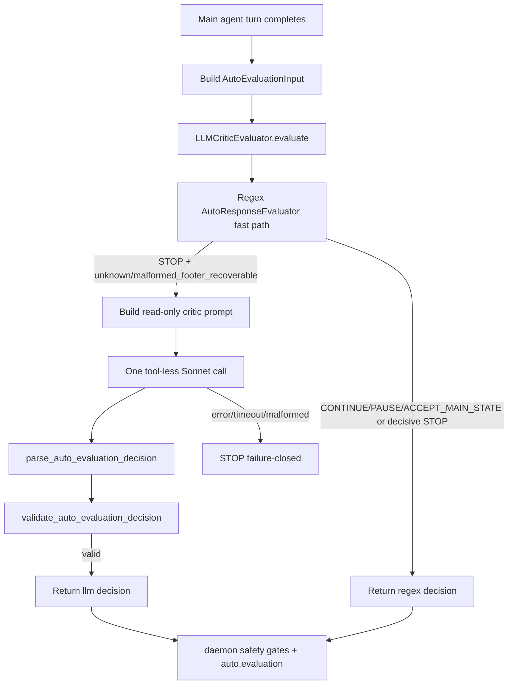

# Architecture Artifact — Task 10375

## Title
`auto-loop-brain` LLM critic: tool-less Sonnet evaluator fallback for `/auto` continuation decisions

## Context inspected

Repository artifacts reviewed:

- `agent/auto_evaluator.py` — current deterministic `AutoResponseEvaluator`, strict `AutoEvaluationInput` / `AutoEvaluationDecision` dataclasses, parser/validator, template renderer, confidence floor.
- `daemon/core.py` — session-owned `/auto` loop, evaluator call site, hidden auto-reply injection, loop/budget gates, `auto.evaluation` event emission.
- `agent/core.py` — main agent chat history, hidden continuation behavior, active history view passed to the main LLM.
- `tests/test_auto_evaluator.py` and `tests/test_auto_mode.py` — existing parser, validator, regex evaluator, and auto-loop regression surface.
- `AUTO-MODE-DESIGN.md`, `AUTO-MODE-CRITIC-REVIEW.md`, and `docs/architecture/10369-auto-agent-mode.md` — prior decisions narrowing `/auto` to a session-owned loop with daemon-owned safety gates and strict evaluator JSON.
- `agent-config.json` / `config.py` — existing configuration shape and endpoint registry.

No code changes are included in this architecture artifact beyond writing this design file.

## Problem statement

The current `/auto` evaluator is deterministic and safe, but its regex body cannot reliably recognize novel permission-deflection or premature-stop phrasings. It can continue only when a hard-coded phrase pattern fires; otherwise it returns `STOP` with `pattern="unknown"` or, for some recoverable footer cases, `pattern="malformed_footer_recoverable"`.

Dan's operational complaint is that an autonomous loop should not stop when the main agent asks an obviously unnecessary question such as “continue?” or “proceed?” after already describing a safe next step. Regex catches some examples but not the long tail.

The system needs a semantic critic that can read the main session context and the just-finished assistant turn, but it must not become a second autonomous actor. It should classify one turn, return strict JSON, and let existing daemon safety gates remain authoritative.

## Recommendation

Add a new `agent/auto_loop_brain.py` module exposing `LLMCriticEvaluator` with the same public evaluator interface:

```python
class LLMCriticEvaluator:
    def evaluate(self, data: AutoEvaluationInput) -> AutoEvaluationDecision: ...
```

`LLMCriticEvaluator` should wrap the existing regex evaluator as a pre-filter:

1. Run `AutoResponseEvaluator.evaluate(data)` first.
2. If the regex decision is anything other than `STOP`, return the regex decision unchanged and emit telemetry as `evaluator_kind="regex"`.
3. If the regex decision is `STOP` but `pattern` is not in `{"unknown", "malformed_footer_recoverable"}`, return the regex decision unchanged.
4. Only for `STOP` + indecisive pattern, make exactly one tool-less LLM call to the configured critic model.
5. Parse and validate the LLM's strict JSON with existing `parse_auto_evaluation_decision()` and `validate_auto_evaluation_decision()`.
6. On any model error, timeout, invalid JSON, schema failure, or low-confidence `CONTINUE`, return a conservative `STOP`.

This preserves bounded cost and failure-closed behavior while replacing the brittle “unknown” stop path with a semantic classifier.

## High-level design



Key architectural rule: the critic is a classifier, not an actor. It receives context and emits a schema-bound decision; it never receives tools, never sends NATS messages, never edits files, never places trades, and never creates arbitrary continuation text.

## Chosen component boundaries

### 1. `agent/auto_evaluator.py` remains the contract module

Keep the existing dataclasses and strict parser/validator here:

- `AutoEvaluationInput`
- `AutoEvaluationDecision`
- `ToolCallSummary`
- `parse_auto_evaluation_decision()`
- `validate_auto_evaluation_decision()`
- `render_auto_reply()`
- `MIN_CONTINUE_CONFIDENCE`

Small required contract updates:

- Add `"clarify_misread_main"` to `AutoReplyTemplate` and `AUTO_REPLY_TEMPLATE_NAMES`.
- Add the rendered template text:
  - `clarify_misread_main`: `It looks like the main agent misread the request — re-read the original task and proceed with the safe next step you described.`
- Decide read-only semantics explicitly. Recommendation: do **not** add `clarify_misread_main` to `READONLY_AUTO_REPLY_TEMPLATES` unless QA proves it cannot cause mutation. It tells the main agent to “proceed with the safe next step,” which may be broader than read-only. In readonly mode, validator should continue to allow only `proceed_readonly_analysis`.
- Add any new LLM-specific pattern names only if truly needed. Acceptance criteria require existing schema; avoid expanding `PATTERNS` unless implementation needs a distinct `misread_main` pattern. The new template can be paired with `pattern="unknown"` or `pattern="declared_next_step"`.

### 2. New `agent/auto_loop_brain.py`

Expose `LLMCriticEvaluator`.

Recommended constructor:

```python
@dataclass(frozen=True)
class AutoLoopBrainConfig:
    model: str
    timeout_seconds: float = 20.0
    max_input_chars: int = 120_000
    max_output_tokens: int = 512
    temperature: float = 0.0

class LLMCriticEvaluator:
    min_continue_confidence = MIN_CONTINUE_CONFIDENCE

    def __init__(
        self,
        *,
        chat_history_provider: Callable[[], Sequence[Any]],
        llm_client: ToollessLLMClient,
        config: AutoLoopBrainConfig,
        regex_evaluator: AutoResponseEvaluator | None = None,
        telemetry: AutoLoopBrainTelemetry | None = None,
    ): ...

    def evaluate(self, data: AutoEvaluationInput) -> AutoEvaluationDecision: ...
```

Why inject `chat_history_provider` instead of adding `chat_history` to `AutoEvaluationInput`?

- Acceptance criterion 1 says the evaluator must preserve the same `evaluate(AutoEvaluationInput) -> AutoEvaluationDecision` signature.
- Acceptance criterion 3 says the critic receives full `chat_history`.
- Constructor injection satisfies both: `evaluate()` signature stays unchanged, while the evaluator can read a read-only snapshot from the owning `Session` at call time.

The provider must return a copied/sanitized read-only view, not the mutable session list. Example integration: `chat_history_provider=lambda: tuple(self.chat_history)`.

### 3. Tool-less LLM client abstraction

Do not call `claude_exec` or any agent/sub-agent tool. Those are tool-enabled autonomous executors and violate the “pure pattern recognizer” boundary.

Add a tiny internal client abstraction used only by the critic, for example:

```python
class ToollessLLMClient(Protocol):
    def complete_json(self, *, model: str, system: str, user: str, timeout: float) -> LLMResult: ...

@dataclass(frozen=True)
class LLMResult:
    text: str
    model_id: str
    usage: TokenUsage | None = None
```

Implementation options:

- Preferred: direct Anthropic Messages API via the existing `ANTHROPIC_API_KEY` secret loading path. Call with `tools=[]` or omit tools entirely, `temperature=0`, and a small `max_tokens` (512).
- Acceptable if the internal gateway supports Anthropic/Sonnet without tools: a direct OpenAI-compatible JSON call to that gateway with no tool definitions. The implementation must document the actual provider and ensure no tool schema is attached.

Model requirement:

- Default model should be a Sonnet 4.6-or-newer identifier configured in `agent-config.json` under `daemon.auto_loop_brain.model`.
- Operators may override to Opus 4.7 via the same config field.
- Startup/config validation should fail closed or disable the LLM critic if the configured model is below Sonnet 4.6. Do not silently downgrade to a cheaper/weaker model.

### 4. Daemon integration

Replace `Session.auto_response_evaluator = AutoResponseEvaluator()` with an evaluator factory:

```python
self.auto_response_evaluator = build_auto_response_evaluator(
    config=DAEMON_AUTO_LOOP_BRAIN_CONFIG,
    chat_history_provider=lambda: tuple(self.chat_history),
)
```

Recommended modes:

- `daemon.auto_loop_brain.enabled`: default `true` after tests pass; allow emergency disable.
- `daemon.auto_loop_brain.model`: required/default Sonnet 4.6+.
- `daemon.auto_loop_brain.timeout_seconds`: default 20.
- `daemon.auto_loop_brain.max_input_chars`: default enough for full taskboard sessions but with deterministic truncation if exceeded.
- `daemon.auto_loop_brain.shadow`: optional rollout mode where the LLM decision is emitted but the regex decision controls behavior.

If `enabled=false`, factory returns the existing regex `AutoResponseEvaluator`.

### 5. Telemetry and cost accounting

Current `AutoEvaluationDecision.to_event_payload()` lacks evaluator metadata. Add metadata without changing the decision schema itself:

```json
{
  "decision": "CONTINUE",
  "confidence": 0.91,
  "pattern": "unknown",
  "reason": "main asked whether to proceed after identifying an in-scope safe next step",
  "auto_reply_template": "continue_next_safe_step",
  "evaluator_kind": "llm",
  "model_id": "claude-sonnet-4-6-...",
  "llm_usage": {
    "input_tokens": 1234,
    "output_tokens": 88,
    "estimated_cost_usd": 0.0123
  }
}
```

Recommended implementation: keep `AutoEvaluationDecision` pure, and let `LLMCriticEvaluator` expose last-call metadata or return a small internal envelope at the daemon boundary. Because acceptance criterion 1 requires the same return type, do not change `evaluate()` to return an envelope. Instead either:

- add optional non-secret fields to `AutoEvaluationDecision.to_event_payload(evaluator_kind=None, model_id=None, usage=None)`, or
- have the `Session` ask the evaluator for `last_evaluation_metadata()` after `evaluate()`.

Prefer the second option to avoid polluting the schema object with transport metadata.

Cost dashboard integration should use the same usage metadata. If no existing general LLM-cost store exists, add a minimal append-only event/counter source keyed by:

- `session_name`
- `agent_name`
- `evaluator_kind="llm"`
- `model_id`
- `input_tokens`
- `output_tokens`
- `estimated_cost_usd`
- timestamp

The dashboard can aggregate this event stream rather than coupling to evaluator internals.

## Data contracts

### Critic input prompt payload

The LLM prompt should include:

1. A fixed system instruction defining the critic role and hard constraints.
2. The full main-agent chat history in a sanitized, read-only JSON form.
3. The structured `AutoEvaluationInput` as JSON.
4. The exact allowed output schema and enums.
5. A reminder that malformed or ambiguous cases should be `STOP`.

Recommended JSON payload shape inside the user message:

```json
{
  "chat_history": [
    {"role": "user", "content": "..."},
    {"role": "assistant", "content": "..."}
  ],
  "evaluation_input": {
    "session_name": "terminal",
    "agent_name": "architect",
    "auto_mode": true,
    "readonly": false,
    "main_response": "...",
    "parsed_auto_state": "unknown",
    "parsed_auto_reason": null,
    "runtime_pause_reason": null,
    "turn_tool_calls": [{"name": "file_read", "input_key": "..."}],
    "consecutive_no_tool_turns": 1,
    "repeated_final_detected": false,
    "iterations_remaining": 42,
    "elapsed_seconds": 78.4
  },
  "allowed_output": {
    "decision": ["STOP", "CONTINUE", "PAUSE", "ACCEPT_MAIN_STATE"],
    "confidence": "number 0..1",
    "pattern": ["permission_deflection", "declared_next_step", "incomplete_artifact", "malformed_footer_recoverable", "main_done_accepted", "safety_pause", "unknown"],
    "auto_reply_template": ["continue_next_safe_step", "proceed_readonly_analysis", "finish_requested_artifact", "clarify_misread_main", null]
  }
}
```

### Critic output

Output must be strict JSON only. No Markdown fences, no prose, no tool request.

Valid example:

```json
{
  "decision": "CONTINUE",
  "confidence": 0.92,
  "reason": "The main agent asked whether to proceed, but the original task explicitly requires the next safe inspection step and no policy pause is present.",
  "pattern": "unknown",
  "auto_reply_template": "clarify_misread_main"
}
```

Invalid/malformed examples must parse to conservative `STOP`:

- Freeform text: `Continue, this is obvious.`
- Missing confidence.
- Unknown template.
- `CONTINUE` with confidence `< 0.85`.
- `CONTINUE` in readonly mode with non-readonly template.

## Prompt design

System prompt draft:

```text
You are KAI's auto-loop critic. You are a tool-less classifier, not an acting agent.

Your only job is to decide whether the daemon should auto-continue after the main agent's just-finished turn.
You must not execute actions, request tools, write plans for yourself, or ask the user questions.

Use the full chat history and the structured evaluation input. The daemon already enforces budgets, tool policy, loop detection, and approval gates. If the situation is ambiguous, unsafe, blocked, repetitive, or genuinely complete, return STOP or PAUSE.

Return exactly one JSON object and nothing else. The JSON must match this schema:
{
  "decision": "STOP|CONTINUE|PAUSE|ACCEPT_MAIN_STATE",
  "confidence": number from 0.0 to 1.0,
  "reason": "short reason, <= 240 chars",
  "pattern": "permission_deflection|declared_next_step|incomplete_artifact|malformed_footer_recoverable|main_done_accepted|safety_pause|unknown",
  "auto_reply_template": "continue_next_safe_step|proceed_readonly_analysis|finish_requested_artifact|clarify_misread_main|null"
}

Only return CONTINUE when confidence is at least 0.85 and a daemon-owned auto_reply_template is appropriate.
Never return CONTINUE to perform a dangerous operation, bypass an approval/policy pause, recover from repeated loops, or invent new work outside the user's original request.
```

## Decision semantics

- `ACCEPT_MAIN_STATE`: use only when the main agent's parsed `AUTO_STATE` is trustworthy. In the LLM fallback path the regex already stopped with an indecisive pattern, so the critic should rarely return this except for malformed-footer cases where the surrounding text clearly maps to the parsed state.
- `CONTINUE`: the only decision that can cause a hidden auto-reply. Must have confidence `>= MIN_CONTINUE_CONFIDENCE`, valid template, and pass daemon mode gates.
- `PAUSE`: use when the main turn exposes a safety/approval condition that should be shown as a pause rather than a generic stop.
- `STOP`: default for ambiguity, model failure, complete work, repeated loops, exhausted budget, or missing required context.

## Rejected alternatives

### A. Replace the regex evaluator entirely with an LLM call

Rejected. It violates the bounded-cost requirement and would spend tokens on easy deterministic cases such as explicit `[AUTO_STATE: done]`, runtime pauses, repeated-final loops, or obvious permission-deflection patterns already caught by regex.

### B. Use a sub-agent (`spawn_agent` / `nats_request`) as the critic

Rejected. Sub-agents are autonomous agents with tool surfaces and long timeouts. The critic must be tool-less and one-shot.

### C. Use `claude_exec` as the critic implementation

Rejected for production path. `claude_exec` is a tool exposed to the main assistant and can run as an autonomous coding executor. It is not a pure classifier boundary and would blur telemetry/cost accounting. Direct API/client invocation with no tools is the correct boundary.

### D. Let the critic generate arbitrary continuation prompts

Rejected. Existing daemon-owned auto-reply templates are a deliberate safety rail. Arbitrary prompts can smuggle actions, broaden scope, or bypass tool policy.

### E. Add `chat_history` to `AutoEvaluationInput`

Rejected for this task because acceptance criterion 1 requires the same `evaluate(AutoEvaluationInput) -> AutoEvaluationDecision` signature and existing tests depend on that dataclass. Inject a read-only history provider into `LLMCriticEvaluator` instead.

## Failure modes and required behavior

| Failure mode | Required behavior |
|---|---|
| Regex returns decisive `CONTINUE`, `PAUSE`, `ACCEPT_MAIN_STATE`, or non-indecisive `STOP` | No LLM call; emit/use regex result. |
| LLM API timeout/error | Conservative `STOP`, `evaluator_kind="llm"`, include non-secret error category in reason/telemetry. |
| LLM returns Markdown/prose/malformed JSON | `parse_auto_evaluation_decision()` -> `STOP`. |
| LLM returns invalid enum/template/confidence | Parser/validator -> `STOP`. |
| LLM returns `CONTINUE` with confidence < 0.85 | Validator -> `STOP`. |
| LLM returns non-readonly template while auto mode is readonly | Validator -> `STOP`. |
| LLM returns a tool request or tries to act in text | Treat as malformed or `STOP`; no tool execution path exists. |
| Chat history exceeds model/context budget | Deterministically truncate oldest middle content, keep original task/user prompt and most recent turns, record truncation metadata. |
| Missing API key or unsupported model | Disable LLM critic or fail startup according to deployment policy; never silently use weaker model. |
| Cost dashboard unavailable | Do not block safe evaluator decision, but log non-secret telemetry failure. |

## Implementation sequence

1. **Extend auto evaluator schema/templates**
   - Add `clarify_misread_main` to `AutoReplyTemplate`, template name set, and `AUTO_REPLY_TEMPLATES`.
   - Keep `MIN_CONTINUE_CONFIDENCE = 0.85` unchanged.
   - Update parser/validator tests for the new template.

2. **Add config model/loading**
   - Add `daemon.auto_loop_brain` to `agent-config.json` and `config.py` accessors.
   - Fields: `enabled`, `model`, `timeout_seconds`, `max_input_chars`, `max_output_tokens`, `temperature`, optional `shadow`.
   - Enforce Sonnet 4.6 minimum by explicit allowlist/predicate. Permit Opus 4.7 override.

3. **Implement `agent/auto_loop_brain.py`**
   - `AutoLoopBrainConfig` dataclass.
   - `LLMCriticEvaluator` with regex pre-filter and one-shot LLM fallback.
   - Prompt builder with sanitized read-only chat history.
   - Direct tool-less LLM client abstraction.
   - Failure-closed handling and last-call metadata for daemon telemetry.

4. **Wire daemon factory**
   - In `Session.__init__`, construct either regex evaluator or `LLMCriticEvaluator` based on config.
   - Inject `chat_history_provider=lambda: tuple(self.chat_history)`.
   - Ensure LLM critic is only available/used while `self.auto_mode` is true; existing call site already sits in the auto loop, but keep this invariant explicit.

5. **Telemetry update**
   - Add `evaluator_kind` and `model_id` to `auto.evaluation` event payloads.
   - For regex fast path: `evaluator_kind="regex"`, `model_id=null` or omitted consistently.
   - For LLM fallback: `evaluator_kind="llm"`, `model_id=<actual model>`, usage/cost fields if available.
   - Feed usage into cost dashboard/event store.

6. **Tests**
   - Unit tests for mocked LLM decisions: `STOP`, `CONTINUE`, `PAUSE`, `ACCEPT_MAIN_STATE`, malformed JSON, invalid template, low confidence, readonly-template rejection, API error.
   - Unit tests proving regex passthrough does not invoke LLM.
   - Unit tests proving LLM fallback invokes exactly once for `STOP` + `unknown` and `STOP` + `malformed_footer_recoverable`.
   - Integration tests in `tests/test_auto_mode.py` for regex passthrough, LLM fallback, hidden auto-reply, and telemetry fields.
   - Recorded-fixture test for a real Sonnet critic call. Gate this behind an environment marker so normal CI can run without network/secrets, but keep the fixture deterministic.

7. **Rollout**
   - First merge with `shadow=true` or environment-gated real calls if production risk is high.
   - Review telemetry for false `CONTINUE` decisions and spend.
   - Enable active fallback once malformed/unknown long-tail cases demonstrate safe improvement.

## Test plan details

### Unit: schema/template

- `parse_auto_evaluation_decision()` accepts `clarify_misread_main`.
- `render_auto_reply("clarify_misread_main")` returns the exact required text.
- `validate_auto_evaluation_decision()` preserves the 0.85 floor.
- Readonly mode rejects `clarify_misread_main` unless the team intentionally adds it to `READONLY_AUTO_REPLY_TEMPLATES`.

### Unit: `LLMCriticEvaluator`

Use a fake `ToollessLLMClient` that records calls and returns canned JSON.

Cases:

1. Regex `permission_deflection` -> `CONTINUE`; fake client call count `0`.
2. Regex explicit done -> `ACCEPT_MAIN_STATE`; fake client call count `0`.
3. Regex decisive safety pause -> no LLM.
4. Regex `STOP/unknown` -> fake client returns `CONTINUE` with `clarify_misread_main`; decision is `CONTINUE`.
5. Regex `STOP/malformed_footer_recoverable` -> fake client returns `PAUSE`; decision is `PAUSE`.
6. Fake client raises timeout -> `STOP`.
7. Fake client returns prose -> `STOP`.
8. Fake client returns `CONTINUE` confidence `0.84` -> `STOP` after validation.
9. Fake client returns unknown template -> `STOP`.

### Integration: daemon auto loop

- Regex passthrough emits `auto.evaluation` with `evaluator_kind="regex"` and no LLM cost.
- LLM fallback emits `auto.evaluation` with `evaluator_kind="llm"`, `model_id`, usage/cost metadata, and then `auto_reply` when valid.
- End-to-end recorded fixture: main agent asks a novel obvious “proceed?” question; regex returns unknown; critic returns high-confidence `CONTINUE`; daemon injects hidden template; synthetic reply is not stored as a user-authored chat message.
- Failure-closed fixture: malformed critic output stops auto and does not inject `auto_reply`.

## Rollout guardrails

- Feature flag: `daemon.auto_loop_brain.enabled`.
- Shadow mode: emits LLM decision/cost but follows regex decision.
- One-call cap: exactly one LLM call per main-agent turn and only for indecisive regex STOP.
- Timeout: default 20 seconds or lower.
- Max output: 512 tokens.
- Temperature: 0.
- Strict JSON parse/validation.
- Existing daemon gates remain outside and after evaluator: runtime pause, loop detection, iteration budget, wall-clock budget, max evaluator continuations, readonly checks.
- No tools in the critic client; no sub-agents; no shell; no `claude_exec`.
- Cost telemetry required before active rollout.

## Risks

1. **False `CONTINUE` from an over-eager critic.** Mitigation: confidence floor, restricted templates, daemon gates, shadow rollout, recorded fixtures.
2. **Cost growth during long auto-mode sessions.** Mitigation: regex pre-filter, only indecisive STOP fallback, one-shot calls, token truncation, dashboard visibility.
3. **Provider/model mismatch.** Mitigation: explicit Sonnet 4.6+ model validation; no silent downgrade.
4. **History size/context overflow.** Mitigation: deterministic truncation keeping the original task and latest turns, plus telemetry flag.
5. **Security boundary drift.** Mitigation: direct tool-less client only; tests assert no tool schemas and no agent tool invocation.
6. **Telemetry schema churn.** Mitigation: add fields as optional event payload fields while preserving existing `AutoEvaluationDecision` schema.

## Acceptance criteria mapping

1. **New module + interface** — `agent/auto_loop_brain.py` exposes `LLMCriticEvaluator.evaluate(AutoEvaluationInput) -> AutoEvaluationDecision`.
2. **Sonnet 4.6+ configurable model** — `daemon.auto_loop_brain.model` with minimum-tier validation and Opus 4.7 override support.
3. **Full chat history + structured input + strict output** — read-only history provider plus JSON prompt; output parsed to existing decision schema.
4. **Regex pre-filter** — regex runs first; LLM only for `STOP` with `pattern in {"unknown", "malformed_footer_recoverable"}`.
5. **Reuse parser/validator** — all LLM output flows through `parse_auto_evaluation_decision()` and `validate_auto_evaluation_decision()`; malformed -> `STOP`.
6. **Confidence floor** — keep `MIN_CONTINUE_CONFIDENCE = 0.85` and daemon min-confidence config default.
7. **New template** — add `clarify_misread_main` with required exact text.
8. **Telemetry/cost** — `auto.evaluation` includes `evaluator_kind` and `model_id`; usage/cost emitted for dashboard aggregation.
9. **Tests** — mocked unit coverage for all decision types and malformed output; integration for regex passthrough, LLM fallback, and recorded real-critic fixture.

## Final recommendation

Implement the LLM critic as a **fallback classifier behind the existing regex evaluator**, not as a replacement for all evaluator logic. Keep the daemon as the only authority that can continue, pause, or stop `/auto`. This gives the requested semantic long-tail handling while preserving the current system's strongest safety properties: bounded cost, no tools, strict schema validation, confidence floor, daemon-owned templates, and failure-closed behavior.
