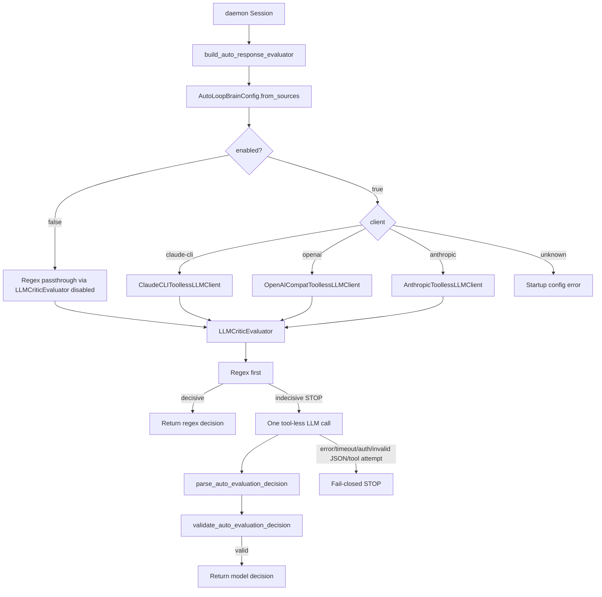

# Architecture Artifact — Task 10381

## Title
`auto-loop-brain` client redesign: config-driven tool-less executor selection

## Context inspected

Repository artifacts reviewed for this read-only architecture task:

- `docs/architecture/10375-auto-loop-brain.md` — parent architecture for the LLM critic, including regex-first behavior, strict JSON parser/validator, redaction, cost caps, kill switch, and `ToollessLLMClient` protocol concept.
- `agent/auto_loop_brain.py` — current implementation. It already has `ToollessLLMClient`, `LLMResult`, `TokenUsage`, `LLMCriticEvaluator`, redaction, caps, and fail-closed parsing, but only ships `AnthropicToollessLLMClient`; `build_auto_response_evaluator()` hardcodes `AnthropicToollessLLMClient()`.
- `agents.yaml` executors block — current executor taxonomy:
  - `codex`: `provider: codex-cli`, `endpoint: codex-cli`, `model: gpt-5.5`
  - `claude`: `provider: claude-cli`, `model: sonnet`
  - `local-llm`: `provider: openai`, `endpoint: kai-local`, `model: qwen35-gptq`
- `agent-config.json` endpoints block — endpoint registry includes OpenAI-compatible `kai-fast`, `kai-smart`, `kai-local`, `openai-direct`, plus `codex-cli`.
- `agent-config.json daemon.auto_loop_brain` — currently `enabled: false`, `model_id: claude-sonnet-4-6`, and safety/cost limits, with no client/endpoint routing keys.
- Tests referenced by grep: `tests/test_auto_loop_brain.py`, `tests/test_auto_mode.py`.

No implementation code changes, commits, or new tickets are part of this architecture artifact.

## Problem statement

The original #10375 architecture required a generic, tool-less LLM client abstraction so the auto-loop critic could be a classifier rather than an actor. The #10377 implementation correctly added the critic boundary and default-disabled rollout guardrails, but the concrete client selection is not aligned with KAI's executor model:

```python
llm_client=llm_client or AnthropicToollessLLMClient()
```

This creates three practical problems:

1. It hardcodes direct Anthropic REST API calls instead of using KAI's configured execution taxonomy.
2. It assumes `ANTHROPIC_API_KEY`, while this operator environment normally uses local `claude` CLI auth for Claude.
3. The existing `ToollessLLMClient` protocol is provider-neutral, but the factory is provider-specific.

The redesign must keep all safety properties from #10375/#10377 while allowing the critic backend to be selected from the same configuration patterns used elsewhere in KAI.

## Recommendation

Ship three concrete `ToollessLLMClient` implementations behind a config-driven factory:

1. `ClaudeCLIToollessLLMClient` — default. Calls local `claude -p` using CLI auth, with system prompt passed via `--append-system-prompt` and user prompt passed as a positional argument.
2. `OpenAICompatToollessLLMClient` — posts `/v1/chat/completions` to a configured `agent-config.json` endpoint such as `kai-smart`, `kai-fast`, `kai-local`, or `openai-direct`.
3. `AnthropicToollessLLMClient` — preserve the existing direct Anthropic Messages API implementation for operators who do have `ANTHROPIC_API_KEY`.

The public evaluator behavior remains unchanged:

```python
LLMCriticEvaluator.evaluate(AutoEvaluationInput) -> AutoEvaluationDecision
```

All native client failures continue to collapse to the same conservative `STOP` path already used for model errors, invalid JSON, schema failure, low confidence, caps, and kill switch conditions. Do not add new exception types to the evaluator public surface.

## High-level architecture



## Configuration contract

Add two routing fields to `daemon.auto_loop_brain`:

```json
{
  "daemon": {
    "auto_loop_brain": {
      "enabled": false,
      "client": "claude-cli",
      "endpoint": null,
      "model_id": "sonnet",
      "max_history_tokens": 16000,
      "temperature": 0.0,
      "min_continue_confidence": 0.85,
      "timeout_seconds": 20.0,
      "max_output_tokens": 512,
      "max_llm_critic_calls_per_session": 20,
      "max_consecutive_llm_critic_calls": 5
    }
  }
}
```

### Required values

`daemon.auto_loop_brain.client` must be one of:

- `claude-cli`
- `openai`
- `anthropic`

`daemon.auto_loop_brain.endpoint` is required only when `client=openai`; it must match a key under `agent-config.json.endpoints` whose endpoint config is OpenAI-compatible (`provider: openai`).

### Defaults

- Keep `enabled: false` as shipped by #10377.
- Default `client: claude-cli`.
- Default `model_id: sonnet`, matching the `agents.yaml` `claude` executor.
- Default `endpoint: null` because `claude-cli` and `anthropic` do not use endpoint registry routing.

This intentionally supersedes the old direct-Anthropic default `claude-sonnet-4-6`. The default should match KAI's configured `claude` executor rather than Anthropic API model naming.

### Environment overrides

`AutoLoopBrainConfig.from_sources()` should read:

- `KAI_AUTO_LOOP_BRAIN_CLIENT`
- `KAI_AUTO_LOOP_BRAIN_ENDPOINT`

in addition to the existing overrides:

- `KAI_AUTO_LOOP_BRAIN_ENABLED`
- `KAI_AUTO_LOOP_BRAIN_MODEL_ID`
- `KAI_AUTO_LOOP_BRAIN_MAX_HISTORY_TOKENS`
- `KAI_AUTO_LOOP_BRAIN_TEMPERATURE`
- `KAI_AUTO_LOOP_BRAIN_MIN_CONTINUE_CONFIDENCE`
- `KAI_AUTO_LOOP_BRAIN_TIMEOUT_SECONDS`
- `KAI_AUTO_LOOP_BRAIN_MAX_OUTPUT_TOKENS`
- `KAI_AUTO_LOOP_BRAIN_MAX_CALLS_PER_SESSION`
- `KAI_AUTO_LOOP_BRAIN_MAX_CONSECUTIVE_CALLS`
- `KAI_AUTO_LOOP_BRAIN_KILL_SWITCH`

Precedence: code defaults < JSON config < environment overrides.

### Startup validation

If `enabled=false`:

- Validate static config shape enough to catch unknown configured client values if cheap, but do not require auth, network, or a local CLI binary.
- Factory may still build a disabled `LLMCriticEvaluator` with a lazy/no-op or selected client, because it will never call the LLM path while disabled.

If `enabled=true`:

- Reject unknown `client` with a clear startup error.
- For `client=openai`, reject missing/unknown endpoint or endpoint whose provider is not `openai`.
- Validate auth prerequisites enough to fail before the daemon starts accepting auto-loop work.
- Continue honoring kill switch; kill switch can disable the LLM critic without needing client auth.

## Client architecture

Keep the existing protocol shape:

```python
class ToollessLLMClient(Protocol):
    def complete_json(
        self,
        *,
        model: str,
        system: str,
        user: str,
        timeout: float,
        temperature: float = 0.0,
        max_output_tokens: int = 512,
    ) -> LLMResult: ...
```

Keep `LLMResult` and `TokenUsage`, with each client populating usage when available:

```python
@dataclass(frozen=True)
class LLMResult:
    text: str
    model_id: str
    usage: TokenUsage | None = None
    tool_call_attempted: bool = False
```

### 1. `ClaudeCLIToollessLLMClient` — default

Purpose: use the same local Claude CLI auth path as KAI's `agents.yaml` `claude` executor, without requiring `ANTHROPIC_API_KEY`.

Invocation contract:

- Use `subprocess.run()` or equivalent with argv list; never use `shell=True`.
- Command shape:

```text
claude -p --model <model_id> --append-system-prompt <system> <user>
```

- `model_id` default is `sonnet`.
- System prompt is supplied via `--append-system-prompt`.
- User prompt is supplied as a positional argument.
- Capture stdout/stderr.
- Enforce `timeout_seconds`.
- Return stdout as `LLMResult.text`.

Safety constraints:

- This client is only a subprocess wrapper around a single prompt call. It must not invoke KAI sub-agents, NATS, `claude_exec`, MCP tools, or any autonomous CLI mode.
- If the local CLI has a flag to disable tools/MCP, use it; if it does not, acceptance must prove that `claude -p` with this invocation is non-interactive and does not execute tools.
- Do not log prompts containing redacted-but-sensitive task context beyond existing telemetry.

Failure mapping:

- Missing `claude` binary, non-zero exit, timeout, stderr-only failure, empty stdout, or malformed JSON all become internal client/model failures caught by `LLMCriticEvaluator`, producing fail-closed `STOP`.
- The public evaluator surface does not expose `CalledProcessError`, `TimeoutExpired`, or custom CLI exceptions.

Usage telemetry:

- CLI token counts are best-effort. Unless the CLI exposes stable JSON usage, return `TokenUsage(input_tokens=0, output_tokens=0)` or `None`; the task requirement prefers 0/0 for this client.
- `model_id` should be the configured model, normally `sonnet`.

### 2. `OpenAICompatToollessLLMClient`

Purpose: support KAI's OpenAI-compatible endpoint registry, including local LLM and gateway endpoints.

Endpoint resolution:

- Read `agent-config.json.endpoints[config.endpoint]`.
- Require `provider: openai`.
- Use endpoint `base_url`, normalized without trailing slash.
- POST to `{base_url}/chat/completions` if `base_url` already includes `/v1` in current config. Do not double-append `/v1`; current endpoints already look like `https://agent-k.ai/v1`, `http://.../v1`, and `https://api.openai.com/v1`.
- Model resolution: use `daemon.auto_loop_brain.model_id` if set; else endpoint `default_model`; else first/known model only if deterministic and documented. Prefer requiring `model_id` for ambiguous endpoints.

Request body:

```json
{
  "model": "<model_id>",
  "messages": [
    {"role": "system", "content": "<system prompt>"},
    {"role": "user", "content": "<user prompt>"}
  ],
  "temperature": 0.0,
  "max_tokens": 512
}
```

Do not include `tools`, `functions`, `tool_choice`, `response_format` unless later proven portable across all target endpoints. The existing strict parser is sufficient.

Auth:

- Prefer `api_key_env` from endpoint config. Read the named env var at startup/use time.
- If no `api_key_env`, use endpoint `api_key` when configured. `kai-local` uses `api_key: not-needed`, which is acceptable.
- If `api_key_env` exists but the env var is absent and no usable fallback key exists, validation fails when `enabled=true`.
- Never print API keys or Authorization headers.

Response parsing:

- Extract `choices[0].message.content` as text.
- Detect non-text/empty responses as client failures.
- Populate `LLMResult.model_id` from response `model` if present, else configured model.

Usage telemetry:

- Map `usage.prompt_tokens` to `TokenUsage.input_tokens`.
- Map `usage.completion_tokens` to `TokenUsage.output_tokens`.
- Optionally map `usage.total_tokens` only as internal metadata; current `TokenUsage` has no total field.
- `estimated_cost_usd` remains optional unless pricing config already exists.

Failure mapping:

- HTTP errors, request timeouts, connection errors, missing auth, malformed JSON response, missing choices/content, or invalid critic JSON all fail closed to `STOP`.

### 3. `AnthropicToollessLLMClient`

Purpose: keep existing #10377 direct Anthropic Messages API path as an explicit third option for operators with an Anthropic key.

Behavior:

- Preserve current no-tools Messages API behavior.
- Require `ANTHROPIC_API_KEY` when `enabled=true` and `client=anthropic`.
- Continue honoring optional `ANTHROPIC_BASE_URL` if the existing implementation already does.
- Use `model_id` from config; operators using this path must provide an Anthropic REST model identifier rather than `sonnet` shorthand unless a small alias map is explicitly added.

Usage telemetry:

- Keep current mapping from Anthropic `usage.input_tokens` and `usage.output_tokens` to `TokenUsage`.

Failure mapping:

- Preserve current behavior: missing key, HTTP error, timeout, malformed body, tool-use block, invalid output JSON, schema failure, or low confidence all fail closed to `STOP`.

## Factory and selection plumbing

### `AutoLoopBrainConfig`

Add fields:

```python
client: str = "claude-cli"
endpoint: str | None = None
```

`AutoLoopBrainConfig.from_sources()` should:

1. Load `daemon.auto_loop_brain.client` and `daemon.auto_loop_brain.endpoint` from JSON.
2. Apply `KAI_AUTO_LOOP_BRAIN_CLIENT` and `KAI_AUTO_LOOP_BRAIN_ENDPOINT` overrides.
3. Normalize `client` to lowercase and strip whitespace.
4. Preserve endpoint case only if endpoint keys are case-sensitive; otherwise strip whitespace.
5. Keep kill switch semantics unchanged.
6. Do not silently disable the critic for an invalid client when `enabled=true`; reject it with a clear config error.

Important correction to current behavior: the existing `_model_meets_minimum_tier()` disabling behavior was appropriate for Anthropic Sonnet 4.6+ policy in #10375, but the new default `model_id: sonnet` would not match that old direct Anthropic model naming. Minimum-tier validation should become client-aware:

- `claude-cli`: accept `sonnet` and any explicitly supported Claude CLI model alias chosen by operators.
- `openai`: do not apply Anthropic Sonnet tier checks; validate endpoint/model availability instead.
- `anthropic`: retain or adapt the Sonnet/Opus minimum policy if still desired, but do not let it disable other clients.

### `build_auto_response_evaluator()`

Change from hardcoded Anthropic construction to a switch on `config.client`:

```python
if llm_client is not None:
    client = llm_client
elif config.client == "claude-cli":
    client = ClaudeCLIToollessLLMClient(...)
elif config.client == "openai":
    endpoint_config = resolve_endpoint(config.endpoint)
    client = OpenAICompatToollessLLMClient(endpoint_config=endpoint_config)
elif config.client == "anthropic":
    client = AnthropicToollessLLMClient()
else:
    raise ValueError("Unsupported daemon.auto_loop_brain.client: ...")
```

Keep explicit `llm_client` injection for tests.

Startup error wording should be actionable, for example:

```text
Unsupported daemon.auto_loop_brain.client='foo'. Expected one of: claude-cli, openai, anthropic.
```

For OpenAI endpoint errors:

```text
daemon.auto_loop_brain.endpoint='codex-cli' is not OpenAI-compatible; expected an agent-config.json endpoint with provider='openai'.
```

## Failure modes and fail-closed behavior

Do not introduce new public evaluator exception types. Internally, clients can raise standard exceptions, but `LLMCriticEvaluator.evaluate()` should catch broad native client failures exactly as it does today and return conservative `STOP`.

Unified fail-closed cases:

- missing CLI binary
- CLI timeout/non-zero exit/empty stdout
- missing API key for selected REST client
- HTTP timeout/error
- malformed provider response
- model returns non-JSON or schema-invalid JSON
- model returns a `CONTINUE` below `min_continue_confidence`
- model attempts a tool call or returns provider-specific tool-use blocks
- critic call caps reached
- kill switch enabled

Telemetry should distinguish the internal cause for observability, but the main daemon behavior remains safe `STOP`.

## Telemetry and cost accounting

Existing `LLMResult.usage` should be populated as follows:

| Client | `input_tokens` | `output_tokens` | `estimated_cost_usd` |
| --- | ---: | ---: | ---: |
| `claude-cli` | `0` | `0` | `None` unless CLI exposes stable usage |
| `openai` | `usage.prompt_tokens` | `usage.completion_tokens` | optional |
| `anthropic` | `usage.input_tokens` | `usage.output_tokens` | optional |

Existing `auto.evaluator_call_metrics` should include:

- `evaluator_kind: llm`
- `client`
- `endpoint` when applicable
- `model_id`
- `latency_ms`
- `success`
- `malformed`
- `escalated_from`
- `calls_this_session`
- `consecutive_llm_critic_calls`
- `llm_usage`

Cost caps from #10377 remain unchanged. Because `claude-cli` has 0/0 best-effort usage, cost-cap behavior should not rely only on token-count telemetry; existing call-count caps remain the primary cap for CLI mode.

## Migration and rollout

### Defaults

- `daemon.auto_loop_brain.enabled: false` stays unchanged.
- New default routing is `client: claude-cli`, `model_id: sonnet`.
- Existing `clarify_misread_main` template, redaction layer, cost cap, kill switch, regex-first escalation, strict parser, and validator are unchanged.

### Operator prerequisites when enabling

When an operator sets `enabled: true`, exactly one selected auth path must work:

1. `client: claude-cli`
   - `claude` CLI installed and on PATH for the daemon process.
   - CLI login already completed under the daemon's runtime user.
   - `claude -p --append-system-prompt ...` invocation verified non-interactive and tool-less.

2. `client: openai`
   - `endpoint` names an OpenAI-compatible key in `agent-config.json.endpoints`.
   - For `kai-smart` / `kai-fast`: configured `api_key_env` such as `AGENT_KAI_API_KEY` must be set, unless a safe configured fallback key exists.
   - For `openai-direct`: `OPENAI_API_KEY` must be set.
   - For `kai-local`: local endpoint reachable and configured auth placeholder accepted.

3. `client: anthropic`
   - `ANTHROPIC_API_KEY` set for the daemon process.
   - `model_id` is a valid Anthropic Messages API model identifier or documented alias.

Daemon config loading should refuse to start with `enabled=true` and no working selected client. It should not silently fall back to another provider because that would surprise operators and could change cost/security posture.

## Decision criteria / ship gates

### `ClaudeCLIToollessLLMClient`

Gate to ship:

- Verified on target host that `claude -p` accepts user prompt as positional arg and `--append-system-prompt` supplies the system prompt.
- Verified command exits non-interactively using existing CLI auth and does not require `ANTHROPIC_API_KEY`.
- Verified no tool/MCP/autonomous action is executed by this invocation; if a disable-tools flag exists, it is used.
- Unit tests mock subprocess success, timeout, non-zero exit, missing binary, and malformed JSON.
- Integration smoke test can run only when `claude` is available; otherwise skip with clear reason.

### `OpenAICompatToollessLLMClient`

Gate to ship:

- Works against at least `kai-smart` and `kai-local` from `agent-config.json` with mocked tests and at least one environment-gated smoke test where credentials/reachability exist.
- Does not double-append `/v1`; posts to `/chat/completions` relative to configured `base_url`.
- Sends no `tools`, `functions`, or `tool_choice` fields.
- Reads `api_key_env` correctly and fails clearly when required env var is missing.
- Extracts content and usage correctly from OpenAI-compatible responses.

### `AnthropicToollessLLMClient`

Gate to ship:

- Existing behavior remains no-regression.
- Direct API path is no longer default.
- Missing `ANTHROPIC_API_KEY` is tolerated while disabled or while using other clients, but rejected clearly when `enabled=true` and `client=anthropic`.
- Unit tests still cover usage extraction, tool-use block detection, HTTP errors, and malformed responses.

## Test plan

Add or update tests in `tests/test_auto_loop_brain.py` and any daemon config/factory test module.

### Config tests

- Default config yields `enabled=false`, `client='claude-cli'`, `model_id='sonnet'`, `endpoint is None`.
- JSON config reads `client` and `endpoint`.
- Env overrides `KAI_AUTO_LOOP_BRAIN_CLIENT` and `KAI_AUTO_LOOP_BRAIN_ENDPOINT` override JSON.
- Unknown client with `enabled=true` raises clear startup error.
- `client=openai` without endpoint raises clear error when enabled.
- `client=openai` with unknown endpoint raises clear error.
- `client=openai` with endpoint `codex-cli` rejects provider mismatch.

### Factory routing tests

- `client=claude-cli` instantiates `ClaudeCLIToollessLLMClient`.
- `client=openai` instantiates `OpenAICompatToollessLLMClient` with the selected endpoint.
- `client=anthropic` instantiates `AnthropicToollessLLMClient`.
- Unknown client rejection is tested.
- Existing explicit `llm_client=` injection still bypasses factory routing for unit tests.

### Client unit tests

`ClaudeCLIToollessLLMClient`:

- subprocess argv contains `claude`, `-p`, `--append-system-prompt`, model, system text, and user text as separate argv entries.
- stdout maps to `LLMResult.text`.
- token usage is 0/0 or `None` per final implementation choice; prefer 0/0.
- timeout, missing binary, and non-zero exit raise internal failures caught by evaluator.

`OpenAICompatToollessLLMClient`:

- request URL is `{base_url}/chat/completions`.
- request body has system/user messages and no tool fields.
- `api_key_env` is read and Authorization header built without logging secrets.
- `kai-local` can use configured non-secret placeholder.
- usage maps prompt/completion tokens.
- HTTP and malformed response failures are covered.

`AnthropicToollessLLMClient`:

- Preserve existing direct API tests.
- Missing key behavior is explicit.
- Usage extraction remains correct.

### Evaluator behavior tests

- Regex decisive result still bypasses LLM for all clients.
- Indecisive `STOP` escalates once when enabled and client is configured.
- Client error returns `STOP` with fail-closed metadata.
- Invalid JSON/schema returns `STOP`.
- Low-confidence `CONTINUE` returns `STOP`.
- Kill switch suppresses LLM call.
- Call caps still suppress LLM calls.

## Phased implementation plan

### Phase 1 — Client implementations, config selection, tests

Scope:

- Add `client` and `endpoint` fields to `AutoLoopBrainConfig`.
- Implement `ClaudeCLIToollessLLMClient`.
- Implement `OpenAICompatToollessLLMClient`.
- Keep/refactor `AnthropicToollessLLMClient` as explicit option.
- Update `build_auto_response_evaluator()` routing.
- Add config validation.
- Add mocked unit and routing tests.

Recommendation: file as one implementation ticket because the factory cannot be meaningfully correct until all three required routing targets exist.

### Phase 2 — Operator-facing docs

Scope:

- Document which client to pick.
- Document auth prerequisites for CLI, OpenAI-compatible endpoints, and Anthropic.
- Include example config snippets.
- Include troubleshooting for missing CLI, missing env var, endpoint provider mismatch, and disabled kill switch.

### Optional Phase 3 — `codex-cli` adapter

Do not recommend now. A Codex CLI tool-less critic would be a fourth backend and needs a separate safety review because current task requirements explicitly limit the taxonomy to `claude-cli`, `openai`, and `anthropic`. Revisit only after Phase 1/2 are stable.

## Rejected alternatives

### Keep Anthropic direct API as default

Rejected. It preserves the current operator breakage and ignores KAI's `claude-cli` executor pattern.

### Use `claude_exec` or sub-agent tooling

Rejected. Those paths are tool-enabled/autonomous agent escalation mechanisms. The critic must remain a tool-less classifier with one bounded completion.

### Auto-fallback from one client to another

Rejected for initial rollout. Automatic provider fallback can surprise operators, bypass intended auth/cost choices, and complicate auditability. Fail clearly instead.

### Only support OpenAI-compatible endpoints

Rejected. It would ignore the normal local Claude CLI auth path, which is the stated default on this box.

### Add `codex-cli` now

Rejected for this phase. The task explicitly asks for three clients and says optional codex-cli adapter is not recommended now.

## Risks and mitigations

| Risk | Impact | Mitigation |
| --- | --- | --- |
| Claude CLI prompt flags differ by installed version | Default client fails | Ship gate requires live verification of `claude -p --append-system-prompt`; document minimum CLI version if needed. |
| Claude CLI may have ambient MCP/tools | Critic boundary violation | Use non-interactive prompt mode and disable-tools flag if available; security review must verify no tool execution. |
| OpenAI-compatible endpoints vary in response details | Parser fragility | Keep request minimal; unit-test target endpoint shapes; fail closed on malformed response. |
| Existing Anthropic model-tier validation rejects `sonnet` shorthand | Default silently disabled | Make minimum-tier validation client-aware; do not apply Anthropic REST model naming to CLI/OpenAI clients. |
| Token usage unavailable for CLI | Cost cap blind spot | Keep call-count caps as primary cap; emit 0/0 usage for CLI. |
| Endpoint config contains placeholder keys | Startup confusion | Validate auth only for selected enabled client; error messages identify missing env var by name without printing values. |

## Acceptance criteria

Implementation is acceptable when:

1. `daemon.auto_loop_brain.enabled` remains default `false`.
2. Default selected client is `claude-cli` and default model is `sonnet`.
3. `AutoLoopBrainConfig.from_sources()` reads JSON `client`/`endpoint` and env overrides.
4. `build_auto_response_evaluator()` routes all three supported clients and rejects unknown values clearly.
5. `client=openai` requires an OpenAI-compatible endpoint key from `agent-config.json`.
6. `ClaudeCLIToollessLLMClient` uses `claude -p` with `--append-system-prompt` and user positional arg.
7. `OpenAICompatToollessLLMClient` posts to `/chat/completions` relative to configured `/v1` base URL and sends no tool fields.
8. `AnthropicToollessLLMClient` remains available but is not default.
9. All clients map native failures to existing fail-closed `STOP`; no new public evaluator exception surface.
10. `LLMResult.usage` is populated where available; CLI reports 0/0 or equivalent best-effort no-usage metadata.
11. Existing #10377 redaction, `clarify_misread_main`, cost caps, kill switch, regex-first behavior, strict parser, and validator are unchanged.
12. Tests cover mocked clients, config routing for all three clients, and unknown-value rejection.

## Realistic ETA

Assuming serial development, code review, security audit, and QA cycles:

- Phase 1 implementation + unit tests: 1.0 to 1.5 developer days.
- Code review fixes: 0.5 day.
- Security audit, focused on subprocess invocation, secret handling, and no-tool guarantees: 0.5 day.
- QA, including mocked tests plus environment-gated smoke checks for `claude-cli` and at least one OpenAI-compatible endpoint: 0.5 to 1.0 day.
- Phase 2 operator docs: 0.5 day.

Total realistic calendar time with serial gates: 3 to 4 business days. If the local Claude CLI flags differ from the assumed `claude -p --append-system-prompt` contract, add 0.5 to 1 day for adapter adjustment and re-review.
