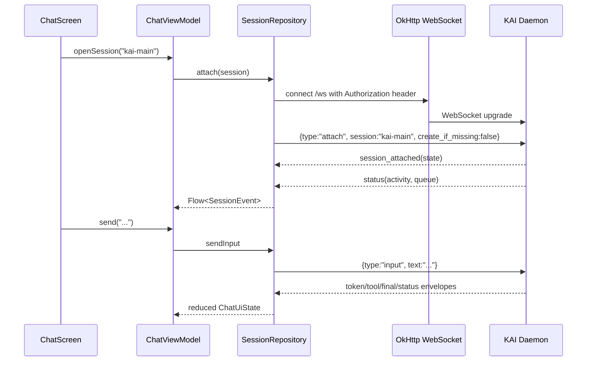

# Architecture Artifact — Task 10392

## Title
KAI Android client requirements and design (Kotlin, parent epic #10391)

## Status
Read-only architecture specification. No application skeleton, product code, commits, or follow-up tickets were created.

## Context inspected

Repository and prior design references reviewed:

- `daemon/server.py` — current FastAPI REST and WebSocket route surface.
- `daemon/protocol.py` — authoritative typed daemon WebSocket wire envelopes.
- `web/src/lib/daemon/client.ts`, `web/src/lib/daemon/types.ts`, `web/src/routes/+page.svelte`, component files — current Svelte behavior parity reference.
- `docs/architecture/10374-heartbeat-phase-2.md` — heartbeat tick / injected-output flow relevant to push notifications.
- `docs/architecture/10387-alert-subscriber.md` — polymarket/alert subscriber design relevant to mobile notifications.
- `docs/architecture/10390-codex-cli-client-and-runtime-toggle.md` — pending runtime auto-loop-brain toggle shape.
- `agent-config.json` — daemon, endpoint, and agent configuration context.

Important finding: the running daemon currently exposes a single WebSocket endpoint at `/ws`, not `/ws/sessions/{name}/stream`. Session selection happens through the first client envelope: `{"type":"attach","session":"...","create_if_missing":...}`.

---

## Executive recommendation

Build a native Android app in Kotlin, using Jetpack Compose + MVVM + coroutines/Flow, that treats the KAI daemon as the single backend. Android should not talk directly to NATS, model providers, Coinbase/KAI market feeds, the taskboard database, or any local files.

Recommended default deployment:

1. **MVP:** LAN-only / Tailscale-accessible daemon with HTTPS/TLS where practical, manually configured daemon URL + mobile-scoped bearer token.
2. **Core interaction:** REST for health/session/market/settings snapshots; WebSocket for session attach, chat token streaming, commands, status, and events.
3. **Push:** foreground direct WebSocket first; background notifications via a daemon-owned push bridge in a later phase. Prefer self-hosted `ntfy` as default for Dan’s operator-only workflow; keep FCM as an optional richer backup if Google Play Services dependency is acceptable.
4. **Security:** daemon-issued constrained mobile token, local biometric/PIN unlock, encrypted storage, revocation/rotation endpoints before public exposure. Do not put daemon admin/org-admin scope or raw provider/taskboard credentials on the phone.

The app should start small: prove reliable daemon connectivity and chat before adding control toggles, market surfaces, and any trade execution.

---

## 1. Use case prioritization

### Priority rank

| Rank | Use case | Phase | Rationale |
|---:|---|---:|---|
| 1 | Configure daemon URL/token and verify `/api/health` | 0 | Without connection bootstrap nothing else is usable. |
| 2 | List active/persisted KAI sessions | 1 | Dan needs to find `kai-main`, `terminal`, and taskboard-fire sessions. |
| 3 | Read session chat history and current status | 1 | Lowest-risk mobile value; matches web UI shape. |
| 4 | Live WebSocket streaming for `kai-main` | 2 | Makes phone a real interface rather than a polling viewer. |
| 5 | Send input/slash commands and interrupt active runs | 2 | Enables phone-side operation. |
| 6 | Push alerts for important daemon outputs | 3 | High value, but needs new server-side mobile push bridge. |
| 7 | Toggle auto-mode / auto-loop-brain | 4 | Powerful controls; should wait for auth/scopes and #10390 endpoints. |
| 8 | Market watchlist + portfolio | 5 | Useful but non-critical; can call existing REST endpoints. |
| 9 | Trigger `/loop` or `/auto` convenience actions | 4/5 | Can be slash-command based initially; dedicated buttons later. |
| 10 | Trade execution UI | 6 | Highest risk; only if Dan explicitly wants it, with biometric confirmation and scoped capability. |

### MVP definition

The bare MVP is **Phase 0 + Phase 1**:

- Android app can store a daemon profile.
- App can ping daemon health.
- App can list sessions.
- App can open a session in read-only chat view with manual refresh/snapshot attach.

Do **not** include push, auto toggles, market charts, or trade execution in MVP.

---

## 2. API surface audit and Android mapping

### Current daemon endpoints Android can call directly

| Endpoint / protocol | Current shape | Android feature mapping | Notes |
|---|---|---|---|
| `GET /api/health` | bearer-auth REST, returns status, agent, session count, scheduler count, heartbeat metrics | connection test, daemon status badge | Use Phase 0 ping. |
| `GET /api/metrics` | bearer-auth REST, detailed diagnostics | optional diagnostics screen | Not MVP; may reveal operational detail, hide behind debug mode. |
| `GET /api/sessions` | returns `{sessions:[{name,created_at,last_activity,state_path,activity_status,queued_inputs}]}` | session list | `state_path` should not be displayed by default on mobile. Consider server redaction/mobile DTO later. |
| `POST /api/sessions` | body `{name}` | create named session | Not required in MVP unless Dan wants mobile session creation. |
| `DELETE /api/sessions/{session_name}` | deletes session | dangerous session management | Defer; require confirmation. |
| `POST /api/sessions/{session_name}/stop` | stop active run | interrupt/stop button | Useful in Phase 2. |
| `GET /api/models` | model registry | optional model settings | Defer; web UI already has this. |
| `POST /api/models/{agent_name}` | switch model endpoint/model/reasoning effort | optional mobile model selector | Defer; risky to expose broadly. |
| `GET /api/market/watchlist?symbols=BLEND,BTC,...` | returns `{quotes:[...]}` | watchlist cards | Phase 5. |
| `GET /api/market/ohlcv?symbol&interval&source&limit` | returns `{bars:[...]}` | chart/sparkline | Phase 5. |
| `GET /api/portfolio` | returns positions/PnL snapshot | portfolio view | Phase 5. Treat as sensitive. |
| `GET /api/sessions/{session}/ui/chart` | current session chart view | preserve web/mobile chart state | Phase 5 or chart parity. |
| `PATCH /api/sessions/{session}/ui/chart` | update symbol/timeframe/source/mode | mobile chart controls | Phase 5. |
| `GET /api/sessions/{session}/ui/watchlist` | session watchlist | watchlist settings | Phase 5. |
| `PATCH /api/sessions/{session}/ui/watchlist` | set/add/remove symbols | watchlist editing | Phase 5. |
| `POST /api/webhooks/taskboard` | HMAC webhook ingress | not for Android | Server-to-server only. Never expose HMAC secret. |
| `POST /api/webhooks/forgejo` | HMAC webhook ingress | not for Android | Server-to-server only. |
| Static `/` and asset fallback | serves web UI | not used by native app | Useful only for browser/PWA rejected alternative. |

### Current WebSocket API

Actual daemon endpoint:

- `GET /ws` upgraded to WebSocket.
- Auth: `Authorization: Bearer <token>` header or `?token=<token>` query param.
- First client message must be `AttachEnvelope`:

```json
{
  "type": "attach",
  "session": "kai-main",
  "create_if_missing": false
}
```

After attach, server sends:

1. `session_attached` with `SessionStateSnapshot`, including recent `chat_history`, UI chart/watchlist state, and auto-mode status.
2. `status` with activity and queue depth.

Client envelopes in `daemon/protocol.py`:

| Envelope | Android use |
|---|---|
| `attach` | attach to selected session. |
| `input` | send normal chat/user input. |
| `slash` | send structured slash commands such as `/auto`, `/schedule`, `/optimizer`, `/strategies`; `/loop` can initially use `input` or `slash` depending daemon support. |
| `interrupt` | stop current run. |
| `subscribe` / `unsubscribe` channels `chart`, `signals`, `nats` | live event panels / chart updates; not MVP. |
| `heartbeat` | client keepalive no-op currently; can be used as app-level ping. |

Server envelopes in `daemon/protocol.py` Android must model:

- `session_attached`
- `token`
- `tool_start`
- `tool_end`
- `final`
- `status`
- `auto_started`
- `auto_stopped`
- `auto_progress`
- `signal`
- `chart_bar`
- `chart_view`
- `watchlist`
- `nats_event`
- `scheduled_job_created`
- `scheduled_job_triggered`
- `scheduled_job_completed`
- `scheduled_job_failed`
- `scheduled_job_cancelled`
- `scheduled_job_paused`
- `scheduled_job_resumed`
- `optimizer_completed`
- `error`

Kotlin should follow `daemon/protocol.py` as source of truth. The Svelte `types.ts` should be used as behavior reference only; it can lag the Python protocol.

### Endpoints mentioned in prompt but not found as current daemon REST

| Prompt-mentioned route | Current finding | Recommendation |
|---|---|---|
| `/ws/sessions/{name}/stream` | Not present. Current route is `/ws` + attach envelope. | Keep Android on `/ws` initially. Optionally add alias later for mobile-friendly session URLs, but not required. |
| `/api/cron/wake` | Not found in inspected `daemon/server.py`. Scheduler is controlled through slash commands and internal scheduler envelopes. | Do not design Android against this route unless a later task adds it. For wake/loop behavior use `/schedule` slash or future explicit endpoints. |
| `/loop` or `/auto` REST endpoints | Not present as REST. `/auto` is intercepted in WebSocket input/slash handling. | Phase 4 can start by sending slash commands; add typed REST only if #10390 chooses that contract. |
| auto-loop-brain runtime config endpoints | Proposed in #10390 as `GET/PATCH /api/daemon/config/auto_loop_brain`, not necessarily landed. | Android Phase 4 depends on that server work. |
| push registration endpoints | Not present. | Add `POST/DELETE/PATCH /api/mobile/devices` before Phase 3 background push. |

### Server additions recommended for mobile

#### Required before background push

```http
POST /api/mobile/devices
Authorization: Bearer <mobile token>
Content-Type: application/json

{
  "device_id": "stable-installation-uuid",
  "platform": "android",
  "push_provider": "ntfy" | "fcm",
  "push_token": "provider-token-or-topic",
  "app_version": "0.3.0",
  "session_filters": ["kai-main"],
  "channels": ["heartbeat", "alerts", "scheduled_jobs", "session_final"]
}
```

Response:

```json
{
  "device_id": "...",
  "registered_at": "2026-...Z",
  "enabled": true,
  "channels": ["heartbeat", "alerts", "scheduled_jobs", "session_final"]
}
```

Additional endpoints:

- `DELETE /api/mobile/devices/{device_id}` — revoke one lost/replaced install.
- `PATCH /api/mobile/devices/{device_id}` — update channel/session policy, provider token, enabled flag.
- `GET /api/mobile/devices` — optional operator diagnostics; mobile-scoped tokens should only see their own device.

#### Recommended for safer mobile auth

- `POST /api/auth/mobile-tokens` — issue constrained token from an existing operator/admin channel, not from mobile self-service.
- `DELETE /api/auth/mobile-tokens/{token_id}` — revoke.
- `POST /api/auth/mobile-tokens/{token_id}/rotate` — rotate without changing device profile.
- `GET /api/auth/me` — return token scope/capabilities and expiry so UI can hide unavailable controls.

#### Recommended for mobile-friendly session snapshots

Current `GET /api/sessions` exposes `state_path`. It is not fatal on LAN, but mobile does not need paths. Add later:

```http
GET /api/mobile/sessions
```

Returns session summaries without local file paths, with `is_main`, `is_taskboard_fire`, and unread/last-event hints if available.

#### Recommended for explicit controls

Instead of relying only on slash commands forever, add typed endpoints after #10390 settles:

- `GET/PATCH /api/daemon/config/auto_loop_brain`
- `POST /api/sessions/{session}/auto/start`
- `POST /api/sessions/{session}/auto/stop`
- `POST /api/sessions/{session}/loop`

Until then, Android can send `/auto ...` over WebSocket.

### WebSocket adaptation for mobile

The current `/ws` protocol is usable as-is but should be wrapped in a battery-conscious client:

- Connect only while a session/chat screen is foregrounded unless foreground service is explicitly enabled.
- Use exponential backoff with jitter: 1s, 2s, 5s, 15s, 30s, max 60s; reset after stable attach.
- Respect Android network callbacks: reconnect on Wi-Fi/cellular availability; fail fast on no network.
- Send app-level `heartbeat` envelope every 30–60 seconds only while connected and foregrounded, if needed to detect half-open sockets.
- Reattach after reconnect and de-duplicate restored history using local message IDs/hash/window.
- For background operation, prefer push notifications over a permanently held WebSocket to avoid battery drain.
- If the daemon later adds `/ws/sessions/{name}/stream`, keep `/ws` compatible; an alias is nice but not necessary.

### Should openclaw-gateway/shim mediate?

Recommendation by deployment stage:

| Stage | Path | Recommendation |
|---|---|---|
| LAN/Tailscale MVP | Android → KAI daemon directly | Preferred. Lowest complexity, already bearer-authenticated, sufficient for one operator. |
| Public internet / reverse proxy | Android → gateway/shim → daemon | Recommended. Gateway terminates TLS, rate-limits, handles scoped mobile auth, hides daemon internals, and can bridge push. |
| Push provider callbacks/relays | Push bridge in daemon or gateway | Prefer daemon-owned event selection with gateway delivery optional. Do not put NATS credentials on phone. |

For Dan-only use, direct daemon access over Tailscale is the best default. The gateway becomes valuable when the daemon is exposed beyond trusted network boundaries or when mobile-scoped auth becomes more sophisticated.

---

## 3. Auth and security model

### Current auth reality

`DaemonServer.require_http_auth()` accepts:

- daemon bearer token,
- configured taskboard/OpenClaw gateway token environment values,
- or unauthenticated local clients if daemon is configured to allow that.

WebSocket auth accepts bearer header or `?token=` query parameter.

For Android, do not rely on unauthenticated local access. Always configure a token.

### Recommended mobile auth model

#### Phase 0/1 practical MVP

- Dan manually enters:
  - daemon base URL,
  - mobile-scoped bearer token if available; otherwise existing daemon token as temporary bootstrap only.
- Store token in Android Keystore-backed encrypted storage.
- Require local biometric/PIN app unlock before revealing or using write controls.
- Mask token in UI; never log it.

#### Target model before remote/public access

- Daemon issues a **mobile operator token** with constrained capabilities.
- Token has:
  - `token_id`,
  - `device_id`,
  - scopes,
  - created/last-used timestamps,
  - expiry or rotation policy,
  - revocation flag.
- Android receives token once and stores it encrypted.
- Daemon can revoke token on device loss without rotating all daemon/operator secrets.

### Capability scopes

Use additive scopes so UI can hide/disable unavailable actions:

| Scope | Allows | Phase |
|---|---|---:|
| `mobile:health:read` | `/api/health` | 0 |
| `mobile:sessions:read` | list sessions, attach read-only snapshots | 1 |
| `mobile:sessions:write` | send input/slash, interrupt, create session | 2 |
| `mobile:events:read` | signals/NATS/scheduled envelopes | 2/3 |
| `mobile:push:register` | register/update this device push target | 3 |
| `mobile:auto:control` | `/auto`, auto-loop-brain toggles | 4 |
| `mobile:market:read` | watchlist/OHLCV/portfolio read | 5 |
| `mobile:trade:execute` | paper/live trade execution if added | 6 only |

Do **not** grant these to mobile:

- admin/org-admin scope,
- HMAC webhook secret access,
- taskboard bearer/session tokens,
- model provider API keys,
- Vault access,
- filesystem state paths,
- unrestricted daemon config writes.

### Read-only vs read-write vs trade execute

Recommended token classes:

1. **Mobile read-only:** health, sessions read, market read, event notifications. Good for initial phone setup.
2. **Mobile operator:** read-only + send input/slash + stop + auto controls. Default target for Dan after MVP.
3. **Mobile trade-execute:** separate optional token or step-up permission requiring biometric confirmation per action. Do not include by default.

### Local app lock

- Use Android `BiometricPrompt` with device credential fallback.
- Lock app on cold start and after configurable idle timeout (default 5 minutes).
- Allow read-only health check before unlock only if token is not used; otherwise unlock first.
- For Phase 6 trade execution: require biometric confirmation immediately before submission, not just app unlock.

### Token rotation and revocation

- Manual rotation in Phase 0/1: Dan edits token in settings.
- Target: daemon token management endpoints with revoke/rotate.
- On 401:
  - mark profile unauthenticated,
  - stop WebSocket reconnect loop,
  - prompt for token update,
  - keep cached read-only data visible but stale.
- Device loss recovery:
  - revoke `device_id`/token from daemon/gateway,
  - optionally delete push device registration,
  - rotate daemon/global token if the temporary bootstrap token was used.

### Transport security

- LAN HTTP is acceptable only for early MVP on a trusted network.
- Tailscale + HTTPS or reverse-proxy TLS is required before regular cellular use.
- Avoid query-token WebSocket URLs when possible because URLs may be logged. OkHttp WebSocket can set `Authorization` headers; use that instead of `?token=`.

---

## 4. Network topology

### Recommended default

**Tailscale-first direct daemon access**:

```text
Android phone ── Tailscale/WireGuard ── srv01/KAI daemon :8765
```

Why:

- Dan is the only target user.
- No need to expose daemon publicly.
- Stable identity and encrypted transport.
- Works on cellular and Wi-Fi.
- Avoids reverse proxy hardening as a prerequisite for MVP.

For early development, LAN-only `http://srv01:8765` or IP address is acceptable if Dan is on the home network.

### Alternatives

| Topology | Pros | Cons | Recommendation |
|---|---|---|---|
| LAN-only HTTP | Fastest setup, simple debugging | Not usable away from home; weaker transport | Phase 0 dev only. |
| Tailscale direct | Secure, simple, cellular-friendly | Requires Tailscale on phone/server | Default MVP-to-production path. |
| Public reverse proxy + TLS | No VPN required; standard mobile URLs | Larger attack surface; needs scoped auth/rate limiting | Later only, ideally via gateway. |
| openclaw-gateway/shim | Can centralize auth, scopes, TLS, push bridge | More moving parts | Use before public exposure or multi-device management. |
| Web UI over browser | Already exists | Push/native/background/auth UX limited | Keep as fallback, not the native app plan. |

### Latency expectations

- Chat token streaming over Wi-Fi/Tailscale: acceptable if <250ms median network RTT; model/tool runtime dominates.
- Cellular: expect reconnects and transient stale state; UI must show connection state clearly.
- Market watchlist polling: 15–60s intervals are enough; do not stream charts continuously in background.
- Push: background notification latency target <10s for FCM; <5–30s for ntfy depending self-hosting/network.

### Offline / degraded behavior

- Show last cached session snapshot and messages with a stale banner.
- Queueing user messages while offline is **not** recommended for MVP because duplicate/late agent prompts are dangerous. Require explicit retry after reconnect.
- If WebSocket disconnects mid-generation, reattach and show that output may be incomplete until next snapshot/final event.

---

## 5. Android app architecture

### Chosen stack

| Concern | Recommendation | Rationale |
|---|---|---|
| Language | Kotlin | Matches preference and native Android ecosystem. |
| UI | Jetpack Compose + Material 3 | Faster greenfield UI, state-driven, modern. |
| Presentation | MVVM with state hoisting | Simple, testable, familiar; Redux/MVI can be introduced selectively for chat stream if needed. |
| Async | Kotlin coroutines + Flow/StateFlow/SharedFlow | Natural for REST/WebSocket streams and Compose state. |
| REST | Retrofit + OkHttp + kotlinx.serialization converter (or Moshi if team prefers) | Mature, easy interceptors/auth; OkHttp also handles WebSocket. |
| WebSocket | OkHttp WebSocket | Same client stack as REST, supports auth headers, robust enough. Ktor not needed initially. |
| Persistence | Room for session/message cache; DataStore for settings | Structured cache vs lightweight preferences. |
| Secure storage | Android Keystore + EncryptedSharedPreferences or Jetpack Security Crypto; store token references/values encrypted | Protect bearer token. |
| DI | Hilt | Standard Android DI, good ViewModel integration. Prefer over Koin for compile-time-ish wiring and ecosystem. |
| Navigation | Navigation Compose | Simple bottom/nav graph. |
| Background | WorkManager for periodic refresh; foreground service only if Dan opts into persistent WebSocket | Battery-safe default. |
| Notifications | Android notification channels + ntfy/FCM receiver | Native UX with channel control. |

### High-level component diagram

```text
┌────────────────────────────────────────────────────────────┐
│                      Compose UI                             │
│ Settings │ Sessions │ Chat │ Events │ Market │ Portfolio    │
└───────────────▲──────────────────────────────▲─────────────┘
                │ StateFlow                    │ actions
┌───────────────┴──────────────────────────────┴─────────────┐
│                       ViewModels                             │
│ SettingsVM │ SessionsVM │ ChatVM │ NotificationsVM │ MarketVM │
└───────────────▲──────────────────────────────▲─────────────┘
                │ domain models / Flow          │ commands
┌───────────────┴──────────────────────────────┴─────────────┐
│                      Repositories                            │
│ DaemonRepository │ SessionRepository │ MarketRepository      │
│ PushRepository   │ AuthTokenRepository                         │
└───────────────▲──────────────────────────────▲─────────────┘
                │                              │
┌───────────────┴──────────────┐   ┌───────────┴──────────────┐
│ Local data sources            │   │ Remote data sources       │
│ Room DAO │ DataStore │ Keystore│  │ Retrofit REST │ OkHttp WS │
└───────────────────────────────┘   └──────────────────────────┘
```

### Suggested package layout

```text
app/
  core/network/        Retrofit, OkHttp, auth interceptor, WS client
  core/security/       biometric lock, encrypted token store
  core/database/       Room db, DAOs, entities
  core/settings/       DataStore daemon profiles
  data/daemon/         REST DTOs, protocol envelope DTOs, repository impls
  domain/model/        Session, ChatMessage, DaemonStatus, WatchQuote
  domain/repository/   interfaces
  feature/settings/
  feature/sessions/
  feature/chat/
  feature/events/
  feature/market/
  feature/portfolio/
  feature/controls/
  feature/trade/       disabled until Phase 6
```

### State model

Use explicit connection state:

```kotlin
sealed interface DaemonConnectionState {
  data object Unconfigured
  data object Disconnected
  data object Connecting
  data class Connected(val health: DaemonHealth)
  data class Attached(val session: String, val activity: String, val queueDepth: Int)
  data class Streaming(val session: String)
  data class Error(val message: String, val recoverable: Boolean)
  data class Stale(val lastConnectedAt: Instant)
}
```

Chat UI state:

- `messages: List<ChatMessage>` from Room + in-memory current stream.
- `currentAssistantDraft: String` accumulated from `token` envelopes until `final`.
- `tools: List<ToolActivity>` from `tool_start`/`tool_end`.
- `autoState` from `auto_started`/`auto_progress`/`auto_stopped`.
- `canSend` derived from auth scope, connection state, and local lock state.

### WebSocket flow



### Data contracts to implement in Kotlin

Kotlin serialization should use a sealed class discriminator `type` matching `daemon/protocol.py`. Unknown future envelope types should not crash the app; parse to `UnknownEnvelope(type, rawJson)` and log redacted diagnostics.

Client DTO examples:

```json
{"type":"input","text":"show BTC status"}
{"type":"slash","command":"/auto","args":"on"}
{"type":"interrupt"}
{"type":"subscribe","channel":"signals"}
{"type":"subscribe","channel":"chart","symbol":"BTC","tf":"1m"}
```

Server DTO examples:

```json
{"type":"token","text":"partial output"}
{"type":"final","text":"complete response"}
{"type":"status","activity":"running","queue":0}
{"type":"error","code":"unauthorized","message":"daemon bearer token required"}
```

---

## 6. Push notifications

### Requirements source mapping

Push should cover:

- Heartbeat-injected outputs Dan should see (from #10374).
- Polymarket alarms / alert subscriber events when #10387 lands.
- Scheduled-job notifications (`scheduled_job_*` WebSocket envelopes and scheduler events).
- Important session finals/errors when app is backgrounded.

### Provider options

| Provider | Pros | Cons | Fit |
|---|---|---|---|
| FCM | Best Android OS integration, reliable background delivery, notification/data messages, familiar | Google account/Play Services/Firebase dependency; server credential management | Good if Dan accepts Google dependency. |
| `ntfy.sh` / self-hosted ntfy | Open-source, self-hostable, simple HTTP publish, no Google dependency | Android background reliability may be weaker than FCM depending install/battery policy; topic secrecy must be managed | Recommended default for Dan-only/self-hosted operator workflow. |
| Foreground daemon WebSocket only | No new provider, real-time while app open | Not background push; battery-unfriendly if held forever | Phase 2/foreground only. |
| Direct Android NATS subscription | Low latency | Puts internal bus/auth on phone; bad security/topology | Reject. |

### Recommendation

- **Foreground:** direct daemon WebSocket events, no push provider.
- **Background default:** self-hosted ntfy bridge, because Dan-only local infrastructure can avoid Firebase and Google account coupling.
- **Backup/optional:** FCM bridge if Dan wants best Android background reliability or Play-distributed builds.

### Server-side wire-up

Add a daemon push bridge that subscribes to sanitized daemon/session event streams. The server decides notification-worthy events; the phone should not filter raw internal NATS.

Proposed event-to-channel mapping:

| Source event | Mobile channel | Notification behavior |
|---|---|---|
| `auto.heartbeat_injected` followed by meaningful `final` or output classified as should-see | `heartbeat` | Notify only if app backgrounded and session matches policy. |
| AlertSubscriber accepted alert prompt / polymarket alarm | `alerts` | High priority; include title, market/event, severity. |
| `scheduled_job_triggered` | `scheduled_jobs` | Low priority unless configured. |
| `scheduled_job_completed` with result preview | `scheduled_jobs` | Default notify if owner session is `kai-main`. |
| `scheduled_job_failed` | `scheduled_jobs` | High priority. |
| `agent.final` / WebSocket `final` for long-running taskboard-fire session | `session_final` | Notify with session and short preview. |
| `agent.error` / WebSocket `error` | `errors` | High priority. |
| Trade/risk execution events if added | `trading` | Separate channel, high priority, no secret details. |

Server endpoints required are listed in the API audit (`/api/mobile/devices`).

### Client-side notification channels

Android notification channels:

- `kai_alerts` — polymarket/AlertSubscriber alarms; high importance.
- `kai_heartbeat` — heartbeat-injected operator-visible outputs; default importance.
- `kai_scheduled_jobs` — scheduled jobs; default importance.
- `kai_session_updates` — final outputs/status; default/low importance.
- `kai_trading` — trade execution/risk alerts; high importance, Phase 6 only.
- `kai_errors` — daemon/auth/connectivity failures; high importance.

Notification tap behavior:

- Opens app.
- Requires biometric/PIN unlock if token-protected content is shown.
- Deep-links to session/event by `session_name` and optional `event_id`/timestamp.
- If offline, shows cached notification payload and stale state.

### Payload constraints

Push payloads must be sanitized:

- No bearer tokens, HMACs, provider API keys, raw signed webhook bodies, or Authorization headers.
- Avoid full chat content by default; use short previews and open app for full content.
- Include stable IDs for deduplication: `notification_id`, `session`, `event_type`, `occurred_at`.

Example sanitized payload:

```json
{
  "notification_id": "uuid",
  "channel": "alerts",
  "title": "KAI Polymarket alert",
  "body": "Price threshold hit for configured market",
  "session": "kai-main",
  "event_type": "alert_subscriber.match",
  "occurred_at": "2026-05-08T12:00:00Z"
}
```

---

## 7. Feature scope by phase and ship gates

### Phase 0 — Bootstrap and daemon ping

Scope:

- New Kotlin Android project.
- Compose hello world.
- Settings screen for daemon base URL + bearer token.
- Keystore-backed encrypted token storage.
- `GET /api/health` ping over LAN/Tailscale.
- Connection status UI.

Ship gate:

- Dan can install debug APK, enter URL/token, and see daemon health without logs exposing secrets.
- Works on Wi-Fi; behavior on bad URL/token is clear.

ETA: 2–3 dev days + serial CR/SA/QA = ~1 week calendar.

### Phase 1 — Session list + read-only chat snapshot

Scope:

- `GET /api/sessions` list.
- Attach selected session over `/ws` or use a one-shot attach to retrieve `session_attached` snapshot, then close if implementing read-only minimal path.
- Display recent `chat_history`, `activity_status`, queue, last activity.
- Manual refresh.

Ship gate:

- Dan can see `kai-main`, `terminal`, and taskboard-fire sessions.
- Chat history is readable and stable across app rotation.
- No send controls yet unless token scope permits and Phase 2 starts.

ETA: 3–5 dev days + gates = ~1–1.5 weeks.

### Phase 2 — Live WebSocket stream + send-message input

Scope:

- Persistent WebSocket while chat screen foregrounded.
- Send `input` and `slash` envelopes.
- Aggregate `token` into assistant draft; finalize on `final`.
- Render `tool_start`/`tool_end`, `status`, `error`, auto progress.
- Interrupt button via `interrupt` or REST stop.
- Reconnect and reattach policy.

Ship gate:

- Dan can use phone as a real chat surface for `kai-main`.
- Mid-generation streaming works.
- Disconnect/reconnect does not duplicate or corrupt messages.

ETA: 5–7 dev days + gates = ~1.5–2 weeks.

### Phase 3 — Push notifications

Scope:

- Add daemon push registration endpoints and push bridge in a server-side task.
- Android registers ntfy topic/token or FCM token.
- Notification channels for heartbeat, alerts, scheduled jobs, session finals/errors.
- Foreground WebSocket notifications remain in-app only; background uses push.

Ship gate:

- With app backgrounded, a test daemon event produces one notification within target latency.
- Revoking device registration stops notifications.
- Payload contains no secrets.

ETA: 7–10 dev days across daemon + Android + QA = ~2–3 weeks.

### Phase 4 — Toggle controls (`/auto`, auto-loop-brain)

Scope:

- If #10390 endpoints exist: call typed config/control endpoints.
- Otherwise: send `/auto ...` slash commands over WebSocket as interim UX.
- Toggle auto-loop-brain on/off only through daemon-authenticated runtime config.
- Show current auto state from `session_attached`, `auto_started`, `auto_progress`, `auto_stopped`.
- Require biometric unlock for write controls.

Ship gate:

- Toggle reflects actual daemon state after refresh/reconnect.
- Failed toggle reverts UI and shows error.
- Mobile token without `mobile:auto:control` cannot toggle.

ETA: 4–6 dev days + gates = ~1–1.5 weeks, assuming #10390 server endpoints have landed; otherwise add server time.

### Phase 5 — Market watch + portfolio

Scope:

- Watchlist default: `BLEND`, `BTC`, `ETH`, `SOL`, `BIO`.
- `GET /api/market/watchlist` cards.
- `GET /api/market/ohlcv` simple sparkline/candlestick view.
- Session watchlist GET/PATCH.
- `GET /api/portfolio` positions/PnL.
- Optional chart WebSocket `subscribe chart` only while screen foregrounded.

Ship gate:

- Data matches web UI for the same symbols/source.
- API failures are per-symbol where possible and do not crash the full screen.
- Portfolio values are hidden behind local unlock.

ETA: 5–8 dev days + gates = ~1.5–2 weeks.

### Phase 6 — Trade-execute UI (optional)

Scope only if Dan explicitly wants it:

- Dedicated trade execution endpoints/scopes if not already present.
- Order preview, risk summary, confirmation.
- Biometric confirmation for every order.
- Strong server-side guardrails: max notional, paper/live distinction, idempotency key, audit log.

Ship gate:

- Security audit approval.
- Risk-manager review of UX and server constraints.
- E2E paper-trade test passes.
- No live-trade path enabled by default.

ETA: 10–15 dev days + CR/SA/QA = ~3–4 weeks minimum.

---

## 8. Build and distribution

### Recommendation

- **Initial distribution:** debug or internal release APK side-loaded by Dan.
- **Preferred ongoing distribution:** Forgejo Releases with signed release APK/AAB built by CI.
- **Avoid Play Store initially:** unnecessary for one operator; adds policy/review overhead.
- **F-Droid:** possible later if dependencies and reproducible build posture align, but not needed for MVP.

### CI

Use GitHub Actions or Forgejo Actions, depending repo hosting standard:

1. Checkout.
2. Set up JDK 17 or 21 as required by Android Gradle Plugin.
3. Run `./gradlew test`.
4. Run lint/static analysis.
5. Build debug APK for PRs.
6. Build signed release APK/AAB for tagged releases.
7. Upload artifact to Forgejo release or CI artifact store.

### Signing keys

- Debug key can be local/CI generated for dev builds.
- Release signing key must be stored in Vault or equivalent secret manager.
- CI receives signing material only at release job runtime.
- Never commit keystore, passwords, Play/FCM service account JSON, ntfy credentials, or daemon tokens.

### Versioning

- Use semantic-ish app version: `0.phase.patch` during staged rollout.
- Include daemon protocol compatibility in app diagnostics, e.g. supported envelope schema version once daemon exposes one.

---

## 9. Tests

### Unit tests

- ViewModel reducers:
  - token aggregation,
  - finalization,
  - tool start/end rendering,
  - status changes,
  - auto progress state,
  - error handling.
- REST repository mapping:
  - health/session/market/portfolio DTOs.
  - 401/403/5xx handling.
- WebSocket protocol parser:
  - every known `daemon/protocol.py` server envelope.
  - unknown envelope fallback.
  - malformed envelope resilience.
- Reconnect/backoff policy.
- Scope-based UI permissions.

### Instrumentation / UI tests

Use Compose Testing:

- Settings entry and masked token display.
- Session list renders loading/empty/error/success.
- Chat screen renders snapshot, streaming draft, final message.
- Interrupt and send buttons enable/disable correctly.
- Biometric-gated controls can be tested with fakes/abstractions.
- Notification tap deep-link routing.

### End-to-end tests

Options:

1. **MockWebServer E2E:** deterministic REST + WebSocket script. Best for CI.
2. **Real daemon via ADB-forwarded port:**
   - Run daemon on host.
   - `adb reverse tcp:8765 tcp:8765` for emulator/device.
   - App uses `http://127.0.0.1:8765` from device after reverse.
   - Exercise health, session attach, send input against a test session.
3. **Tailscale smoke:** manual QA on Dan’s actual phone/network.

### Server contract tests recommended

Before implementation, generate protocol fixtures from Python `daemon/protocol.py` and assert Kotlin can parse them. This avoids drift with the Svelte types.

---

## 10. Realistic ETA

Assuming serial dev → code review → security audit where applicable → QA, and no major fix loops:

| Phase | Dev effort | Calendar with gates | Notes |
|---|---:|---:|---|
| 0 Bootstrap/ping | 2–3 days | ~1 week | Includes project setup and secure settings. |
| 1 Sessions/read-only chat | 3–5 days | ~1–1.5 weeks | Needs protocol snapshot handling. |
| 2 Live chat/send | 5–7 days | ~1.5–2 weeks | Most important reliability slice. |
| 3 Push | 7–10 days | ~2–3 weeks | Requires daemon work + provider choice. |
| 4 Toggles | 4–6 days | ~1–1.5 weeks | Depends on #10390 endpoint availability. |
| 5 Market/portfolio | 5–8 days | ~1.5–2 weeks | Native chart complexity can expand scope. |
| 6 Trade execute | 10–15 days | ~3–4 weeks | Optional; highest security/risk review burden. |

A practical first usable operator app (Phases 0–2) is roughly **3.5–4.5 calendar weeks** with serial review/QA and no major fix loops. Full non-trading app through Phase 5 is roughly **8–11 calendar weeks**. Trade execution adds at least **3–4 weeks** and should be separately approved.

---

## 11. Risks and rejected alternatives

### Key risks

| Risk | Impact | Mitigation |
|---|---|---|
| Daemon API/protocol drift | Android breakage | Treat `daemon/protocol.py` as source of truth; golden fixtures; unknown envelope fallback. |
| Bearer token leakage from mobile | Full daemon compromise if using global token | Add mobile-scoped tokens, encrypted storage, local lock, no logging, Tailscale/TLS. |
| Public daemon exposure | Remote attack surface | Prefer Tailscale; use gateway before public reverse proxy. |
| Background WebSocket battery drain | Poor phone experience | Use WebSocket foreground only; push for background. |
| Push payload leaks sensitive output | Privacy/security issue | Server-side sanitization, short previews, no secrets, channel policy. |
| Slash-command controls are brittle | UI state mismatch | Use typed endpoints once #10390 lands; meanwhile parse server auto envelopes and show errors. |
| Trade execution from phone | Financial/risk exposure | Optional only, separate scope, biometric per order, server limits, paper-first. |
| Android device specifics unknown | Biometric/OS support variations | Assume Android 13+ biometric; confirm Dan’s device before Phase 0 acceptance. |
| Charts expand scope | Delays Phase 5 | Start with quotes/sparklines; defer advanced charting. |

### Rejected alternatives

#### React Native / Flutter

Rejected for this epic because the requested target is a Kotlin Android client. Native Kotlin also gives direct access to Android security, notification, background, and Compose APIs without a cross-platform abstraction layer. Cross-platform frameworks only make sense if iOS becomes a real target.

#### PWA / WebView wrapper over existing Svelte UI

A WebView wrapper would be cheaper short-term and reuse the web UI, but it is the wrong foundation for this request:

- weaker native push/background integration,
- awkward token/biometric storage,
- limited foreground service and notification channel control,
- less reliable WebSocket lifecycle under Android background restrictions,
- still needs mobile UX adaptation.

It remains a possible temporary fallback, not the recommended app architecture.

#### “Just use the web UI in mobile browser”

The browser is useful as a fallback but does not meet the operator use case well:

- no robust background push for heartbeat/alerts/scheduled jobs,
- weaker local biometric/PIN gate,
- less native notification/deep-link UX,
- mobile browser may suspend WebSocket/session state aggressively,
- harder to package a known-good operator tool.

#### Direct NATS or model-provider access from phone

Rejected. It would move internal credentials and bus topology to a losable device and bypass daemon policy/rate limiting/audit.

#### Public reverse proxy as MVP default

Rejected as default because Tailscale/direct access is simpler and safer for one operator. A public proxy is acceptable later with TLS, scoped auth, rate limiting, and preferably gateway mediation.

---

## 12. Hardware assumptions

No device specifics were provided. Design assumes:

- Modern Android 13+ phone.
- Biometric hardware available, with device credential fallback.
- Google Play Services may or may not be acceptable; therefore push design supports ntfy as default and FCM as optional.
- Enough storage for a small Room cache of recent session/message data.

Question to confirm before implementation: Dan’s exact Android model/OS version and whether Google Play Services/FCM is acceptable.

---

## Recommended implementation sequence

1. Freeze daemon protocol fixtures from `daemon/protocol.py` for Android tests.
2. Build Phase 0 project/settings/health ping.
3. Build Phase 1 sessions + read-only chat snapshot.
4. Build Phase 2 live WebSocket send/stream/interrupt.
5. Add mobile-scoped token issuance/revocation on daemon or gateway before any remote/public rollout.
6. Choose push provider (default ntfy, optional FCM) and implement daemon push bridge + Android receiver.
7. Add typed auto/auto-loop controls after #10390 endpoints land; use slash commands only as interim.
8. Add market/portfolio surfaces.
9. Revisit trade execution only after explicit operator approval and separate security/risk design.

---

## Acceptance criteria for this architecture

An implementation agent should be able to proceed when:

- Feature phases and ship gates are clear.
- Current daemon REST/WebSocket API mapping is documented, including gaps.
- Security model avoids admin/org-admin and raw secrets on mobile.
- Network recommendation is explicit: Tailscale/direct by default, gateway for public exposure.
- Kotlin architecture choices are selected and justified.
- Push provider recommendation and server/client wire-up are defined.
- Build/distribution/signing plan is actionable.
- Unit, UI, and E2E test strategy is defined.
- ETA and major risks/rejected alternatives are documented.
