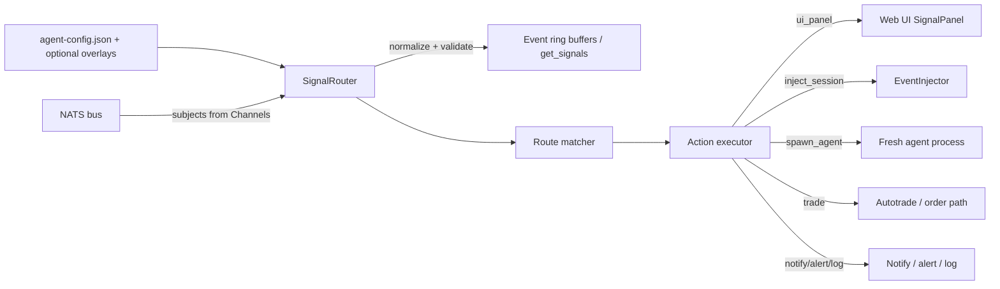

# Task 10394 — ARCH-RECONCILE: Unified `signal_router` Channel/Route/Action Framework

Author: Architect
Date: 2026-05-08
Status: Final architecture artifact, revised 2026-05-08

## 1. Executive recommendation

Unify KAI's NATS event ingestion behind a daemon-owned `signal_router` framework with three first-class concepts:

1. **Channel** — a named NATS subject group with a payload schema/normalizer and minimal validation.
2. **Route** — a channel plus a match expression and an ordered action list.
3. **Action** — a typed terminal effect (`ui_panel`, `inject_session`, `notify`, `trade`, `alert`, `log`, `ignore`, `spawn_agent`).

The router should become the single subscription manager for scanner signals, AI analyses, and alert-style event streams such as polymarket alarms. The existing `EventInjector` from #10389 should survive as the primitive behind `inject_session`. `AlertSubscriber` should be deprecated cleanly: its config block migrates through a read-time compatibility shim into router channels/routes, and its independent NATS subscription wrapper is deleted after shadow/new-mode validation.

Live trading must be protected by a strict backward-compatibility shim for existing top-level `signal_handlers[]`. The shim must translate every legacy handler into router routes at config-load time, preserve matching, cooldown, autotrade gating, and action semantics, and fail daemon startup if translation cannot be proven. Cutover should use `daemon.signal_router.mode: legacy | shadow | new`, defaulting to `shadow` only after Phase A lands, plus `KAI_SIGNAL_ROUTER_KILL_SWITCH=1` to force legacy behavior. The new `spawn_agent` action has no legacy equivalent; in shadow it must only emit would-have-fired metrics and must not create a process.

Recommended UI decision: keep one Svelte signal/alert stream initially, using the existing `SignalPanel.svelte` with category badges and filters (`signals`, `alerts`, `ai_analyses`) rather than creating multiple panels now. Separate panels can be deferred until operator clutter is proven.

## 2. Files inspected

- `agent/signal_consumer.py`
- `agent/signal_handlers.py`
- `daemon/alert_subscriber.py`
- `daemon/event_injector.py`
- `daemon/server.py` around `signal.received` and web socket subscription plumbing
- `web/src/lib/components/SignalPanel.svelte`
- `agent-config.json`
- `docs/architecture/10387-alert-subscriber.md`
- `/home/atc/git/OPS/kai-alert-response/README.md`
- `/home/atc/git/OPS/kai-alert-response/system_prompt.md`
- `/home/atc/git/OPS/kai-alert-response/decision_logic.md`
- `/home/atc/git/OPS/kai-alert-response/tools_reference.md`
- `/home/atc/git/OPS/kai-alert-response/nats_payload_schema.json`
- `/home/atc/git/OPS/kai-alert-response/alert_format_examples.md`
- `/home/atc/git/OPS/kai-alert-response/integration_checklist.md`
- `/home/atc/git/OPS/kai-alert-response/example_alarms/01_cross_above_0_65_sentinel_match.json`

## 3. Current-state summary

### 3.1 Signal path: existing and battle-tested

`agent/signal_consumer.py` currently:

- Subscribes to:
  - `signals.>`
  - `ai.analysis.completed`
- Normalizes scanner messages into a `Signal` dataclass.
- Normalizes AI analysis completion messages into `Signal(source="ai-token-analyzer", signal_type="ANALYSIS")`.
- Stores a bounded ring buffer used by `get_signals`.
- Fires `on_signal`, which `daemon/server.py` uses to fan out:
  - `session.publish_event("signal.received", {"signal": payload})`
  - daemon-bus event channel `signals`.

`agent/signal_handlers.py` currently:

- Loads top-level `signal_handlers[]` from `agent-config.json`.
- Supports matching by exact value, list any-of, dotted paths, case-insensitive strings, AND across fields.
- Supports per-handler cooldown keyed by `(handler_name, symbol)`.
- Supports action verbs in code as:
  - `dispatch_agent`
  - `dispatch_kai`
  - `chat_message`
  - `publish`
  - `webhook`
- Enforces `/autotrade` gating if `requires_autotrade: true` or dispatching to the `trader` agent.

The prompt says the production domain verbs are `notify / trade / alert / log / ignore`; implementation currently names some older terminal effects differently. The router should expose the new eight-kind action taxonomy while preserving legacy verb mappings via shim.

### 3.2 Alert path: new and default-disabled

`daemon/alert_subscriber.py` currently:

- Loads `daemon.alert_subscriber` plus optional `alerts.yaml` overlay and env overrides.
- Defines default disabled polymarket subscription:
  - subject: `polymarket.alpha.alarm.>`
  - template: `prompts/alerts/polymarket.md.tmpl`
  - target session: `kai`
  - max injected turns/hour: `10`
- Normalizes alert payloads into `AlertEvent`.
- Renders prompts through `EventInjectionTemplate`.

`daemon/event_injector.py` provides the reusable guarded injection primitive:

- Renders templates.
- Appends a `HumanMessage` to the target session.
- Applies busy/auto-mode/rate-limit/active-turn gates.
- Emits injected/drop telemetry topics.
- Invokes `run_input(..., pre_injected_input=True, single_auto_iteration=True)`.

This 1-day work is not wasted. It is the foundation for the router's `inject_session` action.

### 3.3 Polymarket alert-response contract

The polymarket-alpha-alarms team has supplied a concrete agent bundle at `/home/atc/git/OPS/kai-alert-response/`. It defines the canonical agent-pack shape for alarm-response agents:

- `system_prompt.md` is the required spawned-agent role/goal.
- `decision_logic.md` is optional additional guidance and includes the seven-step alarm decision tree.
- `tools_reference.md` describes local host tools and env vars.
- `nats_payload_schema.json` is the optional schema for the user-message payload.
- `example_alarms/` contains captured fixtures for route and pack tests.

Operator-confirmed deployment assumption: all relevant trading-platform infra is on the same host as the KAI daemon (`atc-home`). The router and spawned agents can directly access `/home/atc/git/OPS/vpn-stack/scripts/lib/local_first.py`, `/home/atc/git/OPS/vpn-stack/scripts/cache/sweep_state/edge_sentinel_<DATE>.json`, `/home/atc/git/OPS/vpn-stack/scripts/cache/sweep_state/codex_audit/audit_<DATE>.jsonl`, `nats://localhost:4222`, and `docker exec timescaledb psql ...` without cross-host RPC.

## 4. Target architecture

### 4.1 High-level flow



One router subscribes to all configured channels. For each inbound message it:

1. Identifies the channel from subscription binding.
2. Normalizes payload into a `RoutedEvent`.
3. Stores event in the relevant bounded buffer if configured.
4. Evaluates routes for that channel in declaration order.
5. Applies pre-action filters, cooldown/rate-limit/cap gates, and autotrade gates.
6. Executes each matched route's ordered actions.
7. Emits metrics and shadow-diff telemetry.

### 4.2 Domain model

#### Channel

A **Channel** is a named subject group plus payload schema and normalizer.

Fields:

```yaml
name: trade_signals
subjects: ["signals.>"]
schema: trade_signal
buffer:
  enabled: true
  max_events: 200
validation:
  required_fields: [symbol, signal_type]
```

Responsibilities:

- Defines the NATS subject patterns to subscribe.
- Names the payload schema/normalizer.
- Defines minimal validation only; do not put business routing in the channel.
- Optionally enables a ring buffer for query tools.

Initial channels:

```yaml
channels:
  trade_signals:
    subjects: ["signals.>"]
    schema: trade_signal
    buffer: {enabled: true, max_events: 200}

  ai_analyses:
    subjects: ["ai.analysis.completed"]
    schema: ai_analysis
    buffer: {enabled: true, max_events: 200}

  polymarket_alarms:
    subjects: ["polymarket.alpha.alarm.>"]
    schema: polymarket_alarm
    buffer: {enabled: false}
```

Schema normalizers should preserve the existing `Signal.to_dict()` shape for `trade_signals` and `ai_analyses` so `get_signals` and `SignalPanel.svelte` do not regress.

#### Route

A **Route** is a channel-scoped rule with a match expression and ordered action list.

```yaml
- name: clucmay-buy-fanout
  enabled: true
  channel: trade_signals
  match:
    strategy: clucmay02
    signal_type: BUY
    symbol: [BTC, ETH, SOL]
  cooldown_seconds: 1800
  requires_autotrade: true
  actions:
    - kind: ui_panel
      target: signals
    - kind: inject_session
      target: analyst
      template_inline: "A {strategy} BUY signal fired for {symbol} at ${price}. Run MTF TA."
```

Route evaluation rules:

- Evaluate only routes whose `channel` equals the inbound channel.
- Declaration order is preserved.
- Multiple routes may match the same event.
- Each matched route may execute multiple actions.
- `ignore` should stop only the current route's action list unless explicitly configured as `stop_processing: true`; it must not silently suppress other matching routes by default.

#### Action

An **Action** is a typed terminal effect with `kind`, `target`, and per-kind parameters.

The router should expose exactly these eight action kinds in the public config API:

1. `ui_panel`
   - Target taxonomy: `signals | alerts | ai_analyses | <future>`.
   - Publishes a UI/session event and daemon-bus event.
   - Makes formerly implicit `signal.received` surfacing explicit.

2. `inject_session`
   - Target: an agent role/session key from `agent-config.json.agents` (`kai`, `trader`, `analyst`, `risk-manager`, `ceo`, `cto`, etc.).
   - Uses `EventInjector`.
   - Params: `template`, `template_inline`, `rate_limit`, `require_auto_mode`, `single_auto_iteration`, `dedup`.
   - Recommended name remains `inject_session`; it is explicit about the session side effect and matches `EventInjector` terminology.

3. `notify`
   - Target: `chat | push | nats | webhook`.
   - Backward-compatible home for `chat_message`, `publish`, and `webhook` legacy handlers.

4. `trade`
   - Target: `autotrade` or an execution adapter.
   - Must always be gated by `/autotrade` and risk controls.
   - Used for direct automation actions where the router is allowed to invoke the trading path.

5. `alert`
   - Target: operator alert stream.
   - Creates high-salience UI/daemon alert events without necessarily injecting a session turn.

6. `log`
   - Target: `daemon | tui | audit`.
   - Structured log/audit trail action.

7. `ignore`
   - Target optional.
   - No-op action that records a decision reason in metrics/audit.

8. `spawn_agent`
   - Target: an agent-pack name, represented explicitly as `pack`.
   - Resolves to `$AGENTKAI_HOME/agent-packs/<name>/`.
   - Starts a fresh autonomous agent process per matched alarm/event rather than injecting into an existing session.
   - Uses full shell/tool access by design; tool-less or approval-gated guarantees do not apply to this action kind.
   - Primary params: `pack`, `executor`, `model`, `reasoning_effort`, `bypass_approvals`, `timeout_seconds`, `cooldown_key_template`, `cooldown_seconds`, `daily_cap`, `hourly_cap`, `audit_path_template`, `env_passthrough`.

Canonical agent-pack structure:

```text
$AGENTKAI_HOME/agent-packs/<name>/
├── system_prompt.md          # required - LLM role/goal
├── decision_logic.md         # optional - appended to system prompt
├── tools_reference.md        # optional - appended as tool guidance
├── nats_payload_schema.json  # optional - schema for user-message payload
├── README.md                 # human docs, not loaded into prompt
└── example_alarms/           # optional test fixtures, not loaded
```

Other future packs for other trading platforms or event sources should follow the same shape.

### 4.3 RouterDedupTable

Cooldown, dedup, and route-level caps should be a first-class router subsystem, not a private detail of `inject_session`.

`RouterDedupTable`:

- Backing store: SQLite at `$AGENTKAI_HOME/router_dedup.sqlite3`.
- Rows: `namespace`, `key`, `expires_at`, `created_at`, `metadata_json`.
- Cooldown keys are rendered from action templates, e.g. `{rule_id}:{token_id}`.
- Daily/hourly cap rows use separate namespaces such as `cap:day:<route>:<YYYY-MM-DD>` and `cap:hour:<route>:<hour-bucket>`.
- Check-and-set must be atomic: the router consults the table before invoking an action and suppresses the action on hit.
- Recovery is durable across daemon restart. This goes beyond the polymarket bundle's in-memory-acceptable recommendation and is appropriate for a daemon-owned router.

Health surface in `/api/health.signal_router`:

```json
{
  "dedup_db": "ok",
  "spawns_today": 12,
  "spawns_this_hour": 3,
  "spawns_this_minute": 1,
  "top_suppressed": [
    {"rule_id": "cross_above_0_65", "token_id": "824171...", "count": 4}
  ]
}
```

Per-action telemetry should distinguish suppression reason: cooldown, daily cap, hourly cap, shadow dry-run, validation failure, and execution failure.

## 5. Configuration shape

### 5.1 Recommended location

Use `agent-config.json` under `daemon.signal_router` for the core framework because:

- Router is daemon-owned.
- Feature flags/kill switches belong with daemon config.
- Existing `daemon.alert_subscriber` already lives there.
- Top-level `signal_handlers[]` must remain untouched for compatibility.

Optional YAML overlays can be added later for large route sets, but the initial implementation should keep a single source of truth plus compatibility shims.

### 5.2 Proposed JSON/YAML shape

Shown as YAML for readability; actual `agent-config.json` uses JSON.

```yaml
daemon:
  signal_router:
    mode: shadow                 # legacy | shadow | new
    legacy_path: true            # derived from mode; keep only if existing code prefers bools
    strict_legacy_shim: true
    channels:
      trade_signals:
        subjects: ["signals.>"]
        schema: trade_signal
        buffer: {enabled: true, max_events: 200}
      ai_analyses:
        subjects: ["ai.analysis.completed"]
        schema: ai_analysis
        buffer: {enabled: true, max_events: 200}
      polymarket_alarms:
        subjects: ["polymarket.alpha.alarm.>"]
        schema: polymarket_alarm
        buffer: {enabled: false}
    routes:
      - name: all-trade-signals-to-ui
        enabled: true
        channel: trade_signals
        match: {}
        actions:
          - kind: ui_panel
            target: signals

      - name: all-ai-analyses-to-ui
        enabled: true
        channel: ai_analyses
        match: {}
        actions:
          - kind: ui_panel
            target: ai_analyses

      - name: polymarket-alarm-response
        enabled: false
        channel: polymarket_alarms
        match: {}
        actions:
          - kind: spawn_agent
            pack: kai-alert-response
            executor: codex-cli
            timeout_seconds: 300
            cooldown_key_template: "{rule_id}:{token_id}"
            cooldown_seconds: 600
            daily_cap: 50
            hourly_cap: 10
```

### 5.3 Example: existing `signal_handlers[]` translated

Current `agent-config.json` includes disabled examples such as:

```json
{
  "name": "auto-execute-clucmay-buy",
  "enabled": false,
  "match": {
    "strategy": "clucmay02",
    "signal_type": "BUY",
    "symbol": ["BTC", "ETH", "SOL"]
  },
  "action": "dispatch_agent",
  "agent": "trader",
  "task_template": "AUTOTRADE: a clucmay02 BUY signal fired for {symbol} at ${price}...",
  "cooldown_seconds": 1800,
  "requires_autotrade": true
}
```

Shim output:

```yaml
- name: legacy:auto-execute-clucmay-buy
  enabled: false
  channel: trade_signals
  source_compat: signal_handlers
  legacy_action: dispatch_agent
  match:
    strategy: clucmay02
    signal_type: BUY
    symbol: [BTC, ETH, SOL]
  cooldown_seconds: 1800
  requires_autotrade: true
  actions:
    - kind: inject_session
      target: trader
      template_inline: "AUTOTRADE: a clucmay02 BUY signal fired for {symbol} at ${price}..."
      autotrade_gate: true
```

Current `ai-token-analyzer-to-chat`:

```json
{
  "name": "ai-token-analyzer-to-chat",
  "enabled": false,
  "match": {"source": "ai-token-analyzer"},
  "action": "chat_message",
  "template": "[bold magenta][ai-analyzer][/] {symbol} — see eval_results for the full report"
}
```

Shim output:

```yaml
- name: legacy:ai-token-analyzer-to-chat
  enabled: false
  channel: ai_analyses
  source_compat: signal_handlers
  legacy_action: chat_message
  match:
    source: ai-token-analyzer
  actions:
    - kind: notify
      target: chat
      template_inline: "[bold magenta][ai-analyzer][/] {symbol} — see eval_results for the full report"
```

If channel inference is ambiguous, default legacy handlers to `trade_signals` unless the match explicitly identifies `source: ai-token-analyzer` or `signal_type: ANALYSIS`. Emit a warning in `legacy` mode, but fail fast in `shadow`/`new` if the route would not be behaviorally comparable.

### 5.4 Example: polymarket alarm-response route

The operator-confirmed polymarket route is not `inject_session`. It spawns a fresh autonomous process per unsuppressed alarm and hands that process the alarm payload plus the `kai-alert-response` agent pack.

```yaml
daemon:
  signal_router:
    routes:
      - name: polymarket-alarm-response
        channel: polymarket_alarms
        match: {}                        # all alarms; per-rule filtering inside the agent pack
        actions:
          - kind: spawn_agent
            pack: kai-alert-response
            executor: codex-cli
            model: gpt-5.5
            reasoning_effort: high
            bypass_approvals: true
            timeout_seconds: 300
            cooldown_key_template: "{rule_id}:{token_id}"
            cooldown_seconds: 600
            daily_cap: 50
            hourly_cap: 10
            audit_path_template: "/home/atc/git/OPS/vpn-stack/scripts/cache/sweep_state/codex_audit/audit_{date}.jsonl"
            env_passthrough: [KAI_PUSHOVER_USER, KAI_PUSHOVER_TOKEN, KAI_NTFY_TOPIC]
    channels:
      polymarket_alarms:
        subjects: ["polymarket.alpha.alarm.>"]
        schema: polymarket_alarm   # references kai-alert-response/nats_payload_schema.json
```

The pack should be staged under `$AGENTKAI_HOME/agent-packs/kai-alert-response/`. In the current operator host layout the source bundle lives at `/home/atc/git/OPS/kai-alert-response/`; deployment may symlink or copy it, but config should reference the stable pack name, not the source path.

## 6. Backward-compatibility shim — critical design

### 6.1 Requirements

- Top-level `signal_handlers[]` stays valid byte-for-byte.
- Existing `daemon.alert_subscriber` stays valid and is translated on read into router channels/routes.
- No operator config rewrite is required during Phase A/B.
- Every enabled legacy handler must translate to one or more router routes.
- Shim failures must fail daemon startup in `shadow` or `new`; do not silently skip trade rules.
- Legacy action semantics and safety gates must be preserved.

### 6.2 Translation table

| Legacy field/action | Router mapping |
| --- | --- |
| `name` | `route.name = "legacy:" + name` |
| `enabled` | `route.enabled` |
| `match` | `route.match`, using exact same matching engine |
| `cooldown_seconds` | `route.cooldown_seconds`; key remains `(route.name, symbol.upper())` |
| `requires_autotrade` | `route.requires_autotrade` and action gate |
| `action: dispatch_agent` | `kind: inject_session`, `target: agent`, `template_inline: task_template`; shadow mode also computes legacy dispatch decision |
| `action: dispatch_kai` | `kind: inject_session`, `target: kai`, `template_inline: task_template or template` |
| `action: chat_message` | `kind: notify`, `target: chat`, `template_inline: template` |
| `action: publish` | `kind: notify`, `target: nats`, `subject: subject`, `template_inline: template` or raw event |
| `action: webhook` | `kind: notify`, `target: webhook`, `url: url`, `template_inline: template` |
| implicit trader gate | if `agent.lower() == "trader"`, force autotrade gate even if `requires_autotrade` is false |

`daemon.alert_subscriber.subscriptions[]` uses the Section 12 mapping and produces `source_compat: alert_subscriber` routes. For polymarket, the target action is now `spawn_agent` when the route is migrated to the operator-confirmed `kai-alert-response` pack; old `inject_session` alert configs can still be represented for compatibility until the operator migrates them.

### 6.3 Shim validation

At config load, run:

1. **Schema validation**: each handler is a dict; action is known; required action fields exist.
2. **Target validation**:
   - `dispatch_agent.agent` must exist in `agent-config.json.agents` or the currently accepted agent registry.
   - `inject_session.target` must be a known role/session.
3. **Template validation**:
   - Inline templates are strings.
   - File templates are readable.
   - Missing placeholders are allowed, matching current `_DefaultDict` behavior for signal handlers.
4. **Match validation**:
   - Match object is a dict.
   - Dotted paths are accepted.
   - Values are scalar or list only for shim parity.
5. **Parity fixture generation**:
   - For each legacy handler, generate representative events that should match and should not match.
   - Compare `signal_handlers.matches()` vs router matcher.
6. **Safety validation**:
   - Any route that targets `trader` or uses `kind: trade` must have an effective autotrade gate.

Failure policy:

- `mode=legacy`: log validation errors, keep old behavior. This preserves current startup tolerance.
- `mode=shadow` or `mode=new`: fail startup for invalid enabled legacy handlers or any enabled handler whose translation is impossible.
- Disabled malformed handlers may be warnings initially, but recommended implementation should validate all handlers before Phase 5 to avoid a future surprise when an operator flips `enabled`.

### 6.4 Why fail-fast matters

Live trading risk comes primarily from silent rule drops or safety-gate drift. A router that starts with a partially translated config is more dangerous than a daemon that refuses to start and leaves the operator on the kill switch/legacy path.

## 7. Match expression surface

Phase A/B should intentionally keep the match language identical to `signal_handlers.py`:

- exact scalar equality
- list any-of
- dotted path lookup
- case-insensitive string compare for strings
- AND across keys
- missing field means no match

Do **not** add regex, JSONPath, numeric ranges, expression languages, or arbitrary Python in the cutover. Those features widen the security and correctness surface and make parity testing harder. If needed later, add operator-explicit operators only after legacy cutover, e.g.:

```yaml
match:
  confidence: {op: in, value: [high, very_high]}
  score: {op: ">=", value: 0.8}
```

But this is out of scope for Phase A-C, except for the explicit pre-action gate below.

### 7.1 Pre-action filter gate

Architect recommendation: use a `pre_action` filter instead of expanding `match` with file-backed operators.

Reasoning:

- The core `match` language must stay identical to `signal_handlers.py` for legacy parity and live-trading safety.
- Sentinel lookup is a side-effect-adjacent file read with date templating and JSON parsing; it should not be hidden inside the legacy matcher.
- Some routes, including the canonical polymarket route in Section 5.4, intentionally let the agent pack perform per-rule filtering. A pre-action gate is available when the operator wants declarative short-circuiting, without forcing it into every pack.

Shape:

```yaml
pre_action:
  kind: filter
  expr:
    sentinel_match:
      file: "/home/atc/git/OPS/vpn-stack/scripts/cache/sweep_state/edge_sentinel_{date}.json"
      token_field: "token_id"
      tokens_path: "$.tokens"
      whitelist_rules_path: "$.whitelist_rules"
      on_missing: "allow_high_leverage_only"
```

`sentinel_match` returns `allow`, `suppress`, or `error`. `suppress` writes an audit row and emits route telemetry but does not invoke the action. `error` follows route policy: for polymarket, malformed sentinel should produce escalation/audit rather than silently dropping high-leverage rules.

## 8. Code reorganization

### 8.1 Recommended module ownership

Use `daemon/signal_router.py` as the primary module because:

- `EventInjector` is daemon-owned.
- UI session event publishing is daemon-owned.
- AlertSubscriber compatibility and Heartbeat-style injection are daemon services.
- Feature flags live under `daemon` config.

Keep lightweight compatibility types or imports in `agent/` only if tools depend on them.

### 8.2 Proposed module layout

`daemon/signal_router.py`:

- `ChannelConfig`
- `RouteConfig`
- `ActionConfig`
- `RoutedEvent`
- `RouteDecision`
- `ActionDecision`
- `SignalRouterConfig`
- `RouterDedupTable`
- `RouterAuditWriter`
- `SpawnAgentExecutor`
- `AgentPackLoader`
- `SignalRouter`
- `load_signal_router_config(config)`
- `translate_legacy_signal_handlers(config)`
- `translate_alert_subscriber_config(config)`
- `validate_signal_router_config(config)`

`agent/signal_handlers.py`:

- Keep as compatibility in Phase A/B.
- Move or re-export matcher functions (`_flatten_signal`, `_resolve_field`, `matches`, `render_template`) from a new shared module, e.g. `daemon/signal_matcher.py` or `agent/signal_matcher.py`.
- During Phase C, delete or shrink to a shim if no direct TUI dependencies remain.

`agent/signal_consumer.py`:

- Phase A: keep existing `SignalConsumer` as the legacy subscription/buffer path.
- Phase B: router shadows it.
- Phase C: convert `SignalConsumer` into either:
  - a thin channel normalizer + ring-buffer class used by `SignalRouter`, or
  - a compatibility facade over `SignalRouter.query()` for `get_signals`.

`daemon/alert_subscriber.py`:

- Keep only as a transitional config adapter during shim phases.
- Translate current `daemon.alert_subscriber` config into channels/routes at config-load time.
- Keep `AlertEvent` normalization helpers only if useful as the `polymarket_alarm` schema normalizer.
- Delete the independent NATS subscription manager after router cutover validation.

`daemon/server.py`:

- Replace direct `_handle_signal` binding with router `ui_panel` action implementation.
- Fold existing `_handle_signal` and `_handle_ai_analysis` callback behavior into router channel normalizers/actions.
- Own one `EventInjector` and pass it to router action executor.
- Expose router metrics in `/api/metrics` and health in `/api/health`.

### 8.3 Router internals

```text
SignalRouter
  - bus
  - config
  - event_injector
  - action_executor
  - buffers: channel -> deque
  - dedup_table
  - audit_writer
  - stats
  - start(): subscribe once per unique subject pattern/channel binding
  - handle_message(channel, subject, payload): normalize, buffer, route, execute
  - query(channel/symbol/strategy/signal_type/limit): get_signals compatibility
```

Subscription behavior:

- Subscribe once per `(channel_name, subject_pattern)`.
- Detect duplicate exact subject subscriptions and coalesce if same channel.
- Detect overlapping subject patterns at config validation and warn/error based on policy.

NATS callback contract:

```python
async def _handle_router_message(channel_name: str, subject: str, payload: dict[str, Any]) -> None:
    ...
```

The callback must stay hot-path safe:

- Normalize and decision computation should be synchronous and cheap.
- Slow action effects should be scheduled/backgrounded.
- Do not await webhooks, injected turns, or agent runs inside the NATS callback except through bounded async scheduling consistent with current `SignalHandlerRunner.run_async` behavior.
- `spawn_agent` is always scheduled outside the hot callback and bounded by `timeout_seconds`.

## 9. Action execution details

### 9.1 `ui_panel`

Publishes an event to live sessions and daemon bus.

Payload contract:

```json
{
  "type": "signal.received",
  "signal": {
    "id": "optional stable id",
    "category": "signals",
    "channel": "trade_signals",
    "subject": "signals.clucmay02.BTC",
    "source": "signal-scanner",
    "strategy": "clucmay02",
    "symbol": "BTC",
    "signal_type": "BUY",
    "price": 65000.0,
    "timestamp": "...",
    "received_at": 123456.0,
    "details": {}
  }
}
```

For backward compatibility:

- Keep session topic `signal.received` initially.
- Keep websocket subscription channel `signals` initially.
- Keep `SignalEnvelope(type="signal", signal=...)` initially.
- Add `category`/`channel` fields to the signal payload rather than changing the envelope.

Whether `inject_session` also publishes `signal.received`:

- **No, not implicitly.** UI surfacing must be explicit via `ui_panel` action.
- Rationale: session injection and UI display are separate effects. Some injected events may be noisy or sensitive; some UI events should not wake agents.
- Routes that need both should declare both actions explicitly.

### 9.2 `inject_session`

Uses `EventInjector`.

Action params:

```yaml
- kind: inject_session
  target: analyst
  template: prompts/signals/analyst-signal.md.tmpl
  template_inline: null
  rate_limit:
    max_per_hour: 10
  require_auto_mode: true
  single_auto_iteration: true
  dedup:
    ttl_seconds: 900
    key_fields: [channel, symbol, signal_type, strategy]
```

The router converts `RoutedEvent` into `EventInjectionRequest` and chooses an `EventInjectionPolicy` with source like `signal_router:<channel>`.

### 9.3 `trade`

`trade` must be isolated from mere session injection:

- `kind: trade` represents a direct automation action.
- It must never be inferred from `signal_type: BUY` alone.
- It must require all current autotrade/risk gates.
- It should produce audit logs and diff metrics in shadow.
- It should be disabled unless the route or legacy shim explicitly asks for trading behavior.

Legacy `dispatch_agent` to `trader` should remain `inject_session target=trader` plus autotrade gate, not direct `trade`, unless current production behavior is direct order execution. This preserves existing semantics: the trader agent decides and uses tools.

### 9.4 `notify`, `alert`, `log`, `ignore`

Implement these as small action adapters, not as separate subscription systems.

- `notify target=chat` maps legacy `chat_message`.
- `notify target=nats` maps legacy `publish`.
- `notify target=webhook` maps legacy `webhook`.
- `notify target=push` supports `pushover`, `ntfy`, and `log_only` backends.
- `alert` emits high-salience operator alert telemetry/UI events.
- `log` writes structured log/audit records.
- `ignore` records route decision and reason; optional `stop_processing` can be introduced later.

`notify target=push` shape:

```yaml
- kind: notify
  target: push
  backends: [pushover, ntfy, log_only]
  pushover:
    user_env: KAI_PUSHOVER_USER
    token_env: KAI_PUSHOVER_TOKEN
    priority: 1
    url: "{polymarket_url}"
    url_title: "Open Polymarket"
  ntfy:
    topic_env: KAI_NTFY_TOPIC
    priority: 3
```

Rules:

- Env vars only; never inline Pushover user keys, tokens, or ntfy topics.
- Fallback chain is route-configured, normally `pushover -> ntfy -> log_only`.
- Pushover priority accepts `0 | 1 | 2`; ntfy priority accepts `1-5`.
- If all configured push backends fail, write audit, emit `auto.notify.push.failed`, and do not block the rest of the route.

### 9.5 `spawn_agent`

`spawn_agent` starts a fresh process for each unsuppressed route action. This is intentionally different from `inject_session`: no existing KAI session receives a human message, and no prior conversational state is reused.

Action params:

```yaml
- kind: spawn_agent
  pack: kai-alert-response
  executor: codex-cli
  model: gpt-5.5
  reasoning_effort: high
  bypass_approvals: true
  timeout_seconds: 300
  cooldown_key_template: "{rule_id}:{token_id}"
  cooldown_seconds: 600
  daily_cap: 50
  hourly_cap: 10
  audit_path_template: "/home/atc/git/OPS/vpn-stack/scripts/cache/sweep_state/codex_audit/audit_{date}.jsonl"
  env_passthrough: [KAI_PUSHOVER_USER, KAI_PUSHOVER_TOKEN, KAI_NTFY_TOPIC]
```

Parameter contract:

- `pack: string` resolves to `$AGENTKAI_HOME/agent-packs/<name>/`.
- `executor: string` is `codex-cli | claude-cli | openai | anthropic`; default `codex-cli`.
- `model: string` defaults to the executor's default model.
- `reasoning_effort: string` is `medium | high | xhigh` and applies to `codex-cli` only.
- `bypass_approvals: bool` defaults to `true`. This follows Dan's autonomy-by-design rule for this product path.
- `timeout_seconds: int` hard-kills the spawned process; default `300`.
- `cooldown_key_template: string` is a Jinja-style field template that renders the action dedup key, e.g. `{rule_id}:{token_id}`.
- `cooldown_seconds: int` defaults to `0`; polymarket uses `600`.
- `daily_cap: int` defaults to `0` unlimited; polymarket uses `50`.
- `hourly_cap: int` defaults to `0` unlimited; polymarket uses `10`.
- `audit_path_template: string` controls where decisions are written.
- `env_passthrough: list[string]` forwards only named environment variables into the child.

Pack loading:

- Load `system_prompt.md` first.
- Append `decision_logic.md` and `tools_reference.md` if present.
- Validate the inbound payload against `nats_payload_schema.json` if present before spawning.
- Do not load `README.md` or `example_alarms/` into the prompt.
- The user message to the spawned process contains subject, route name, rendered event payload, and router metadata.

Process semantics:

- Spawn outside the NATS callback.
- Enforce `RouterDedupTable` cooldown and cap checks before process creation.
- Shadow mode must not spawn. It records would-have-fired `spawn_agent` decisions only.
- Tool-less guarantees do not apply. `spawn_agent` is a full-tools, full-shell autonomous agent by design, with per-step approvals bypassed when configured.
- The spawned process inherits the daemon host filesystem and can import `/home/atc/git/OPS/vpn-stack/scripts/lib/local_first.py`, read sentinel/audit files, reach `nats://localhost:4222`, and run local shell commands subject to daemon process permissions.

Telemetry:

- `auto.spawn_agent.fired`
- `auto.spawn_agent.suppressed_cooldown`
- `auto.spawn_agent.suppressed_daily_cap`
- `auto.spawn_agent.suppressed_hourly_cap`
- `auto.spawn_agent.exit_ok`
- `auto.spawn_agent.exit_failed`
- `auto.spawn_agent.timed_out`

### 9.6 Audit log writes

Every route decision writes one JSONL row: fired, suppressed, failed, timed out, or shadow would-have-fired. This is a router side effect, not merely an action-specific log.

Default path:

```text
$AGENTKAI_HOME/audit/router_{date}.jsonl
```

Routes may override with `audit_path_template`. The polymarket route uses:

```text
/home/atc/git/OPS/vpn-stack/scripts/cache/sweep_state/codex_audit/audit_{date}.jsonl
```

Minimum row fields:

```json
{
  "ts": "2026-05-08T19:42:11.337Z",
  "route": "polymarket-alarm-response",
  "channel": "polymarket_alarms",
  "subject": "polymarket.alpha.alarm.cross_above_0_65",
  "action_kind": "spawn_agent",
  "decision": "fired",
  "reason": null,
  "rule_id": "cross_above_0_65",
  "token_id": "824171...",
  "cooldown_key": "cross_above_0_65:824171...",
  "shadow": false
}
```

Audit write failure emits telemetry and structured daemon logs. It should not block a notification fallback chain, but repeated audit failures should mark `/api/health.signal_router.audit` unhealthy.

## 10. UI surface decision

### Recommendation: one panel initially, with category badges and filters

Keep the existing `SignalPanel.svelte` path and evolve it into a unified event panel. Do not create separate panels in the cutover phases.

Reasons:

- Minimizes frontend churn during a live-trading-sensitive backend migration.
- Existing websocket subscription model already understands channel `signals`.
- Operators benefit from one chronological stream with filters during shadow validation.
- Separate panels can be introduced later if clutter becomes a real UX problem.

Minimum UI changes:

- Add optional display fields to the existing alert type:
  - `category`: `signals | alerts | ai_analyses`
  - `channel`: router channel name
  - `route_names`: matched routes, optional
  - `severity`, for alerts
- Add small category badge.
- Add category filter if needed.

Wire decision:

- Continue publishing `signal.received` for `ui_panel` actions.
- Continue daemon-bus channel `signals` initially for compatibility.
- Add payload `category` instead of adding a new websocket subscription channel in Phase A-C.
- Do not publish `signal.received` for `inject_session` unless the route includes `ui_panel`.

Optional Phase 8:

- Rename UI subscription channel from `signals` to `events` while keeping `signals` as alias.
- Split visual sections within the same component if clutter appears.

## 11. Shadow mode and cutover plan

### Feature flags

```yaml
daemon:
  signal_router:
    mode: shadow   # legacy | shadow | new
```

Environment kill switch:

```bash
KAI_SIGNAL_ROUTER_KILL_SWITCH=1
```

Kill-switch behavior:

- Forces `mode=legacy` unconditionally.
- Starts only legacy `SignalConsumer`/`SignalHandlerRunner` path for signals.
- During transitional releases, keeps legacy `AlertSubscriber` behavior at its current default-disabled setting if that service still exists.
- Prevents all router-only effects, including `spawn_agent`.
- Emits a clear health/metrics field: `signal_router.kill_switch_active=true`.

### Phase A: Land router code path + shim, no behavior change

Behavior:

- Legacy path remains authoritative.
- Router subscribes in shadow only if duplicate subscriptions will not produce duplicate side effects. Prefer feeding router from the legacy callback during early shadow to avoid NATS duplicate side effects; if it subscribes to NATS directly, all actions must be dry-run except metrics.
- Router computes route decisions but does not execute side effects.
- `spawn_agent` is wired and config-validatable, including agent-pack validation, but is not invoked in `legacy` or `shadow`.
- Router emits shadow metrics comparing legacy decisions and router decisions.

Deliverables:

- Data classes/config loader.
- Channel normalizers for `trade_signal` and `ai_analysis`.
- Legacy shim.
- Matcher parity tests.
- Dry-run action decision model.

Acceptance criteria:

- Existing UI signal flow unchanged.
- Existing `get_signals` output unchanged for fixtures.
- Existing `signal_handlers[]` configs load unchanged.
- With a fixture suite, router decisions exactly match legacy decisions for match/no-match, cooldown allow/block, autotrade gate, and action target.

### Phase B: Operator validates shadow metrics

Behavior:

- `mode=shadow` remains default after Phase A confidence.
- Legacy side effects remain authoritative.
- Router either receives mirrored events from legacy path or direct NATS events with dry-run effects.
- Router shadow-evaluates routes including `spawn_agent`, but must not actually spawn; it only counts would-have-fired, suppressed-cooldown, and cap decisions.
- Metrics expose divergence and spawn dry-run counts.

Minimum validation period:

- 3 trading days for normal signal flow, or
- 7 calendar days if signal frequency is low, or
- at least 500 routed events and at least 20 matched route events, whichever takes longer.

Shadow diff metrics:

```text
signal_router_events_total{channel}
signal_router_routes_evaluated_total{channel}
signal_router_legacy_diff_total{kind}
signal_router_legacy_diff_rate
signal_router_decision_latency_ms_bucket
signal_router_action_dry_run_total{kind,target}
signal_router_spawn_agent_would_fire_total{route,pack}
signal_router_shim_translation_errors_total
signal_router_subject_overlap_warnings_total
```

Diff kinds:

- `match_mismatch`
- `cooldown_mismatch`
- `autotrade_gate_mismatch`
- `action_kind_mismatch`
- `action_target_mismatch`
- `template_render_mismatch`
- `ui_payload_mismatch`

Phase B -> C / Phase 5 decision threshold:

- **Zero critical diffs** for enabled routes over the validation period.
  - Critical diffs: `trade`, `inject_session target=trader`, autotrade gate, enabled route dropped, or legacy side effect not mirrored.
- **Zero shim translation errors**.
- **Zero subject overlap errors** for enabled channels.
- Non-critical diff rate below **0.1%** and explained/accepted by operator.
- p95 router decision latency below **5 ms** excluding action side-effect time; p99 below **20 ms**.
- No duplicate UI events during shadow.
- Health endpoint reports router healthy continuously during validation.

### Phase C / Phase 5: Flip to new path

Behavior:

- Operator sets `daemon.signal_router.mode: new` or `legacy_path: false` if that legacy boolean exists.
- Legacy signal side effects stop.
- Router executes actions authoritatively.
- `spawn_agent` actions actually fire, subject to `RouterDedupTable`, caps, timeout, and audit writes.
- The polymarket `kai-alert-response` route can be enabled at this point.
- Legacy `SignalConsumer` becomes query facade or is disabled except for compatibility methods.

Immediate rollback:

- Set `KAI_SIGNAL_ROUTER_KILL_SWITCH=1` and restart daemon/TUI to force legacy.
- Keep legacy code present for at least one release after new path is enabled.

Acceptance criteria:

- No critical production diffs in shadow period.
- All enabled legacy handlers have route parity tests.
- Operator has documented rollback steps.
- Router metrics/health visible.

### Phase D: Delete dead legacy code

Only after at least one stable release/week in `new` mode:

- Remove old independent signal handler runner if unused.
- Keep config shim for `signal_handlers[]` for at least one additional release unless operator explicitly migrates config.
- Delete `daemon/alert_subscriber.py` as a subscription service after the read-time shim has run cleanly for N days in shadow plus `mode: new`.
- Delete `daemon/event_injector.py` alert-only glue, but preserve `EventInjector` itself for heartbeat and router `inject_session`.

## 12. AlertSubscriber's fate

Operator decision: deprecate `AlertSubscriber` cleanly, not refactor it as a long-lived thin wrapper.

Current `daemon.alert_subscriber.subscriptions[]` maps to:

```yaml
channels:
  polymarket_alarms:
    subjects: ["polymarket.alpha.alarm.>"]
    schema: polymarket_alarm

routes:
  - name: alert-subscription:polymarket-default
    enabled: false
    channel: polymarket_alarms
    source_compat: alert_subscriber
    match: {}
    actions:
      - kind: spawn_agent
        pack: kai-alert-response
        executor: codex-cli
        bypass_approvals: true
        timeout_seconds: 300
        cooldown_key_template: "{rule_id}:{token_id}"
        cooldown_seconds: 600
        daily_cap: 50
        hourly_cap: 10
```

Mapping details:

| AlertSubscriber field | Router mapping |
| --- | --- |
| `enabled` global | controls whether adapter routes are enabled/loaded, unless kill switch |
| `kill_switch` | disables generated alert routes |
| `subject_pattern` | channel subject |
| `prompt_template_path` | legacy `inject_session.template`; superseded by `spawn_agent.pack` for polymarket |
| `target_session` | legacy `inject_session.target`; superseded by fresh process semantics for polymarket |
| `target_agent` | optional metadata or future role override; do not invent new routing now |
| `max_injected_turns_per_hour` | legacy `inject_session.rate_limit.max_per_hour`; maps to `hourly_cap` for spawn-agent routes |
| alert normalizer | channel schema `polymarket_alarm` |

Migration behavior:

- The shim translates the legacy block on read, so existing `agent-config.json` does not require a flag day.
- Old configs keep working through the shim while operators move to `daemon.signal_router.routes`.
- The polymarket subscription becomes a route under the unified `signal_router` framework.
- The operator-confirmed route is the Section 5.4 `spawn_agent` route, not an `inject_session` route.
- Env overrides (`KAI_ALERT_SUBSCRIBER_*`) are preserved only through the compatibility window.

Deletion criteria:

- Run the read-time shim cleanly for N operator-approved days in shadow.
- Run `mode: new` with router-owned polymarket subscriptions and zero alert-router critical diffs.
- Delete `daemon/alert_subscriber.py` and the alert-only path in `daemon/event_injector.py`.
- Preserve `EventInjector` itself. Heartbeat still uses it, and the router's `inject_session` action still uses it.

## 13. Subject-pattern collision handling

Risk: overlapping NATS subjects can duplicate events or route them through the wrong schema.

Rules:

1. Exact duplicate `(channel, subject)` is allowed and coalesced.
2. Exact duplicate subject across different channels is an error unless explicitly marked `allow_overlap: true`.
3. Obvious wildcard overlap, e.g. `signals.>` and `signals.clucmay02.>`, should warn in `legacy`, fail in `shadow/new` unless ordered and intentional.
4. `ai.analysis.completed` should not be swallowed by `signals.>` because it is separate, but validation should check generated route assumptions.
5. Config should expose overlap warnings in health/metrics.

## 14. Performance requirements

The scanner signal path is hot enough that the router must not add user-visible latency.

Targets:

- p95 decision latency under 5 ms, excluding side-effect execution.
- p99 decision latency under 20 ms.
- NATS callback does not block on webhooks, agent turns, or network notifications.
- NATS callback does not block on spawned agent processes; enqueue spawn work and return.
- Route matching remains O(routes for channel), not O(all routes).
- Pre-index routes by channel.
- Pre-parse match keys and action configs at load time.
- Template files should be loaded/cached at config load; inline templates are precompiled if practical.
- SQLite dedup check-and-set must stay under the same p95/p99 decision budget.

## 15. Failure modes and handling

| Failure | Handling |
| --- | --- |
| Invalid router config | Fail startup in `shadow/new`; log in `legacy` where possible |
| Legacy shim translation failure | Fail startup in `shadow/new`; never silently drop enabled handler |
| Unknown action kind | Fail config validation |
| Unknown `inject_session` target | Fail config validation for enabled route |
| Unknown `spawn_agent` pack | Fail config validation for enabled route |
| Missing template file | Fail config validation for enabled route |
| Malformed payload | Drop event, increment malformed metric, do not inject |
| Subject overlap | Fail if enabled and ambiguous in `shadow/new`; warn in `legacy` |
| Action execution exception | Log, increment action error, continue next route unless policy says stop |
| `EventInjector` target busy/rate-limited | Publish/drop telemetry, no retry queue in v1 |
| `spawn_agent` timeout | Kill process, emit `auto.spawn_agent.timed_out`, write audit |
| `spawn_agent` cap/cooldown hit | Suppress before process creation, emit specific telemetry, write audit |
| Push backend failure | Fall through configured chain; if all fail, emit `auto.notify.push.failed` and audit |
| Audit write failure | Emit telemetry/log; mark health unhealthy if repeated |
| Autotrade disabled | Gate action, emit metric/log; do not execute |
| Router unavailable | Kill switch or `mode=legacy` falls back to old path |
| In-flight alert at cutover | At-most-once semantics; accept possible drop during restart, no durable replay in v1 |

## 16. Tests and verification

### 16.1 Unit tests

- Channel normalizers:
  - `signals.>` payload -> exact old `Signal.to_dict()` shape.
  - `ai.analysis.completed` -> exact old AI signal shape.
  - polymarket payload -> same `AlertEvent.to_template_values()` values.
- Matcher parity:
  - exact scalar
  - list any-of
  - dotted path
  - case-insensitive strings
  - missing fields no-match
- Shim translation:
  - every action maps correctly
  - trader implicit autotrade gate preserved
  - cooldown preserved
  - disabled handlers preserved as disabled routes
- Action validation:
  - unknown target/action/template fails.
- `spawn_agent` action:
  - mock subprocess and verify executor args, model, reasoning effort, approval bypass flag, hard timeout, and exit code handling.
  - verify `env_passthrough` forwards only named env vars.
  - verify cooldown/cap checks run before process creation.
  - verify telemetry events for fired, suppressed cooldown, suppressed daily/hourly cap, exit ok, exit failed, and timed out.
- `RouterDedupTable`:
  - atomic concurrent check-and-set permits one winner.
  - cooldown rows survive daemon restart.
  - daily/hourly cap namespaces do not collide with cooldown keys.
- `notify target=push`:
  - pushover failure falls through to ntfy success.
  - pushover and ntfy failure falls through to `log_only`.
  - `auto.notify.push.failed` emits only when the push chain fails.

### 16.2 Golden fixture tests

Build a fixture matrix from current `agent-config.json`:

- BUY signal matching `any-buy-to-analyst`.
- SELL signal matching `any-sell-to-analyst`.
- high confidence BUY matching risk-manager handler.
- clucmay BUY BTC/ETH/SOL matching trader handler and autotrade gate.
- AI analyzer completion matching chat handler.
- Negative fixtures for wrong symbol, wrong signal type, missing confidence.
- Polymarket alarm-response fixture from `/home/atc/git/OPS/kai-alert-response/example_alarms/01_cross_above_0_65_sentinel_match.json`.

For each fixture compare:

- legacy match set
- router match set
- cooldown decision
- autotrade gate decision
- action kind/target/template render

### 16.3 Shadow validation tests

- Run old and router decisions on same event object.
- Assert no duplicate side effects.
- Assert diff metrics increment on intentionally mutated configs.
- Assert `KAI_SIGNAL_ROUTER_KILL_SWITCH=1` prevents router side effects.

### 16.4 Integration tests

- NATS fake bus publishes `signals.clucmay02.BTC`; UI receives one `signal.received`.
- `get_signals` returns the same newest-first results as before.
- Alert subscription config generates a polymarket router route through the compatibility shim.
- Polymarket route end-to-end: captured fixture matches `polymarket-alarm-response`, passes pack schema validation, renders cooldown key `cross_above_0_65:<token_id>`, writes audit, and would spawn in `new` mode.
- Shadow-mode polymarket route records would-have-spawned metrics but creates no subprocess.
- Legacy `inject_session` alert configs remain representable until migration.
- Busy session/rate-limit drops are emitted through existing `auto.alert_*`-style telemetry or router equivalent.

## 17. Phased ticket plan, decision criteria, and ETA

Do not file these automatically; this is the recommended implementation sequence.

### Phase 1 — Router skeleton + RouteDecision model + RouterDedupTable + shim harness

Scope:

- Add router config/data classes.
- Add channel/route/action model.
- Add `RouteDecision`/`ActionDecision` dry-run model.
- Add `RouterDedupTable` with SQLite durability, atomic check-and-set, and cap namespaces.
- Add config validation framework.
- Add legacy shim harness, dry-run only.

Decision criteria:

- Unit tests pass for parsing/validation.
- Dedup concurrent-write and restart-durability tests pass.
- No runtime path change.
- Kill switch recognized.

ETA with serial dev/CR/SA/QA: 4-5 developer days.

### Phase 2 — Backward-compat shims

Scope:

- Implement full `signal_handlers[] -> routes[]` translation.
- Implement `daemon.alert_subscriber -> routes[]` migration shim.
- Extract/reuse matcher.
- Build golden parity fixture suite.

Decision criteria:

- 100% parity on golden fixtures.
- Enabled malformed legacy trade handler fails startup in shadow/new.
- Trader autotrade gate parity proven.
- Existing alert subscriber config translates without requiring an `agent-config.json` flag day.

ETA: 4-5 developer days.

### Phase 3 — Core action kinds

Scope:

- Implement `ui_panel` and `inject_session` action executors.
- Implement `notify` including `push` subtypes and fallback chain.
- Implement `log`, `ignore`, `alert`, and `trade` validators/executors.
- Reuse `EventInjector`.

Decision criteria:

- Existing `signal.received` UI unchanged for signals.
- Push fallback tests pass: Pushover -> ntfy -> log-only.
- `trade` and trader-targeted injection remain autotrade-gated.

ETA: 5-7 developer days.

### Phase 4 — `spawn_agent` + agent-pack format + bundle staging

Scope:

- Implement `spawn_agent` executor for `codex-cli` first, with executor interface for `claude-cli`, `openai`, and `anthropic`.
- Implement agent-pack loader and validation.
- Stage or symlink `kai-alert-response` into `$AGENTKAI_HOME/agent-packs/kai-alert-response/`.
- Enforce cooldown, daily cap, hourly cap, timeout, audit, and env passthrough.
- Add polymarket fixture tests from the bundle.

Decision criteria:

- Mock subprocess tests prove args/env/timeout/exit telemetry.
- Shadow mode never spawns.
- Polymarket fixture would spawn exactly once, then suppresses on cooldown.

ETA: 5-7 developer days.

### Phase 5 — Shadow mode + diff metrics + telemetry

Scope:

- Run legacy side effects and router dry-run decisions in parallel.
- Emit diff metrics and health.
- Prevent duplicate side effects.
- Include `spawn_agent` would-have-fired metrics and suppression counters.

Decision criteria:

- Shadow mode can run continuously.
- Diff metrics visible.
- No duplicate UI/session/action side effects.
- No subprocesses are created in shadow.
- Decision latency target met.

ETA: 4-6 developer days.

### Phase 6 — Cutover to new path

Scope:

- Operator flips `daemon.signal_router.mode: new` after validation.
- Router becomes authoritative.
- Legacy path retained behind kill switch.
- Polymarket `spawn_agent` route enabled.

Decision criteria:

- Phase 5 thresholds met: zero critical diffs, zero shim errors, zero overlap errors, non-critical diff rate <0.1% and explained, p95 decision latency <5 ms.
- Rollback documented and tested.

ETA: 2-4 developer days, after N-day operator shadow validation.

### Phase 7 — AlertSubscriber deprecation + delete

Scope:

- Keep read-time shim for legacy config.
- Delete `daemon/alert_subscriber.py` after stable `new` mode and operator-approved N-day window.
- Delete alert-only `EventInjector` glue while preserving `EventInjector` itself.
- Remove any remaining independent alert NATS subscription wiring.

Decision criteria:

- Router owns polymarket subscription.
- Legacy `daemon.alert_subscriber` block still translates if present.
- Heartbeat and router `inject_session` still use `EventInjector`.

ETA: 2-3 developer days.

### Optional Phase 8 — UI panel reshape

Scope:

- Add category filters/badges, possibly rename subscription from `signals` to `events` with backwards alias.
- Consider separate panels only if operator feedback says unified stream is cluttered.

Decision criteria:

- No websocket breaking change.
- Existing signal workflows remain visible.

ETA: 2-4 developer days + 1-2 days frontend QA.

### Total realistic ETA

Assuming serial code review, security audit, QA, and no major fix loops:

- Implementation through shadow mode: **4.5-6 calendar weeks**.
- Operator validation window: **3-7 days**, depending on signal volume.
- Cutover, deprecation, and stabilization: **1-1.5 additional weeks**.
- Optional UI reshape: **up to 1 additional week**.

Total to safe cutover/deprecation readiness: **approximately 6-8 calendar weeks**. With fix loops or low signal volume, plan for **8-9 weeks**.

## 18. Risks and mitigations

### 18.1 Live trading regression

Risk: legacy handler translation changes a trading rule, drops a rule, or removes autotrade gating.

Mitigation:

- Fail-fast shim in `shadow/new`.
- Golden parity tests for all current handler shapes.
- Zero critical shadow diffs required before cutover.
- Kill switch forces legacy unconditionally.
- Keep legacy code for at least one release after cutover.

### 18.2 Subject-pattern collision

Risk: overlapping wildcards duplicate or misclassify events.

Mitigation:

- Config-load overlap detection.
- Coalesce exact duplicate subscriptions.
- Fail ambiguous overlaps in `shadow/new`.
- Metrics for overlap warnings.

### 18.3 Match language expansion

Risk: adding regex/JSONPath/ranges creates security/performance/correctness regressions.

Mitigation:

- Phase A-C match language exactly equals legacy matcher.
- Keep sentinel lookup as `pre_action` filter, not core `match`.
- Defer richer operators until after cutover.

### 18.4 Performance latency

Risk: router adds latency on scanner hot path.

Mitigation:

- Pre-index routes by channel.
- Pre-validate configs/templates.
- Async schedule side effects.
- p95/p99 latency metrics and cutover thresholds.

### 18.5 AlertSubscriber state migration

Risk: in-flight polymarket alert is lost or duplicated at cutover.

Mitigation:

- Accept at-most-once v1 semantics from #10387.
- Perform cutover on daemon restart/quiet period.
- Keep default disabled until operator opts in.
- No durable retry queue in v1.
- Router-owned dedup state is durable, so cooldown resets are not an added cutover risk.

### 18.6 Duplicate UI/session effects in shadow

Risk: router shadow accidentally executes side effects while legacy does too.

Mitigation:

- Shadow actions are dry-run only.
- If router subscribes directly to NATS in shadow, enforce executor-level `dry_run=true`.
- Prefer feeding router from legacy ingested event during early shadow.
- `spawn_agent` has an explicit no-spawn invariant in shadow tests.

### 18.7 Spawn storm or runaway agent

Risk: a noisy alarm rule creates too many autonomous agent processes.

Mitigation:

- `RouterDedupTable` cooldown check happens before process creation.
- Per-route `daily_cap` and `hourly_cap` suppress before spawn.
- `timeout_seconds` hard-kills each process.
- Health exposes current spawn counts and top suppressed `(rule_id, token_id)` pairs.

## 19. Decisions and rejected alternatives

### Decision: daemon-owned router

Chosen because UI event publishing, session injection, alert handling, and daemon metrics are daemon responsibilities.

Rejected: `agent/signal_router.py` as the main owner. It would keep signal code near existing agent modules but would couple daemon-only `EventInjector` and websocket/session publishing back into `agent/`.

### Decision: one panel first

Chosen to minimize frontend churn and preserve existing `SignalPanel.svelte`/`signal.received` flow.

Rejected: immediate separate panels for signals/alerts/AI analyses. Cleaner taxonomy but higher UI/API churn during backend migration.

### Decision: strict legacy matcher first

Chosen to maximize behavior parity.

Rejected: richer expression language in first implementation. Useful long term but dangerous during live-trading cutover.

### Decision: sentinel lookup is a pre-action gate

Chosen to preserve legacy matcher parity while allowing declarative file-backed filtering for non-legacy routes.

Rejected: `sentinel_match` inside `match`. It hides file IO/date templating inside the same surface that must remain behaviorally identical to `signal_handlers.py`.

### Decision: spawn fresh per alarm

Chosen because the polymarket alert-response use case requires a fresh autonomous process with full-shell access and no per-step approvals.

Rejected: inject alarms into the existing `kai` session. It reuses conversational state and does not match the operator-confirmed latency/autonomy contract.

### Decision: AlertSubscriber is deprecated

Chosen because it avoids a second subscription framework while preserving #10389 `EventInjector` value for the paths that still need injection.

Rejected: keep AlertSubscriber as independent long-term service or refactor it as a permanent thin wrapper. Both preserve the duplication the task is meant to remove.

## 20. Final acceptance criteria for the architecture implementation

A future implementation should be considered complete only when:

1. Existing `signal_handlers[]` works unchanged.
2. Router config supports channels/routes/actions with the eight public action kinds.
3. `trade_signals`, `ai_analyses`, and polymarket alert channels are representable.
4. `ui_panel` preserves current `signal.received` UI behavior.
5. `inject_session` uses `EventInjector`.
6. `spawn_agent` can launch a fresh agent process from a validated agent pack in `new` mode only.
7. `spawn_agent` never spawns in `shadow`; it emits would-have-fired metrics only.
8. `RouterDedupTable` enforces cooldown, hourly cap, and daily cap before side effects.
9. Every route decision writes an audit row or marks audit health unhealthy on repeated write failure.
10. `AlertSubscriber` no longer owns independent NATS subscriptions after router cutover.
11. Shadow mode reports decision diffs without side effects.
12. Kill switch forces legacy path and prevents router-only effects.
13. Cutover requires zero critical diffs and zero shim errors.
14. Live trading cannot be enabled by translation accident; trader/direct trade paths remain autotrade-gated.

## Spec revision history

- 2026-05-08 — codex xhigh — added `spawn_agent` action kind, deprecated AlertSubscriber, cooldown subsystem details, polymarket route migration; per operator-confirmed details from kai-alert-response bundle.
