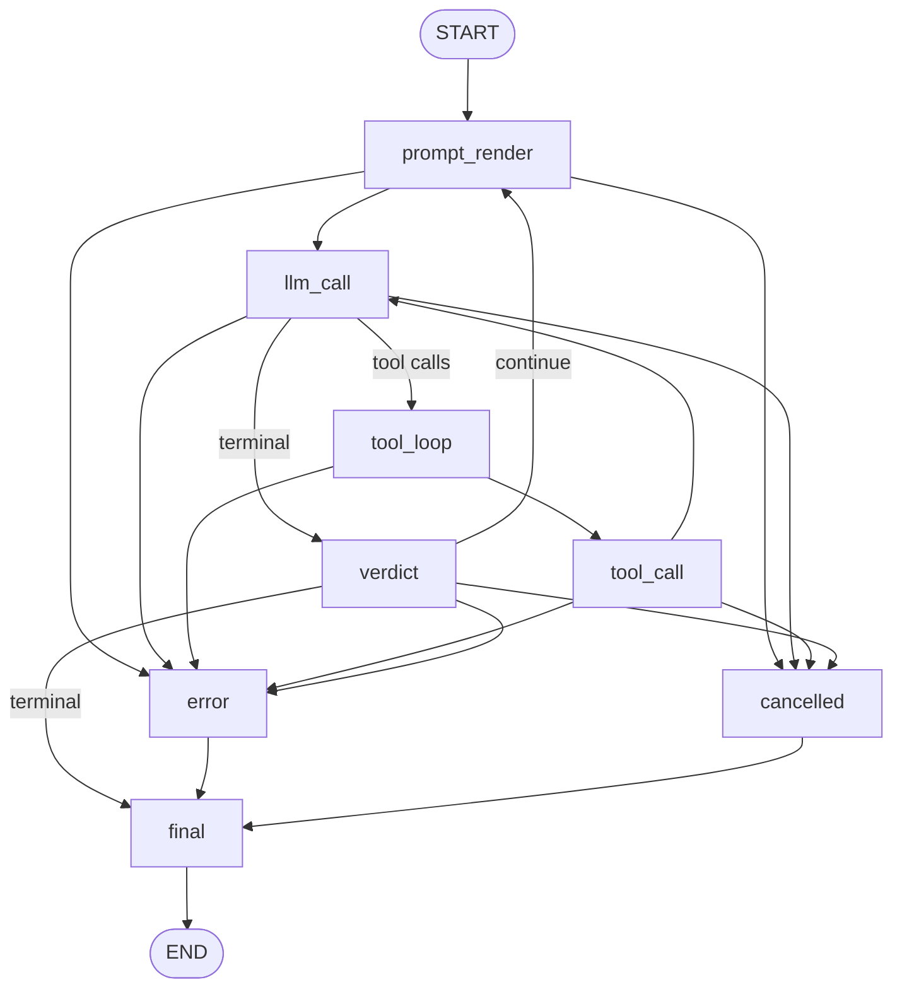

# 10428 LangGraph Convergence Spec

Status: architecture spec only  
Ticket: #10428  
Related ticket: #10429 Claude Agent SDK + OAuth  
Scope: replace parallel agent execution paths with one LangGraph StateGraph model  
Non-goal: this document changes no runtime source

## Contents

- [Preamble: Requirements Restated](#preamble-requirements-restated)
- [1. Audit Of All Current Paths](#1-audit-of-all-current-paths)
- [2. Target StateGraph](#2-target-stategraph)
- [3. Node Interface Contract](#3-node-interface-contract)
- [4. Migration Sequencing](#4-migration-sequencing)
- [5. State Model Choice](#5-state-model-choice)
- [6. Observability](#6-observability)
- [7. Backward Compatibility](#7-backward-compatibility)
- [8. Test Strategy](#8-test-strategy)
- [9. Dependency Analysis](#9-dependency-analysis)
- [10. Risk Register](#10-risk-register)
- [11. Open Operator Questions](#11-open-operator-questions)

## Preamble: Requirements Restated

The authoritative ticket body was supplied at `/tmp/file_langgraph_spec.json`. This preamble restates its operator pain, goals, and required sections.

Operator pain:

1. Main chat execution uses `AgentRunner` around legacy LangChain `create_tool_calling_agent` and `AgentExecutor`.
2. Sub-agents repeat the same legacy pattern.
3. Auto-loop critic execution still shells out through Codex and Claude CLI clients.
4. SDLC workflows include subprocess-oriented session launcher paths, including the ticket's referenced `bin/codex-spawn.sh` path.
5. `codex_exec` and `claude_exec` tools shell out, so nested agent work does not share lifecycle, state, streaming, or policy semantics with the main runner.

Required target:

1. One StateGraph model for main agent, sub-agent, critic, and SDLC flows.
2. Native streaming and observability from graph events.
3. Pluggable nodes for Codex Responses, subprocess fallback, Claude SDK/OAuth from #10429, and local/test transports.
4. Explicit per-node overrides for reasoning effort, target role, environment, tool budgets, and runtime config.
5. SDLC dispatcher flows represented as subgraphs with explicit gate states.

Required sections: audit current paths, target StateGraph, node contract, migration sequencing, state model, observability, backward compatibility, tests, dependency analysis, risk register, and open operator questions.

Citation rule: current-state claims cite repository file and line numbers; dependency facts cite upstream sources in Section 9; #10429 is treated as a future Claude node implementation, not a blocker for Phase 1.

## 1. Audit Of All Current Paths

### 1.1 Dependency And Runtime Baseline

- `requirements.txt` pins `langchain>=0.3,<1.0`, `langchain-openai>=0.3,<1.0`, and `langchain-core>=0.3,<1.0` at `requirements.txt:1` through `requirements.txt:3`.
- The visible requirements list ends with `pandas>=2.2,<3.0` and contains no `langgraph` dependency through `requirements.txt:18`.
- The container runtime uses Python 3.13 via `python:3.13-slim` at `Dockerfile:4` and `Dockerfile:20`.
- Runtime dependencies are installed from `requirements.txt` at `Dockerfile:31` through `Dockerfile:34`.
- Audit conclusion: Python is compatible with modern LangGraph, but the LangChain package pins require a Phase 1 compatibility decision.

### 1.2 Main Agent Path: `agent/core.py`

- The module describes itself as a LangChain agent core wrapping `AgentExecutor` at `agent/core.py:1`.
- It imports `AgentExecutor` and `create_tool_calling_agent` at `agent/core.py:14`.
- `create_llm` creates streaming `ChatOpenAI` instances at `agent/core.py:186` through `agent/core.py:217`.
- `_create_codex_chat_model` resolves Codex OAuth credentials, applies model and reasoning settings, and returns `ChatCodex` with Responses API settings at `agent/core.py:232` through `agent/core.py:269`.
- `ChatCodex` adapts Responses API behavior, moves system messages into `instructions`, refreshes OAuth credentials, and flattens list content for the current `astream_events` path at `agent/core.py:273` through `agent/core.py:379`.
- `AgentRunner` starts at `agent/core.py:673` and owns chat history, auto state, active-tool state, primary endpoint, and fallback configuration at `agent/core.py:676` through `agent/core.py:689`.
- `AgentRunner` reads runtime config and applies a reasoning override at `agent/core.py:691` through `agent/core.py:693`.
- `AgentRunner` injects memory and skills tools at `agent/core.py:703` through `agent/core.py:729`.
- `_apply_reasoning_effort_override` normalizes and applies reasoning settings to primary and fallback endpoints at `agent/core.py:651` through `agent/core.py:670`.
- `_rebuild_executors` constructs prompt and LLM at `agent/core.py:842` through `agent/core.py:849`, calls `create_tool_calling_agent` at `agent/core.py:850`, wraps it in `AgentExecutor` at `agent/core.py:851` through `agent/core.py:857`, and repeats the pattern for fallbacks at `agent/core.py:863` through `agent/core.py:871`.
- Tool policy gating happens before execution at `agent/core.py:903` through `agent/core.py:932`.
- `_wrap_tool` wraps sync and async tools and tracks active tool calls at `agent/core.py:934` through `agent/core.py:978`.
- `reload_llm` rebuilds executor state and returns effective reasoning effort at `agent/core.py:986` through `agent/core.py:1041`.
- `override_max_iterations` mutates executor iteration budgets at `agent/core.py:1043` through `agent/core.py:1061`.
- `run` appends user input to chat history at `agent/core.py:1079` through `agent/core.py:1087`, appends final AI output at `agent/core.py:1235` through `agent/core.py:1238`, and parses auto state at `agent/core.py:1239` through `agent/core.py:1240`.
- `_stream_executor` consumes LangChain `astream_events(..., version="v2")` at `agent/core.py:1275` through `agent/core.py:1278` and maps token, usage, tool start, tool end, and final events at `agent/core.py:1281` through `agent/core.py:1311`.
- Audit conclusion: main execution state is split across `AgentRunner`, endpoint mutation, LangChain callbacks, and daemon republishing instead of one application-owned state object.

### 1.3 Sub-Agent Path: `agent/sub_agents.py`

- Sub-agents import `AgentExecutor` and `create_tool_calling_agent` at `agent/sub_agents.py:5`.
- `SubAgent` starts at `agent/sub_agents.py:31`, reads endpoint and fallback configuration at `agent/sub_agents.py:38` through `agent/sub_agents.py:43`, and creates tools, memory tools, and skill tools at `agent/sub_agents.py:48` through `agent/sub_agents.py:68`.
- `SubAgent` creates its LLM at `agent/sub_agents.py:70`, builds its prompt at `agent/sub_agents.py:76` through `agent/sub_agents.py:90`, calls `create_tool_calling_agent` at `agent/sub_agents.py:92`, and wraps the result in `AgentExecutor` at `agent/sub_agents.py:93` through `agent/sub_agents.py:99`.
- Fallback sub-agent executors repeat the legacy pattern at `agent/sub_agents.py:101` through `agent/sub_agents.py:126`.
- NATS subscription state is established at `agent/sub_agents.py:144` through `agent/sub_agents.py:156`.
- `_handle_request` logs requests, publishes thinking, invokes the executor, records tool calls, and publishes responses at `agent/sub_agents.py:166` through `agent/sub_agents.py:201`.
- `_invoke` attaches tool callbacks at `agent/sub_agents.py:212` through `agent/sub_agents.py:219`.
- `_invoke_with_fallback` owns primary/fallback retry behavior at `agent/sub_agents.py:228` through `agent/sub_agents.py:274`.
- Audit conclusion: sub-agents duplicate main legacy executor construction without sharing graph state, tool-loop logic, or fallback representation.

### 1.4 Auto-Loop Brain Critic: `agent/auto_loop_brain.py`

- The module imports `subprocess` at `agent/auto_loop_brain.py:13`.
- Valid critic clients are `claude-cli`, `openai`, `anthropic`, and `codex-cli`; the default is `codex-cli`; Codex reasoning values are declared at `agent/auto_loop_brain.py:32` through `agent/auto_loop_brain.py:36`.
- `ToollessLLMClient.complete_json` is the critic protocol at `agent/auto_loop_brain.py:109` through `agent/auto_loop_brain.py:121`.
- `ClaudeCLIToollessLLMClient` builds `claude -p --append-system-prompt` at `agent/auto_loop_brain.py:130` through `agent/auto_loop_brain.py:135` and invokes `subprocess.run` at `agent/auto_loop_brain.py:139`.
- `CodexCLIToollessLLMClient` builds `codex exec` with bypass and reasoning flags at `agent/auto_loop_brain.py:149` through `agent/auto_loop_brain.py:180` and invokes `subprocess.run` at `agent/auto_loop_brain.py:195`.
- OpenAI-compatible critic calls post to `/chat/completions` at `agent/auto_loop_brain.py:257` through `agent/auto_loop_brain.py:260`.
- Anthropic critic calls post to `/v1/messages` at `agent/auto_loop_brain.py:305` through `agent/auto_loop_brain.py:314`.
- `AutoLoopBrainConfig` stores enabled, client, model, timeout, cap, base URL, and reasoning settings at `agent/auto_loop_brain.py:342` through `agent/auto_loop_brain.py:358`.
- Config is built from runtime config and environment at `agent/auto_loop_brain.py:365` through `agent/auto_loop_brain.py:399`.
- The evaluator builds the critic prompt, calls `complete_json`, fails closed on tool-use attempts, parse failures, and exceptions, and emits telemetry/cost metrics at `agent/auto_loop_brain.py:459` through `agent/auto_loop_brain.py:540`.
- `build_toolless_llm_client` chooses CLI or HTTP clients at `agent/auto_loop_brain.py:609` through `agent/auto_loop_brain.py:633`.
- Audit conclusion: critic decisions are outside the agent state machine and have separate subprocess timeout, stderr, usage, and error semantics.

### 1.5 Tool Registry And Policy

- `agent/tools.py` imports `subprocess` at `agent/tools.py:8`.
- `_shell_exec` reads session worktree and env context at `agent/tools.py:129` through `agent/tools.py:130` and runs commands through `subprocess.run(shell=True)` at `agent/tools.py:131` through `agent/tools.py:139`.
- `shell_exec` is registered at `agent/tools.py:158` through `agent/tools.py:162`.
- `_codex_exec` checks the Codex CLI, builds `codex exec --full-auto --skip-git-repo-check`, and runs it through `subprocess.run` at `agent/tools.py:241` through `agent/tools.py:257`.
- `codex_exec` is registered at `agent/tools.py:276` through `agent/tools.py:286`.
- `_claude_exec` builds `claude -p --dangerously-skip-permissions` and runs it through `subprocess.run` at `agent/tools.py:300` through `agent/tools.py:315`.
- `claude_exec` is registered at `agent/tools.py:334` through `agent/tools.py:345`.
- Main and sub-agent tool registries include shell, Python, web, Codex, and Claude tools at `agent/tools.py:1233` through `agent/tools.py:1242` and `agent/tools.py:1281` through `agent/tools.py:1290`.
- `ToolPolicy` defines policy shape at `agent/tool_policy.py:14` through `agent/tool_policy.py:24`.
- Shell, Python, Docker, Codex, and Claude tool policies are declared at `agent/tool_policy.py:49` through `agent/tool_policy.py:83`.
- Taskboard, gateway, Git, Forgejo, memory, and skill tool policies are declared at `agent/tool_policy.py:166` through `agent/tool_policy.py:270`.
- The policy registry is built from `create_tools` at `agent/tool_policy.py:289` through `agent/tool_policy.py:313`, and unknown tools default to conservative policy at `agent/tool_policy.py:323` through `agent/tool_policy.py:332`.
- Audit conclusion: policy registry should remain authoritative, but Codex and Claude shell tools should become graph nodes or explicitly marked legacy fallback tools.

### 1.6 Daemon Session, Input, Scheduler, And Protocol

- `daemon/core.py` imports `AgentRunner`, session env/worktree helpers, and `create_tools` at `daemon/core.py:37` through `daemon/core.py:42`.
- `SessionEventBus.publish` creates session events and pushes subscriber queues at `daemon/core.py:625` through `daemon/core.py:640`.
- Session state stores chat history, queue, UI state, runner, runtime env, taskboard dispatcher, source/job metadata, auto state, heartbeat, and sub-agent pools at `daemon/core.py:651` through `daemon/core.py:694`.
- `publish_event` records LLM usage and auto evaluator metrics at `daemon/core.py:707` through `daemon/core.py:725`.
- `attach_runtime` creates tools and `AgentRunner` at `daemon/core.py:1001` through `daemon/core.py:1014`.
- Session save/load persists chat history, queue, UI state, heartbeat, and sub-agent buffers at `daemon/core.py:1041` through `daemon/core.py:1110`.
- `stream_agent_events` accepts source, job id, tool budget, env overlay, and auto controls at `daemon/core.py:1117` through `daemon/core.py:1126`.
- Scheduler runs inject system context at `daemon/core.py:1132` through `daemon/core.py:1137`.
- Tool budget overrides are applied at `daemon/core.py:1147` through `daemon/core.py:1152`.
- Worktree and runtime env context wrap runner execution at `daemon/core.py:1185` through `daemon/core.py:1194`.
- The session calls `agent_runner.run` at `daemon/core.py:1195` through `daemon/core.py:1199` and republishes runner events at `daemon/core.py:1211` through `daemon/core.py:1213`.
- Auto-loop decisions and guards run after each turn at `daemon/core.py:1220` through `daemon/core.py:1451`.
- `_create_agent_runner_override` accepts role, reasoning, thinking, and env inputs, creates an override `AgentRunner`, and logs effective overrides at `daemon/server.py:1419` through `daemon/server.py:1470`.
- `run_input` accepts scheduler/routing overrides, swaps in an override runner, streams session events, handles cancellation, and restores the original runner at `daemon/server.py:1473` through `daemon/server.py:1548`.
- `_handle_scheduled_job_trigger` passes job prompt, role, reasoning, thinking, and env into `run_input` at `daemon/server.py:1876` through `daemon/server.py:1886`.
- WebSocket forwarding maps session events at `daemon/server.py:2407` through `daemon/server.py:2467`.
- `_event_to_message` maps token, tool, final, status, and error events at `daemon/server.py:2480` through `daemon/server.py:2522`.
- `daemon/protocol.py` forbids extra envelope fields at `daemon/protocol.py:21` through `daemon/protocol.py:25`.
- Token, tool, final, and status envelopes are defined at `daemon/protocol.py:125` through `daemon/protocol.py:151`.
- Scheduled job envelopes carry routing fields at `daemon/protocol.py:225` through `daemon/protocol.py:252`.
- Audit conclusion: daemon lifecycle should stay daemon-owned, but routing overrides should become graph input state rather than temporary runner replacement.

### 1.7 Scheduler And Runtime Config

- Scheduler routing field names live at `daemon/scheduler.py:39` through `daemon/scheduler.py:42`.
- `ScheduledJob` stores target role, reasoning effort, thinking level, and env overrides at `daemon/scheduler.py:207` through `daemon/scheduler.py:230`.
- `ScheduledJob` normalizes and emits routing overrides at `daemon/scheduler.py:232` through `daemon/scheduler.py:312`.
- `ScheduledJobRoutingOverride` sidecar model lives at `daemon/scheduler.py:315` through `daemon/scheduler.py:343`.
- Absolute, recurring, and event job creation accepts routing fields at `daemon/scheduler.py:442` through `daemon/scheduler.py:560`.
- Sidecar overrides are merged and persisted at `daemon/scheduler.py:580` through `daemon/scheduler.py:619` and `daemon/scheduler.py:835` through `daemon/scheduler.py:871`.
- `RoleRuntimeConfig` stores role, agent, Codex auth, taskboard, and git helper fields at `agent/runtime_config_resolver.py:51` through `agent/runtime_config_resolver.py:68`.
- `RoleRuntimeConfig.env_overlay` emits agent role, Forgejo, git helper, and taskboard env values at `agent/runtime_config_resolver.py:101` through `agent/runtime_config_resolver.py:131`.
- `RuntimeConfigResolver.resolve_for_role` caches and resolves Vault/env config at `agent/runtime_config_resolver.py:247` through `agent/runtime_config_resolver.py:338`.
- Runtime config store loads, merges, exposes, and updates effective config sections at `daemon/runtime_config_store.py:87` through `daemon/runtime_config_store.py:195`.
- Audit conclusion: graph invocation should receive effective config and env overlay; graph nodes should not read Vault or mutate runtime config.

### 1.8 Taskboard Dispatcher And Verdict Router

- Dispatcher imports resolver, Forgejo, taskboard, status router, and worktree helpers at `agent/taskboard_dispatcher.py:21` through `agent/taskboard_dispatcher.py:31`.
- Role routes map taskboard roles to providers and profiles at `agent/taskboard_dispatcher.py:273` through `agent/taskboard_dispatcher.py:304`.
- `DaemonTaskboardSpawner.spawn` resolves runtime config, builds env overlays, prepares worktrees/prompts, attaches daemon runtime, starts auto mode, and launches `run_input` at `agent/taskboard_dispatcher.py:455` through `agent/taskboard_dispatcher.py:682`.
- `_process_row` routes events, reserves sessions, resolves config, mints tokens, renders prompts, and spawns sessions at `agent/taskboard_dispatcher.py:919` through `agent/taskboard_dispatcher.py:1086`.
- Spawn failure is recorded with `failure_class="tool_runtime_exception"` at `agent/taskboard_dispatcher.py:1087` through `agent/taskboard_dispatcher.py:1109`.
- In-process finalization derives outcome from daemon run state at `agent/taskboard_dispatcher.py:2595` through `agent/taskboard_dispatcher.py:2682`.
- Reaper behavior handles orphaned rows at `agent/taskboard_dispatcher.py:2706` through `agent/taskboard_dispatcher.py:2729`.
- Status router documents staged review and latest-task ownership at `agent/taskboard_status_router.py:10` through `agent/taskboard_status_router.py:34`.
- Status router role maps live at `agent/taskboard_status_router.py:49` through `agent/taskboard_status_router.py:91`.
- Review verdict routing lives at `agent/taskboard_status_router.py:182` through `agent/taskboard_status_router.py:228`.
- `route_event` prioritizes verdict routing before status-change routing at `agent/taskboard_status_router.py:231` through `agent/taskboard_status_router.py:285`.
- Audit conclusion: SDLC gate state is spread across dispatcher, daemon sessions, router, worktree helpers, and row reaper logic; Phase 5 should make those gates explicit.

### 1.9 UI Activity, #10424, Wrapper Path, And Tests

- Browser chat activity accepts status, token, final, tool, and auto envelopes at `web/src/lib/chat-activity.ts:40` through `web/src/lib/chat-activity.ts:48`.
- Tool previews and matching are handled at `web/src/lib/chat-activity.ts:50`, `web/src/lib/chat-activity.ts:119`, and `web/src/lib/chat-activity.ts:145` through `web/src/lib/chat-activity.ts:199`.
- Final events clear activity state at `web/src/lib/chat-activity.ts:127` through `web/src/lib/chat-activity.ts:129`.
- Page WebSocket handling routes status, token, final, tool, and auto envelopes at `web/src/routes/+page.svelte:826` through `web/src/routes/+page.svelte:855`.
- #10424 records current chat activity foundations and limitations at `docs/architecture/10424-ui-redesign-spec.md:389` through `docs/architecture/10424-ui-redesign-spec.md:404`.
- #10424 proposes richer tool fields at `docs/architecture/10424-ui-redesign-spec.md:663` through `docs/architecture/10424-ui-redesign-spec.md:690`.
- The current architecture doc records no `claude-spawn.sh` or `codex-spawn.sh` in this canonical tree at `docs/architecture/agent-health-monitoring.md:568` through `docs/architecture/agent-health-monitoring.md:570`, and describes desired wrapper behavior at `docs/architecture/agent-health-monitoring.md:572` through `docs/architecture/agent-health-monitoring.md:580`.
- Existing regression anchors include agent final normalization at `tests/test_agent_core.py:22` through `tests/test_agent_core.py:45`, daemon event/tool budget tests at `tests/test_daemon_core.py:163` through `tests/test_daemon_core.py:207`, CLI critic tests at `tests/test_auto_loop_brain.py:96` through `tests/test_auto_loop_brain.py:152`, scheduler override tests at `tests/test_scheduler.py:13` through `tests/test_scheduler.py:70` and `tests/test_server_scheduler_overrides.py:120` through `tests/test_server_scheduler_overrides.py:184`, env overlay tests at `tests/test_session_env_overlay.py:12` through `tests/test_session_env_overlay.py:45`, and UI activity tests at `web/src/lib/chat-activity.test.ts:8` through `web/src/lib/chat-activity.test.ts:107`.
- Audit conclusion: graph migration should preserve current envelope shape first, then expose richer #10424 fields additively.

## 2. Target StateGraph

### 2.1 Nodes

Initial nodes: `prompt_render`, `llm_call`, `tool_call`, `tool_loop`, `verdict`, `final`, `error`, and `cancelled`.

- `prompt_render` builds model messages, system instructions, memory context, skill context, scheduler context, taskboard context, and hidden continuation prompts.
- `llm_call` invokes one model transport and streams model events.
- `tool_loop` inspects model output, budgets, max iterations, policy status, repeated-call guards, and cancellation state.
- `tool_call` executes allowed or denied tool calls through existing policy and registry hooks.
- `verdict` classifies final output, auto-loop decisions, and SDLC gate results.
- `final` persists final messages, usage, errors, and terminal events.
- `error` normalizes exceptions into safe operator-visible state.
- `cancelled` preserves cancellation semantics and terminal cancellation events.

### 2.2 State Fields

Ticket-required fields: `messages`, `intermediate_steps`, `tool_results`, `reasoning_effort_override`, `target_agent_role_override`, `env_overlay`, `run_id`, and `observability_events`.

Compatibility fields: `session_name`, `turn_id`, `source`, `job_id`, `runtime_config`, `scheduler_context`, `taskboard_context`, `tool_budget`, `max_iterations`, `iteration_count`, `active_tool_calls`, `usage`, `errors`, `cancel_requested`, `auto_state`, `auto_decision`, `sdlc_gate`, `final_output`, and `fallback_trace`.

### 2.3 Conditional Edges

```text
START -> prompt_render -> llm_call
llm_call -> tool_loop      # model emitted tool calls and budget remains
tool_loop -> tool_call     # a stable call_id can be assigned and policy can represent the result
tool_call -> llm_call      # tool results become model input
llm_call -> verdict        # no tool calls, terminal text, refusal, blank retry exhausted, or terminal policy stop
verdict -> prompt_render   # auto mode or SDLC gate requests a continuation
verdict -> final -> END
any node -> error -> final
any node -> cancelled -> final
```

`llm_call` goes to `tool_loop` when the model response contains tool calls, tool budget and max iterations remain, state is not cancelled, and policy can represent each request as allowed or denied. `llm_call` goes to `verdict` when there are no tool calls, final text exists, blank-output retry is exhausted, or provider/policy state is terminal.

### 2.4 Diagram

```text
START -> prompt_render -> llm_call -- no tool --> verdict --> final -> END
                           |                          ^
                           | tool calls               |
                           v                          |
                         tool_loop -> tool_call ------+

any node -> error -> final
any node -> cancelled -> final
verdict -> prompt_render for auto or SDLC continuation
```



### 2.5 Streaming And Checkpoints

The compiled graph streams LangGraph `astream_events`. A graph adapter maps normalized events into the existing session bus: model token to `agent.token`, usage to `llm.usage`, tool start to `agent.tool_start`, tool success/denial/timeout/error to `agent.tool_end`, node status to `agent.status`, final output to `agent.final`, normalized exception to `agent.error`, and auto verdict to current auto progress or stop events.

Checkpoint policy: Phase 1 uses no durable checkpoint and can use test-only memory saver; Phase 2 may add in-memory checkpointing for replay tests; Phase 4 may checkpoint critic decisions; Phase 5 may checkpoint SDLC gate state; durable checkpoint storage waits for operator retention and redaction policy.

## 3. Node Interface Contract

### 3.1 Signature And Partial State

Every node uses the ticket-required async shape:

```python
async def node(state) -> partial_state:
    ...
```

Implementation should type that as `async def llm_call(state: AgentGraphState) -> PartialAgentGraphState`. Dependencies should be injected through node factories or a small runtime object in state; tests should be able to use plain dictionary fixtures.

Allowed partial updates: append `messages`, `intermediate_steps`, `tool_results`, and `observability_events`; replace scalar fields such as `final_output`, `auto_decision`, and `cancel_requested`; append normalized error records. Disallowed updates: mutating input state in place, writing runtime config, swapping daemon runner objects, emitting raw secrets, or emitting uncapped tool output to WebSocket-bound metadata.

### 3.2 Required And Optional Fields

- `prompt_render` requires `messages`, `session_name`, `run_id`, `turn_id`, `runtime_config`, `env_overlay`, and `target_agent_role_override`.
- `llm_call` requires `messages`, `run_id`, `turn_id`, `reasoning_effort_override`, `runtime_config`, and `observability_events`.
- `tool_loop` requires `messages`, `tool_budget`, `max_iterations`, `iteration_count`, `intermediate_steps`, and `cancel_requested`.
- `tool_call` requires `messages`, `tool_results`, `env_overlay`, `active_tool_calls`, and `observability_events`.
- `verdict` requires `messages`, `final_output`, `auto_state`, `source`, `job_id`, `taskboard_context`, and `scheduler_context`.
- `final` requires `messages`, `final_output`, `usage`, `errors`, and `observability_events`.
- Optional fields include `pre_injected_input`, `single_auto_iteration`, `worktree_path`, `fallback_trace`, `checkpoint_id`, `parent_run_id`, `subgraph_name`, `timeout_ms`, and `retry_policy`.

### 3.3 Streaming Hooks

Normalized event hooks: `node.started`, `node.completed`, `node.failed`, `model.token`, `model.usage`, `tool.started`, `tool.completed`, `tool.failed`, `tool.denied`, `verdict.completed`, `final.completed`, and `cancelled`.

Required event fields: `event`, `run_id`, `turn_id`, `node`, `ts`, and `payload`. Nodes may stream while running, but still return partial state. Events must be redacted before daemon logs or WebSocket output. Ordering must be stable enough for replay snapshots.

### 3.4 Error, Timeout, Cancellation, And Overrides

Error records contain `node`, `error_type`, `message`, `retryable`, `tool_name`, `call_id`, `status_code`, `timeout_ms`, and `ts`. Tool denial is an outcome, not an exception. Tool timeout is observable and may be fatal or synthetic based on policy. Model timeout routes to fallback when fallback exists; exhausted fallback routes to `error`; unexpected exceptions route to `error`.

`asyncio.CancelledError` must propagate. Nodes may emit `cancelled` in `finally`, but must not continue after cancellation. Subprocess fallback nodes must terminate child processes on cancellation.

Reasoning overrides are normalized before graph invocation, passed to `llm_call`, mapped into Codex Responses request metadata, mapped by Claude SDK transport from #10429 if supported, and logged internally if ignored by an unsupported transport. Environment overlays are resolved before graph invocation, applied around tool execution, redacted in logs/events, and inherited into subgraphs unless explicitly replaced. Role overrides are resolved before graph invocation when possible and stored as effective metadata; model nodes must not perform Vault lookup.

### 3.5 Model Transport Contract

```python
class ModelNodeTransport(Protocol):
    async def invoke(
        self,
        *,
        messages: list,
        tools: list,
        reasoning_effort: str | None,
        run_id: str,
        turn_id: str,
    ) -> ModelNodeResult:
        ...
```

Initial transports: `codex_responses`, `openai_compatible_chat`, `codex_cli_subprocess`, `claude_cli_subprocess`, and `test_fake_model`. Future #10429 transport: `claude_agent_sdk_oauth`. #10429 should provide a transport or adapter satisfying this contract.

## 4. Migration Sequencing

### 4.1 Phase 1: Install LangGraph And Add Canary Graph

- Objective: install compatible LangGraph, build an empty StateGraph beside `AgentRunner`, route one non-tool canary turn behind a flag, and keep legacy default.
- Files: `requirements.txt`, new graph modules under `agent/`, new tests under `tests/`, and minimal daemon flag plumbing if needed.
- Tests: graph compilation, fake non-tool turn to `final`, legacy `AgentRunner` default, daemon republish regression.
- Risk: low if older compatible LangGraph is chosen; medium if LangChain family upgrade is required.
- Dependency: decide Section 9 Option A or Option B first.
- Rollback: set `KAI_AGENT_GRAPH_BACKEND=legacy` and revert dependency addition if imports conflict.
- Exit: one canary turn succeeds, legacy remains primary, and operator rollback is one env change.

### 4.2 Phase 2: Main AgentRunner Defaults To LangGraph

- Objective: move main `AgentRunner` execution to LangGraph by default while keeping legacy `AgentExecutor` behind a rollback flag.
- Files: `agent/core.py`, graph modules, `daemon/core.py`, `daemon/server.py`, and agent/daemon tests.
- Current anchors: main `create_tool_calling_agent` at `agent/core.py:850`; main `AgentExecutor` at `agent/core.py:851` through `agent/core.py:857`; session execution call at `daemon/core.py:1195` through `daemon/core.py:1199`.
- Tests: token/tool/final/status/error/usage event parity, policy denial, timeout, reasoning override, env overlay, and legacy rollback.
- Risk: medium because main chat streaming and tool calls are user-visible.
- Rollback: set `KAI_AGENT_GRAPH_BACKEND=legacy`; preserve `ChatCodex` and legacy executor until Phase 6.
- Exit: main default uses graph, current WebSocket contract remains stable, and scheduled overrides work on graph path.

### 4.3 Phase 3: Sub-Agents Become A LangGraph Subgraph

- Objective: replace duplicate sub-agent `AgentExecutor` construction with shared graph logic or a subgraph.
- Files: `agent/sub_agents.py`, graph modules, sub-agent tests, and NATS request tests.
- Current anchors: legacy import at `agent/sub_agents.py:5`; `create_tool_calling_agent` at `agent/sub_agents.py:92`; `AgentExecutor` at `agent/sub_agents.py:93` through `agent/sub_agents.py:99`.
- Tests: request/response status parity, tool recorder compatibility, fallback model behavior, and NATS status publication.
- Risk: medium-low.
- Rollback: set `KAI_SUB_AGENT_GRAPH_BACKEND=legacy` and keep old executor code until Phase 6.
- Exit: sub-agent events and fallback behavior match current behavior.

### 4.4 Phase 4: Auto-Loop Critic Becomes A Graph Node

- Objective: move critic decision into graph state, preserve fail-closed behavior, and prepare for Claude SDK transport from #10429.
- Files: `agent/auto_loop_brain.py`, graph modules, `daemon/core.py`, and auto-loop tests.
- Current anchors: critic client selection at `agent/auto_loop_brain.py:609` through `agent/auto_loop_brain.py:633`; Codex CLI subprocess at `agent/auto_loop_brain.py:195`; Claude CLI subprocess at `agent/auto_loop_brain.py:139`; session auto decisions at `daemon/core.py:1220` through `daemon/core.py:1451`.
- Tests: continue, done, pause, malformed, timeout, tool-use-attempt verdicts, deterministic verdict replay, and cost metric preservation.
- Risk: medium because auto mode depends on conservative stops.
- Dependency: #10429 is not required to start this phase, but is required before removing Claude CLI fallback.
- Rollback: set `KAI_AUTO_LOOP_BRAIN_GRAPH=0` and keep current evaluator until Phase 6.
- Exit: graph critic reproduces evaluator decisions and telemetry/cost metrics remain available.

### 4.5 Phase 5: SDLC Dispatcher Becomes Explicit Subgraph

- Objective: model taskboard ingest, route, reserve, runtime resolution, worktree prep, prompt render, agent turn, verdict route, finalization, and reaper reconcile as explicit graph states.
- Files: `agent/taskboard_dispatcher.py`, `agent/taskboard_status_router.py`, graph modules, `daemon/server.py`, dispatcher tests, and deployment wrapper references if `bin/codex-spawn.sh` exists outside this checkout.
- Current anchors: role routes at `agent/taskboard_dispatcher.py:273` through `agent/taskboard_dispatcher.py:304`; env overlay at `agent/taskboard_dispatcher.py:517` through `agent/taskboard_dispatcher.py:529`; worktree/prompt prep at `agent/taskboard_dispatcher.py:530` through `agent/taskboard_dispatcher.py:618`; `run_input` launch at `agent/taskboard_dispatcher.py:675` through `agent/taskboard_dispatcher.py:682`; verdict routing at `agent/taskboard_status_router.py:182` through `agent/taskboard_status_router.py:228`; reaper at `agent/taskboard_dispatcher.py:2706` through `agent/taskboard_dispatcher.py:2729`.
- Tests: staged review routing parity, worktree isolation, runtime config overlay, reaper classification, and shadow-mode old router vs graph router comparison.
- Risk: high because this crosses taskboard, worktree, Forgejo, daemon, and long-run job state.
- Rollback: set `KAI_TASKBOARD_GRAPH=0` and preserve existing dispatcher/router until graph behavior is proven.
- Exit: graph decisions match router decisions, `tool_runtime_exception` classifications remain compatible, and wrapper consumers are discovered or forwarded.

### 4.6 Phase 6: Dead-Code Sweep

- Objective: delete legacy `AgentExecutor` and subprocess client paths after graph defaults are stable.
- Removal anchors: main legacy agent/executor at `agent/core.py:850` through `agent/core.py:857`; sub-agent legacy agent/executor at `agent/sub_agents.py:92` through `agent/sub_agents.py:99`; auto-loop Claude CLI at `agent/auto_loop_brain.py:124` through `agent/auto_loop_brain.py:146`; auto-loop Codex CLI at `agent/auto_loop_brain.py:149` through `agent/auto_loop_brain.py:208`; `codex_exec` at `agent/tools.py:239` through `agent/tools.py:286`; `claude_exec` at `agent/tools.py:295` through `agent/tools.py:345`.
- Tests: no removed executor imports, graph-only E2E pass, and legacy flags fail clearly or are removed from docs.
- Risk: medium-high because env rollback ends after deletion.
- Dependency: operator approval, #10429 Claude node production readiness if Claude CLI is removed, and deployment wrapper discovery.
- Rollback: code rollback to previous release.
- Exit: graph backend is the only supported execution engine.

## 5. State Model Choice

### 5.1 Recommendation

Use `TypedDict` plus LangGraph reducers for graph state. Use Pydantic at daemon, scheduler, and WebSocket boundaries. Avoid dataclasses for core graph state.

Rationale: `TypedDict` matches `async def node(state) -> partial_state`, reducers naturally append messages/steps/results/events, tests can build plain dict fixtures, Pydantic is already used for strict protocol boundaries at `daemon/protocol.py:21` through `daemon/protocol.py:25`, scheduler routing fields already live in Pydantic-style boundaries at `daemon/scheduler.py:207` through `daemon/scheduler.py:230`, and dataclasses do not express reducer semantics as directly.

### 5.2 Sample Schema

```python
from typing import Any
from typing_extensions import Annotated, NotRequired, TypedDict
from langgraph.graph.message import add_messages

def append_items(left: list[dict[str, Any]], right: list[dict[str, Any]]) -> list[dict[str, Any]]:
    return [*left, *right]

class AgentGraphState(TypedDict):
    messages: Annotated[list[Any], add_messages]
    intermediate_steps: Annotated[list[dict[str, Any]], append_items]
    tool_results: Annotated[list[dict[str, Any]], append_items]
    observability_events: Annotated[list[dict[str, Any]], append_items]
    run_id: str
    turn_id: str
    session_name: str
    source: str
    reasoning_effort_override: str | None
    target_agent_role_override: str | None
    env_overlay: dict[str, str]
    runtime_config: dict[str, Any]
    tool_budget: int | None
    max_iterations: int
    iteration_count: int
    final_output: NotRequired[str]
    usage: NotRequired[dict[str, Any]]
    errors: NotRequired[list[dict[str, Any]]]
    auto_decision: NotRequired[dict[str, Any]]
    sdlc_gate: NotRequired[dict[str, Any]]
```

### 5.3 Ownership

Graph-owned state: per-turn messages, tool loop steps, pending/completed tool results, model usage, per-turn errors, final output, and observability events.

Daemon-owned state: session registry, WebSocket subscribers, runtime config mutation, scheduler registry, taskboard polling lifecycle, and session save/load.

Input copied from daemon: chat history, env overlay, source/job metadata, scheduler context, and taskboard context.

## 6. Observability

### 6.1 Event Pipeline

Current anchors: runner event streaming is in `_stream_executor` at `agent/core.py:1272` through `agent/core.py:1311`; session republish happens at `daemon/core.py:1211` through `daemon/core.py:1213`; WebSocket forwarding happens at `daemon/server.py:2407` through `daemon/server.py:2467`; protocol envelopes live at `daemon/protocol.py:125` through `daemon/protocol.py:151`; browser activity reducers live at `web/src/lib/chat-activity.ts:127` through `web/src/lib/chat-activity.ts:214`.

Target pipeline: LangGraph emits `astream_events`; the graph adapter normalizes events into session bus events; the session bus remains the daemon contract; the WebSocket mapper remains stable in Phase 1 and Phase 2; #10424 richer envelopes are adopted additively after protocol changes land.

### 6.2 Mapping

- `model.token` -> `agent.token` -> `TokenEnvelope`.
- `model.usage` -> `llm.usage`.
- `tool.started` -> `agent.tool_start` -> `ToolStartEnvelope`.
- `tool.completed` -> `agent.tool_end` -> `ToolEndEnvelope`.
- `tool.failed` -> `agent.tool_end` plus internal error metadata.
- `node.status` -> `agent.status` -> `StatusEnvelope`.
- `final.completed` -> `agent.final` -> `FinalEnvelope`.
- `error.completed` -> `agent.error` -> `ErrorEnvelope`.

Compatibility rule: do not add WebSocket fields until protocol code changes, because current envelope models forbid extra fields at `daemon/protocol.py:21` through `daemon/protocol.py:25`.

### 6.3 #10424 And Logging

#10424 proposes `call_id`, `turn_id`, `args_summary`, `status`, `error`, and `ts` at `docs/architecture/10424-ui-redesign-spec.md:663` through `docs/architecture/10424-ui-redesign-spec.md:690`. Graph events should provide `run_id`, `turn_id`, `call_id`, `node`, `tool_name`, redacted `args_summary`, `status`, `duration_ms`, and safe `error`; adoption should store these internally first, add protocol fields under #10424, update UI matching to `call_id`, and keep tool-name matching fallback for one release.

Daemon logs should include session, run, turn, node, source, job, effective role, reasoning override, tool name, call id, duration, status, and error type. Redaction rules: no OAuth tokens, no taskboard bearer tokens, no raw env overlay, no full tool output by default, and no full prompt snapshots without explicit test approval. Replay snapshots should normalize timestamps, generated ids, provider request ids, and secret-like values.

## 7. Backward Compatibility

### 7.1 Flags

- Global: `KAI_AGENT_GRAPH_BACKEND=legacy|langgraph-canary|langgraph`.
- Main rollback: `KAI_AGENT_GRAPH_LEGACY_FALLBACK=1`.
- Sub-agent backend: `KAI_SUB_AGENT_GRAPH_BACKEND=legacy|langgraph`.
- Auto-loop backend: `KAI_AUTO_LOOP_BRAIN_GRAPH=0|1`.
- Taskboard backend: `KAI_TASKBOARD_GRAPH=0|1` and `KAI_TASKBOARD_GRAPH_SHADOW=1`.

### 7.2 Guarantees

- Every phase ships behind a flag.
- Operators can pin main sessions to legacy during cutover.
- Phase 1 and Phase 2 preserve current WebSocket envelope names.
- Scheduled override fields remain supported.
- Runtime env overlay remains supported.
- Tool policy remains authoritative.
- No durable graph checkpoint is required before operators approve storage and retention behavior.

### 7.3 Override Compatibility

Graph input must carry `target_agent_role_override`, `reasoning_effort_override`, `thinking_level` or normalized equivalent, `env_overlay`, `tool_budget`, `source`, and `job_id`. Current anchors: scheduler override fields are stored at `daemon/scheduler.py:227` through `daemon/scheduler.py:230`; `run_input` accepts override fields at `daemon/server.py:1478` through `daemon/server.py:1486`; session env overlay wraps execution at `daemon/core.py:1185` through `daemon/core.py:1194`; dispatcher env overlay is built at `agent/taskboard_dispatcher.py:517` through `agent/taskboard_dispatcher.py:529`.

## 8. Test Strategy

### 8.1 Graph-Level Unit Tests

Required graph tests: compilation, non-tool response to final, tool response into tool loop, tool result back to model, budget exhaustion routing, cancellation routing, reasoning override propagation, and env overlay propagation. Mock transports: streaming fake model, tool-call fake model, timeout fake model, fallback fake model, and fake Claude SDK transport placeholder for #10429.

### 8.2 Node-Level Unit Tests

- `prompt_render`: system prompt, scheduler context, taskboard context, no input mutation.
- `llm_call`: token stream, usage, reasoning override, provider error, fallback.
- `tool_loop`: tool-call detection, budget checks, stable call ids, unknown tool.
- `tool_call`: policy, denial, timeout, redaction, result message.
- `verdict`: auto state, critic decision, SDLC gate, fail-closed behavior.
- `final`: final output, safe errors, message append, usage.

### 8.3 End-To-End And Replay Tests

E2E scenarios: main non-tool turn, main tool turn, tool timeout, cancellation, scheduled job with target role override, scheduled job with reasoning override, scheduled job with env overlay, taskboard role turn in shadow mode, auto-loop continue, and auto-loop stop.

Replay inputs: fixed fake model responses, fixed tool outputs, injected clock, fixed run id, and fixed turn id. Replay outputs: normalized graph event list, final graph state, session event list, and WebSocket envelope list. Snapshot exclusions: raw secrets, absolute timestamps unless injected, full prompts, full tool output, and provider request ids unless normalized.

### 8.4 Phase Gates

- Phase 1: legacy default and canary graph turn.
- Phase 2: main event parity and rollback flag.
- Phase 3: sub-agent status and fallback parity.
- Phase 4: critic verdict parity and cost metrics.
- Phase 5: dispatcher routing parity and reaper compatibility.
- Phase 6: no legacy imports and clear removed-flag behavior.

## 9. Dependency Analysis

### 9.1 Current Pins And Latest LangGraph

Current pins are `langchain>=0.3,<1.0`, `langchain-openai>=0.3,<1.0`, and `langchain-core>=0.3,<1.0` at `requirements.txt:1` through `requirements.txt:3`, with no `langgraph` entry through `requirements.txt:18`.

The dependency check for this spec found PyPI `langgraph` latest at `1.2.0`. That release declares Python `>=3.10` and `langchain-core>=1.4.0,<2`. The repo Python runtime is compatible because the Docker image is Python 3.13, but the current `langchain-core>=0.3,<1.0` pin is not compatible with LangGraph 1.2.0.

### 9.2 Phase 1 Options

Option A: upgrade `langchain`, `langchain-core`, and `langchain-openai` together, use LangGraph 1.x, and retest `ChatCodex`, tool calling, streaming, and `astream_events`. This is preferred long term because AgentExecutor is being removed.

Option B: install an older LangGraph compatible with `langchain-core` 0.3. PyPI metadata shows `langgraph` 0.3.34 requires `langchain-core<0.4,>=0.1`. Use this only for Phase 1 canary if the LangChain upgrade is too large, and schedule the LangChain family upgrade before Phase 2 default cutover.

### 9.3 Upgrade And #10429 Impact

`langchain-openai` upgrade tests must cover Codex OAuth refresh, Responses API `instructions` mapping, message flattening, streaming token chunks, tool-call event shape, usage metadata, and fallback endpoint behavior. Current anchors: `ChatCodex` behavior lives at `agent/core.py:273` through `agent/core.py:430`; Responses API settings are passed at `agent/core.py:257` through `agent/core.py:269`.

#10429 should provide Claude OAuth authentication, streaming normalization, tool-call shape mapping, timeout/cancellation behavior, reasoning or thinking parameter mapping if supported, and an adapter for the `ModelNodeTransport` contract in Section 3.5. #10429 does not block Phase 1, but it blocks removal of Claude CLI paths in Phase 6 unless operators accept losing Claude subprocess fallback.

### 9.4 Sources

- PyPI `langgraph`: https://pypi.org/project/langgraph/
- PyPI `langgraph` JSON: https://pypi.org/pypi/langgraph/json
- LangGraph docs: https://docs.langchain.com/langgraph
- LangGraph streaming docs: https://docs.langchain.com/oss/python/langgraph/streaming
- LangGraph event streaming docs: https://docs.langchain.com/oss/python/langgraph/event-streaming

## 10. Risk Register

1. Dependency conflict. Risk: latest LangGraph requires LangChain core 1.x. Impact: Phase 1 may become a dependency upgrade. Mitigation: run dependency spike before implementation. Rollback: keep legacy backend and revert dependency change.
2. Subprocess workflow callers. Risk: deployment may still call `bin/codex-spawn.sh`. Anchor: this checkout records no wrapper at `docs/architecture/agent-health-monitoring.md:568` through `docs/architecture/agent-health-monitoring.md:570`. Mitigation: discover deployment consumers before Phase 6. Rollback: keep or forward wrapper entry points.
3. Reaper compatibility. Risk: SDLC graph changes failure classes or orphan cleanup. Anchors: spawn failure uses `tool_runtime_exception` at `agent/taskboard_dispatcher.py:1087` through `agent/taskboard_dispatcher.py:1109`; reaper handles orphaned rows at `agent/taskboard_dispatcher.py:2706` through `agent/taskboard_dispatcher.py:2729`. Mitigation: add reaper compatibility tests before Phase 5. Rollback: disable `KAI_TASKBOARD_GRAPH`.
4. Worktree and env overlay. Risk: graph tools run in wrong worktree or miss taskboard credentials. Anchors: session env/worktree context wraps runner execution at `daemon/core.py:1185` through `daemon/core.py:1194`; tools read session worktree/env at `agent/tools.py:129` through `agent/tools.py:130`. Mitigation: pass `worktree_path` and `env_overlay` into graph state. Rollback: use legacy backend.
5. WebSocket protocol churn. Risk: richer graph fields break strict envelopes. Anchors: protocol forbids extras at `daemon/protocol.py:21` through `daemon/protocol.py:25`; UI currently matches tool rows by name at `web/src/lib/chat-activity.ts:164` through `web/src/lib/chat-activity.ts:199`. Mitigation: keep protocol stable until #10424 backend changes land. Rollback: disable graph backend or revert protocol-only changes.
6. Override regression. Risk: graph path drops scheduler or runtime override fields. Anchors: scheduled jobs store override fields at `daemon/scheduler.py:227` through `daemon/scheduler.py:230`; `run_input` accepts overrides at `daemon/server.py:1478` through `daemon/server.py:1486`. Mitigation: require override fields in graph input and tests. Rollback: route scheduled sessions through legacy backend.
7. Tool policy bypass. Risk: `tool_call` executes tools without current policy. Anchors: policy gate exists at `agent/core.py:903` through `agent/core.py:932`; policy registry is declared at `agent/tool_policy.py:49` through `agent/tool_policy.py:344`. Mitigation: centralize policy evaluation in graph `tool_call`. Rollback: use legacy backend.
8. Fallback drift. Risk: provider fallback behavior changes. Anchors: main fallback executors are created at `agent/core.py:863` through `agent/core.py:871`; sub-agent fallback executors are created at `agent/sub_agents.py:101` through `agent/sub_agents.py:126`. Mitigation: make fallback explicit state and test primary failure. Rollback: use legacy backend.
9. State growth. Risk: graph state grows with prompts, tool outputs, and events. Impact: memory pressure and replay noise. Mitigation: cap event payloads, summarize tool outputs, and delay durable checkpointing. Rollback: disable checkpoints.
10. Cancellation semantics. Risk: graph nodes swallow cancellation as generic error. Anchors: `run_input` handles cancellation at `daemon/server.py:1536` through `daemon/server.py:1540`; `stop_session_run` cancels current input tasks at `daemon/server.py:1731` through `daemon/server.py:1766`. Mitigation: require `CancelledError` propagation and cancellation E2E tests. Rollback: use legacy backend.
11. Secret leakage. Risk: graph observability emits env overlay or runtime credentials. Anchor: runtime resolver emits Forgejo and taskboard env values at `agent/runtime_config_resolver.py:104` through `agent/runtime_config_resolver.py:131`. Mitigation: redact before observability events and logs. Rollback: disable richer observability.
12. Claude SDK timing. Risk: Phase 6 removes Claude CLI before #10429 has SDK parity. Impact: loss of Claude-backed critic or nested agent execution. Mitigation: treat Claude SDK as future node implementation and require operator sign-off before deleting Claude CLI fallback. Rollback: keep Claude CLI fallback until #10429 passes graph transport tests.

## 11. Open Operator Questions

1. Should Phase 1 upgrade LangChain packages for LangGraph 1.x, or use an older LangGraph bridge release for the canary?
2. Which sessions, roles, or agents are acceptable canaries?
3. How long must Phase 1 run before Phase 2 can make the graph path default?
4. How many releases should legacy `AgentExecutor` rollback stay available?
5. Does any deployment still own or call `bin/codex-spawn.sh`?
6. Should `codex_exec` and `claude_exec` remain explicit tools after graph model nodes exist?
7. What provider should be the first production graph transport?
8. What is the delivery date for #10429 Claude SDK + OAuth node contract?
9. Should graph checkpoints remain in memory through Phase 5?
10. What retention and redaction policy applies to `observability_events`?
11. Should #10424 richer tool envelopes land before Phase 2 default cutover?
12. Should auto-loop critic graph migration wait for Claude SDK transport?
13. What rollback SLA do operators require during default cutover?
14. Should scheduler override fields appear in UI details, daemon logs, or both?
15. What replay snapshot coverage is required before Phase 5 SDLC migration?

## Appendix A: Phase 1 Implementation Ticket Shape

This appendix describes the first implementation ticket that should follow this spec.

Ticket title:

- Install LangGraph compatibility baseline and add canary StateGraph path.

Ticket scope:

- Add the chosen `langgraph` dependency.
- Add a graph state type.
- Add a graph builder.
- Add a fake model transport.
- Add one non-tool graph path.
- Add a backend selection flag.
- Keep legacy as the default backend.
- Add tests proving the graph compiles.
- Add tests proving the fake model path reaches `final`.
- Add tests proving the legacy path is still default.

Explicit non-goals:

- Do not migrate tool execution yet.
- Do not migrate sub-agents yet.
- Do not migrate auto-loop critic yet.
- Do not migrate taskboard dispatcher yet.
- Do not remove `AgentExecutor`.
- Do not remove subprocess tools.
- Do not change WebSocket protocol fields.
- Do not add durable checkpoints.

Acceptance criteria:

- Dependency install works in the normal development environment.
- A fake-model graph turn produces one final response.
- A default session still uses legacy execution.
- A canary session can select graph execution by env flag.
- Current daemon event republish tests still pass.
- Current scheduler override tests still pass.
- Current env overlay tests still pass.
- The graph path emits a stable `run_id`.
- The graph path emits a stable `turn_id`.
- The graph path does not log secrets.

Implementation notes:

- Use a fake transport first so provider behavior does not block graph wiring.
- Keep graph construction side-effect free.
- Keep node functions importable in unit tests without daemon startup.
- Keep provider-specific model code behind a transport interface.
- Keep rollout flag parsing centralized.
- Prefer explicit errors for unsupported backend flag values.
- Put every graph event through one adapter before it reaches the session bus.
- Keep `observability_events` internal in Phase 1.
- Use short-lived in-memory state only.
- Avoid adding a persistence migration.

Rollback checklist:

- Set backend flag to legacy.
- Confirm no durable graph state was written.
- Confirm dependency import does not affect legacy import path.
- Confirm daemon startup succeeds with graph disabled.
- Confirm existing sessions do not require graph fields.

## Appendix B: Event Normalization Matrix

The graph should normalize provider and node events into application events before they reach the daemon bus.

Model events:

- Provider token chunk becomes `model.token`.
- Provider final content becomes `model.completed`.
- Provider usage metadata becomes `model.usage`.
- Provider refusal becomes `model.refusal`.
- Provider timeout becomes `model.timeout`.
- Provider transport error becomes `model.error`.
- Provider rate limit becomes `model.rate_limited`.
- Provider authentication failure becomes `model.auth_error`.

Tool events:

- Pending tool call becomes `tool.pending`.
- Policy check started becomes `tool.policy.started`.
- Policy allow becomes `tool.policy.allowed`.
- Policy denial becomes `tool.policy.denied`.
- Tool execution started becomes `tool.started`.
- Tool execution completed becomes `tool.completed`.
- Tool timeout becomes `tool.timeout`.
- Tool exception becomes `tool.failed`.
- Tool result redaction becomes `tool.redacted`.

Graph node events:

- Node entry becomes `node.started`.
- Node exit becomes `node.completed`.
- Node retry becomes `node.retrying`.
- Node skipped becomes `node.skipped`.
- Node exception becomes `node.failed`.
- Node cancellation becomes `node.cancelled`.

Decision events:

- Tool-loop decision becomes `decision.tool_loop`.
- Fallback decision becomes `decision.fallback`.
- Auto-loop decision becomes `decision.auto_loop`.
- SDLC gate decision becomes `decision.sdlc_gate`.
- Finalization decision becomes `decision.final`.

Session bus mapping:

- `model.token` maps to `agent.token`.
- `model.usage` maps to `llm.usage`.
- `tool.started` maps to `agent.tool_start`.
- `tool.completed` maps to `agent.tool_end`.
- `tool.timeout` maps to `agent.tool_end` with internal status.
- `tool.failed` maps to `agent.tool_end` with internal status.
- `tool.policy.denied` maps to `agent.tool_end` with internal status.
- `node.started` may map to `agent.status`.
- `node.completed` may map to `agent.status`.
- `final.completed` maps to `agent.final`.
- `node.failed` after normalization maps to `agent.error`.
- `node.cancelled` after normalization maps to `agent.error` or a future cancellation envelope.

Replay normalization:

- Replace absolute timestamps with fixture timestamps.
- Replace generated call ids with deterministic placeholders.
- Replace provider request ids with deterministic placeholders.
- Replace secret-like values with `[REDACTED]`.
- Replace long tool output with summaries.
- Preserve event order.
- Preserve node names.
- Preserve status names.
- Preserve retry counts.
- Preserve final state shape.

Operator-facing event policy:

- Token streams can remain high-volume.
- Tool lifecycle events must be low-volume.
- Node status events should be sampled or limited if they become noisy.
- Error events must be safe and actionable.
- Usage events should include provider and model only after normalization.
- Auto-loop decision events should include the stop or continue reason.
- SDLC gate events should include route and target role when safe.

## Appendix C: Transport Parity Checklist

Each model transport must satisfy the same observable contract.

Shared requirements:

- Accept normalized messages.
- Accept normalized tool schema.
- Accept normalized reasoning effort.
- Accept `run_id`.
- Accept `turn_id`.
- Stream token events if the provider supports streaming.
- Return final text.
- Return tool calls in one normalized shape.
- Return usage metadata if available.
- Return provider-safe error classification.
- Support cancellation.
- Support timeout.
- Avoid leaking credentials.
- Avoid provider-specific objects outside the transport layer.

Codex Responses transport:

- Preserve OAuth refresh behavior.
- Preserve system-to-instructions mapping.
- Preserve Responses API request metadata.
- Preserve reasoning effort mapping.
- Preserve streaming token chunks.
- Preserve tool-call shape.
- Preserve usage metadata.

OpenAI-compatible chat transport:

- Preserve chat completions message shape.
- Preserve tool schema compatibility.
- Preserve streaming chunks.
- Preserve usage metadata.
- Ignore unsupported reasoning fields with an internal event.

Codex CLI fallback transport:

- Preserve current CLI prompt ordering.
- Preserve current reasoning effort flag mapping.
- Preserve timeout behavior.
- Capture stdout safely.
- Capture stderr safely.
- Terminate child process on cancellation.
- Mark output as subprocess-backed in observability events.

Claude CLI fallback transport:

- Preserve current prompt invocation behavior.
- Preserve timeout behavior.
- Capture stdout safely.
- Capture stderr safely.
- Terminate child process on cancellation.
- Mark output as subprocess-backed in observability events.

Claude SDK transport from #10429:

- Use OAuth flow supplied by #10429.
- Use streaming hooks supplied by #10429.
- Normalize Claude tool calls to graph tool calls.
- Normalize Claude usage to graph usage.
- Normalize Claude timeout and cancellation behavior.
- Map reasoning or thinking controls only when #10429 confirms support.
- Keep the graph state shape unchanged when this transport lands.

Fake transport:

- Return deterministic non-tool responses.
- Return deterministic tool-call responses.
- Return deterministic timeout errors.
- Return deterministic provider errors.
- Support replay snapshots.
- Avoid network access.
- Avoid provider credentials.

## Appendix D: Rollout Controls

Operator-visible backend selection:

- `legacy` means the current path handles the turn.
- `langgraph-canary` means only explicitly selected sessions use graph.
- `langgraph` means graph is default.
- Invalid values fail closed to legacy during Phase 1.
- Invalid values should become startup errors after Phase 2 if operators approve.

Canary selection options:

- Session name allowlist.
- Agent role allowlist.
- Source allowlist.
- Scheduler job id allowlist.
- Taskboard project allowlist.
- Percentage-based canary only after deterministic allowlists are proven.

Recommended Phase 1 default:

- Legacy default.
- One canary session.
- Fake model path first.
- Provider transport only after fake path passes.
- Internal observability events only.
- No protocol changes.

Recommended Phase 2 default:

- Graph default for main turns.
- Legacy rollback flag enabled.
- Current protocol shape preserved.
- Provider fallback trace internally logged.
- Tool events parity tested.

Recommended Phase 5 shadow mode:

- Run current dispatcher decision.
- Run graph dispatcher decision without mutation.
- Compare route, role, prompt kind, runtime config source, and gate result.
- Emit mismatch metrics.
- Do not mutate taskboard from shadow graph.

## Appendix E: Design Decisions

Decision 1:

- Use `TypedDict` and reducers internally.
- Keep Pydantic at external boundaries.
- Reason: graph nodes return partial state, while protocol and scheduler boundaries need validation.

Decision 2:

- Keep daemon session lifecycle outside the graph.
- Reason: sessions, WebSocket clients, scheduler registry, taskboard polling, and runtime config mutation are broader than one agent turn.

Decision 3:

- Treat subprocess Codex and Claude as transitional transports or legacy tools.
- Reason: they are useful rollback paths but should not remain the primary architecture.

Decision 4:

- Make #10429 a transport dependency, not a graph-shape dependency.
- Reason: Claude SDK should plug into the same node interface without changing graph state.

Decision 5:

- Preserve current WebSocket envelopes during early phases.
- Reason: protocol models are strict, and #10424 already owns richer UI activity design.

Decision 6:

- Delay durable graph checkpoints.
- Reason: checkpoint retention, redaction, and storage ownership need operator input.

Decision 7:

- Put override fields directly in graph input.
- Reason: swapping runner objects is a migration artifact; state should carry role, reasoning, and env explicitly.

Decision 8:

- Normalize graph events before session bus publication.
- Reason: provider event formats should not leak into daemon or UI contracts.

Decision 9:

- Keep policy evaluation inside the graph `tool_call` node.
- Reason: tool execution is a state transition and must preserve current safety semantics.

Decision 10:

- Make SDLC graph migration last among functional migrations.
- Reason: it crosses external systems, reaper behavior, worktrees, taskboard state, and long-running sessions.
